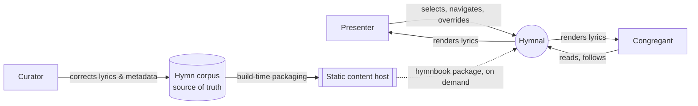
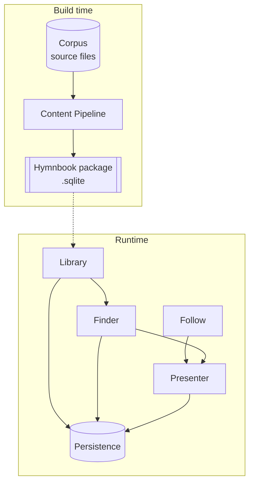
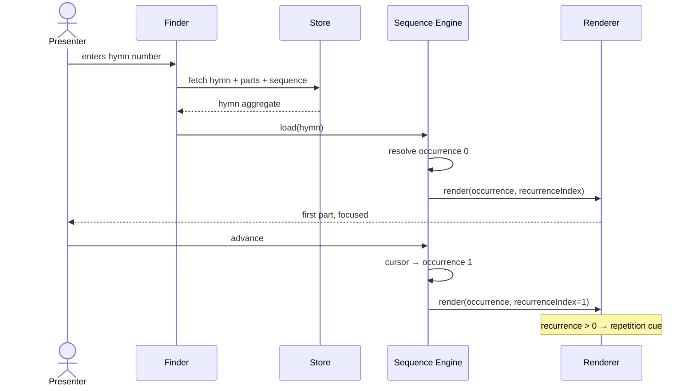
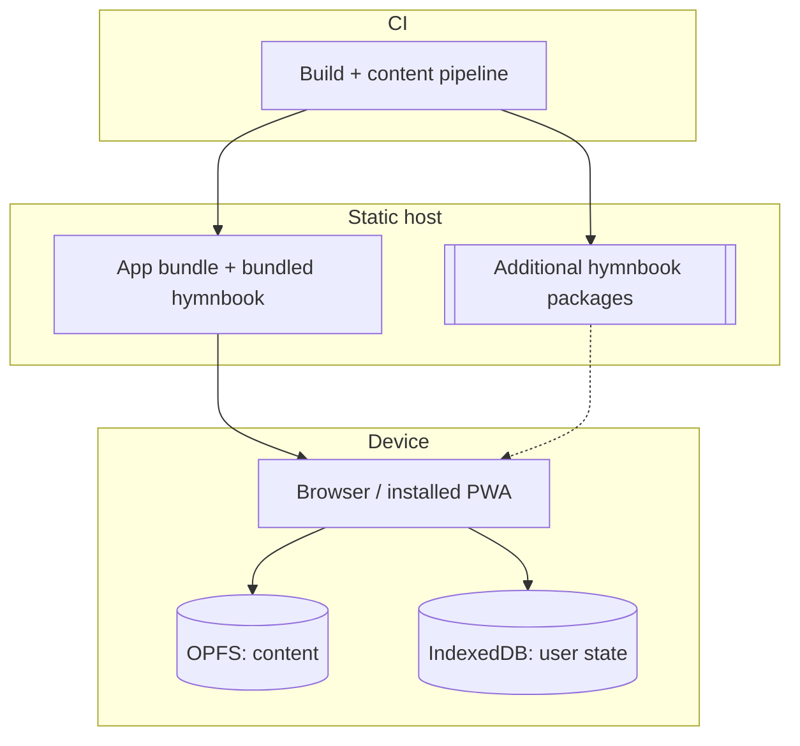

# Hymnal — Architecture

Following the [arc42](https://arc42.org) template. Sections are populated where
decided and marked `OPEN:` where not, so the gaps are visible rather than
implied.

- **Status:** Phase 1 design, pre-implementation
- **Last updated:** 2026-09-20

---

## 1. Introduction and Goals

Hymnal presents hymn lyrics on a screen during corporate worship, and lets a
reader find and follow a hymn on their own device.

The existing implementation (now under [`archive/`](../../archive/)) generated
1,631 frozen HTML slide decks at build time. Every hymn was a static file, the
hymnal's name was compiled into a Rust binary, search matched only on hymn
number, and no state survived a page load. It proved the content was worth
having and that the presentation idea worked. It could not become the system
described here, which is why it was archived rather than refactored
([ADR-0002](../decisions/0002-rebuild-from-a-clean-slate.md)).

### 1.1 Requirements Overview

#### Phase 1 — this document's scope

| #   | Requirement                                                                            |
| --- | -------------------------------------------------------------------------------------- |
| R1  | Select among multiple hymnbooks, across multiple languages                             |
| R2  | Find a hymn quickly — by number, and by text within its lyrics                         |
| R3  | Present a hymn dynamically, following its **sung order** rather than its printed order |
| R4  | Make repeated parts legible _as repetitions_, with distinct visual treatment           |
| R5  | Move focus through the hymn — by part, and by line within a part                       |
| R6  | Allow the presenter to navigate freely at any time, overriding the expected order      |
| R7  | Persist content and user state on the device, and work fully offline                   |
| R8  | Adapt from a phone screen to a large display                                           |

#### Explicitly deferred

Recorded so scope creep stays visible:

| Deferred                                               | Rationale                                                                                                    |
| ------------------------------------------------------ | ------------------------------------------------------------------------------------------------------------ |
| Multi-device live sync                                 | [ADR-0011](../decisions/0011-defer-multi-device-sync-and-projector-output.md)                                |
| Projector / external display output                    | [ADR-0011](../decisions/0011-defer-multi-device-sync-and-projector-output.md)                                |
| Audio follow — announcement detection, lyric alignment | Phase 2; [ADR-0010](../decisions/0010-model-liveness-as-pluggable-follow-sources.md)                         |
| Native app packaging                                   | [ADR-0006](../decisions/0006-defer-the-native-wrapper-decision.md)                                           |
| Transliteration — search and display across scripts    | [ADR-0014](../decisions/0014-defer-transliteration.md)                                                       |
| Bookmarks                                              | [ADR-0012](../decisions/0012-drop-the-bookmark-helper.md)                                                    |
| Content authoring / editing UI                         | Corpus is corrected by rule and by hand for now; [ADR-0009](../decisions/0009-migrate-the-corpus-by-rule.md) |

### 1.2 Quality Goals

Ordered. Where two conflict, the higher one wins — this ordering is the single
most useful thing in the document.

| #   | Goal                                         | Why it ranks here                                                                                                               | Concretely                                                                        |
| --- | -------------------------------------------- | ------------------------------------------------------------------------------------------------------------------------------- | --------------------------------------------------------------------------------- |
| 1   | **Lyrical correctness**                      | A wrong word projected in front of a congregation is the only truly unrecoverable failure. Everything else is an inconvenience. | Content is validated at build time; the app never silently repairs malformed data |
| 2   | **Legibility in the room**                   | If it can't be read from the back, or in sunlight, it has failed at its one job                                                 | Malayalam shaped correctly at every size; contrast and scale are user-controlled  |
| 3   | **Offline reliability**                      | Venue networks are unreliable or absent, and the need is _during_ a service                                                     | No network call is on any critical path after install                             |
| 4   | **Retrieval speed**                          | Hymns are announced with no warning and everyone waits for the operator                                                         | Number → on screen in under 3 seconds, no network                                 |
| 5   | **Extensibility across books and languages** | The corpus is one book today; the model is worthless if a second book requires reworking it                                     | A new hymnbook is data, not code                                                  |

Note what is _absent_: raw runtime performance, visual novelty, and feature
breadth. This is a reading and presenting tool used under mild time pressure by
people who are not thinking about software.

### 1.3 Stakeholders

| Role           | Expectation                                                                                                   |
| -------------- | ------------------------------------------------------------------------------------------------------------- |
| **Congregant** | Follows along on a personal device; wants the right hymn, readable, without fiddling                          |
| **Presenter**  | Drives the display during a service; needs speed, and needs to override the expected order without hesitation |
| **Curator**    | Maintains lyric accuracy and metadata; needs errors to be findable and fixable                                |
| **Maintainer** | Solo developer; needs a system one person can still understand in a year                                      |

---

## 2. Architecture Constraints

### 2.1 Technical

| Constraint                      | Consequence                                                                                    |
| ------------------------------- | ---------------------------------------------------------------------------------------------- |
| Local-first, no backend service | No accounts, no server-side search, no sync. All state is on-device                            |
| Static hosting only             | Content packages are fetched as plain files; no dynamic API exists                             |
| Browser runtime                 | Storage, fonts and text rendering are subject to browser policy — notably storage eviction     |
| Malayalam script                | Requires correct complex-text shaping; rules out naive text measurement and hand-rolled layout |
| Target device floor             | A mid-range Android phone, several years old — not a development laptop                        |

### 2.2 Organisational

| Constraint                   | Consequence                                                                                                                  |
| ---------------------------- | ---------------------------------------------------------------------------------------------------------------------------- |
| Single maintainer            | Complexity is the binding cost. Every moving part must earn its place; two ways to do something is one too many              |
| No infrastructure budget     | Rules out hosted services, relays and managed databases                                                                      |
| **AGPL-3.0-only**            | Any wrapper, dependency or distribution channel must be compatible. See §11 — this is a live risk for app store distribution |
| Lyrics are third-party works | Redistribution rights are not established. See §11                                                                           |

### 2.3 Conventions

- Documentation as in [`docs/README.md`](../README.md).
- Content is data. A new hymnbook must never require a code change.
- `OPEN:` marks deliberate gaps.

---

## 3. Context and Scope

### 3.1 Business Context



The dotted edge is the only external dependency at runtime, and it is optional:
the core hymnbook ships inside the application
([ADR-0007](../decisions/0007-bundle-the-core-hymnbook.md)).

### 3.2 Technical Context

| Interface        | Direction    | Protocol               | Notes                                       |
| ---------------- | ------------ | ---------------------- | ------------------------------------------- |
| Hymnbook package | Host → App   | HTTPS GET, static file | Prebuilt SQLite; only for non-bundled books |
| Content store    | App ↔ Device | OPFS                   | Installed hymnbooks                         |
| User state       | App ↔ Device | IndexedDB              | Preferences, recents, last position         |
| Bundled hymnbook | Build → App  | Build asset            | Malayalam YMEF 16th ed.                     |

### 3.3 Out of Scope

No backend, no accounts, no telemetry, no inter-device communication, no audio
input, no chord charts or sheet music, no in-app content editing.

---

## 4. Solution Strategy

Five decisions carry the design. Each links its ADR.

**1. Separate a hymn's _structure_ from its _performance_.**
The central modelling insight, and the thing the old implementation could not
express. A hymn owns a set of **parts**; it separately owns a **sequence** of
references to those parts. A part may be referenced many times, so a refrain is
stored once and sung repeatedly.

This makes an **occurrence** — a specific position in the sequence — a distinct
addressable thing from the **part** whose text it shows. That distinction is
what makes R4 possible: the renderer knows this exact text has been seen before,
how many times, and what preceded it. It also makes R3 and R6 independent —
the sequence is the _expectation_, never a constraint on navigation.
→ [ADR-0003](../decisions/0003-model-hymns-as-parts-and-an-occurrence-sequence.md),
and the [domain model SDD](../design/0001-domain-model.md).

**2. Web frontend now, native wrapper later.**
Every candidate path — PWA, Capacitor, Tauri — runs a web frontend. The frontend
is therefore the irreversible decision and the wrapper is late-binding. Phase 1
requires no native capability whatsoever, so committing to a wrapper now would
buy nothing and cost flexibility.
→ [ADR-0004](../decisions/0004-build-a-responsive-web-application.md),
[ADR-0006](../decisions/0006-defer-the-native-wrapper-decision.md)

**3. SQLite as the content store, one database per hymnbook.**
Content is read-heavy, immutable at runtime, and needs full-text search over
Malayalam. A prebuilt SQLite per book makes a hymnbook a _file_ — installable,
removable, versionable, and independently distributable — which is what makes R1
and quality goal 5 cheap.
→ [ADR-0008](../decisions/0008-sqlite-as-the-on-device-content-store.md)

**4. "What is live" is an observable with pluggable sources.**
Phase 1 ships exactly one source: local user navigation. But the presentation
layer subscribes to an _abstraction_, not to the user's taps. Audio follow later
becomes an additional source rather than a rewrite of the renderer. This is one
interface, and it is the only concession Phase 1 makes to Phase 2.
→ [ADR-0010](../decisions/0010-model-liveness-as-pluggable-follow-sources.md)

**5. Migrate the corpus by rule, and refine it in use.**
The existing 1,631 hymns have no titles, no sequences, and a `bridge` field
empty in every record. Perfect data is unreachable without a manual pass over
the printed book. A rule-based migration produces a good-enough corpus now, and
the storage format is designed so corrections never require re-migration.
→ [ADR-0009](../decisions/0009-migrate-the-corpus-by-rule.md)

---

## 5. Building Block View

### 5.1 Level 1 — Whitebox



| Block                | Responsibility                                                                | Deliberately not responsible for                    |
| -------------------- | ----------------------------------------------------------------------------- | --------------------------------------------------- |
| **Content Pipeline** | Validate the corpus, derive parts and sequences, emit one SQLite per hymnbook | Anything at runtime — it is a build tool            |
| **Library**          | List, install, remove hymnbooks; know which are available offline             | Hymn content                                        |
| **Finder**           | Retrieval by number and by lyric text; recents                                | Ranking beyond relevance; any notion of "favourite" |
| **Presenter**        | Walk a sequence, resolve occurrences to parts, render, hold focus             | Deciding _why_ focus moved — that comes from Follow |
| **Follow**           | Produce a stream of "what is live now"                                        | Rendering                                           |
| **Persistence**      | Content store and user state, as two separate concerns                        | Business rules                                      |

### 5.2 Level 2 — Presenter

The only block complex enough to decompose in Phase 1.

| Component               | Responsibility                                                                                                                     |
| ----------------------- | ---------------------------------------------------------------------------------------------------------------------------------- |
| **Sequence Engine**     | Holds the sequence, the cursor, and navigation. Answers "what is occurrence _n_", "what follows", "has this part been seen before" |
| **Occurrence Resolver** | Maps an occurrence to its part, its recurrence index, and its relationship to neighbours                                           |
| **Renderer**            | Lays out parts and lines responsively; owns typography                                                                             |
| **Focus Controller**    | Owns the active occurrence and active line; drives transitions                                                                     |

The Sequence Engine is deliberately pure — no rendering, no storage, no
framework. It is the one piece with genuinely intricate logic, and it should be
testable without a DOM.

`OPEN:` Level 2 for Content Pipeline and Finder, once the migration rules and
the Malayalam search strategy are settled.

---

## 6. Runtime View

### 6.1 Present a hymn



The `recurrenceIndex` crossing that boundary is the mechanism behind R4. The
renderer is told not merely _which text_ but _which showing of it_.

### 6.2 Presenter overrides the sequence (R6)

The congregation repeats a chorus unexpectedly; the presenter jumps directly to
that part. The Sequence Engine appends an **ad-hoc occurrence** rather than
rewinding the cursor — so history stays linear, the recurrence count stays
truthful, and the stored sequence is never mutated by a live deviation.

### 6.3 Install a hymnbook

Fetch package → verify → write to OPFS → register in Library → available
offline. Failure at any step leaves the previous state intact; a partially
written book is never registered.

`OPEN:` First-run flow, storage-eviction recovery (§11), and Phase 2 audio
follow.

---

## 7. Deployment View



Single artifact, static hosting, no runtime infrastructure. A service worker
makes the app itself available offline; the bundled hymnbook means a first run
with no network is still useful.

`OPEN:` Wrapper deployment, once [ADR-0006](../decisions/0006-defer-the-native-wrapper-decision.md)
is resolved.

---

## 8. Cross-cutting Concepts

### 8.1 Domain model

Hymnbook → Hymn → Parts + Sequence, with Occurrence as a first-class addressable
position. Specified in full in the [domain model SDD](../design/0001-domain-model.md).

### 8.2 Addressing

Any presentable location is `(hymnbook, hymn, occurrence, line)`. One scheme
serves navigation, persistence of last position, and — later — an audio follow
source reporting a position. Defining it once avoids three incompatible
addressing schemes appearing independently.

### 8.3 Typography and internationalisation

Malayalam requires correct complex-script shaping; conjuncts must not break
under size changes. Fonts are bundled, never fetched — a network-dependent font
would violate quality goal 3. Each hymnbook declares its language and script so
typography is data-driven. UI language is independent of content language.

### 8.4 Search

Number lookup is exact and must be instant. Text search runs over lyrics via
SQLite FTS5. Malayalam needs normalisation (Unicode NFC, chillu and ZWJ/ZWNJ
handling) before indexing — naive tokenisation will produce poor recall.

`OPEN:` Whether FTS5's default tokeniser is adequate for Malayalam, or a custom
one is required. This needs an experiment against the real corpus, not a
judgement call.

### 8.5 Persistence

Two stores with different lifecycles, deliberately not merged: **content**
(large, immutable, re-fetchable, in OPFS) and **user state** (small, mutable,
irreplaceable, in IndexedDB). Losing content is an inconvenience; losing user
state is data loss. See §11 on eviction.

### 8.6 Handling imperfect content

The corpus is known-imperfect, and quality goal 1 says never silently repair.
Validation happens at **build time**, where a human can act on it. At runtime a
malformed hymn renders as plainly as possible and is flagged — it never crashes
the presenter, and never guesses. Contrast with the archived implementation,
which called `panic!` on any hymn shape its four templates did not anticipate.

### 8.7 Presentation and legibility

Responsive from phone to large display. User-controlled text scale and contrast.
Focus transitions must be smooth enough not to distract and fast enough not to
lag singing.

`OPEN:` The recurrence cue's visual language (R4) — deferred by design. Because
occurrence is addressable, inline-with-cue, pinned-refrain, and jump-back are
all view strategies over the same data. This is a design question, answerable
later with something real on screen.

### 8.8 Accessibility

Lyrics are semantic text, never images. Focus changes announced to assistive
technology. Full keyboard navigation — which also serves presenters using a
remote or clicker.

---

## 9. Architecture Decisions

| ADR                                                                          | Decision                                                   | Status   |
| ---------------------------------------------------------------------------- | ---------------------------------------------------------- | -------- |
| [0001](../decisions/0001-record-architecture-decisions.md)                   | Record architecture decisions                              | Accepted |
| [0002](../decisions/0002-rebuild-from-a-clean-slate.md)                      | Rebuild from a clean slate, archive the old implementation | Accepted |
| [0003](../decisions/0003-model-hymns-as-parts-and-an-occurrence-sequence.md) | Model hymns as parts plus an occurrence sequence           | Accepted |
| [0004](../decisions/0004-build-a-responsive-web-application.md)              | Build a responsive web application                         | Accepted |
| [0005](../decisions/0005-use-solidjs.md)                                     | Use SolidJS as the frontend framework                      | Accepted |
| [0006](../decisions/0006-defer-the-native-wrapper-decision.md)               | Defer the native wrapper decision                          | Deferred |
| [0007](../decisions/0007-bundle-the-core-hymnbook.md)                        | Bundle the core hymnbook, download additional books        | Accepted |
| [0008](../decisions/0008-sqlite-as-the-on-device-content-store.md)           | SQLite as the on-device content store                      | Accepted |
| [0009](../decisions/0009-migrate-the-corpus-by-rule.md)                      | Migrate the corpus by rule, refine in place                | Accepted |
| [0010](../decisions/0010-model-liveness-as-pluggable-follow-sources.md)      | Model liveness as pluggable follow sources                 | Accepted |
| [0011](../decisions/0011-defer-multi-device-sync-and-projector-output.md)    | Defer multi-device sync and projector output               | Deferred |
| [0012](../decisions/0012-drop-the-bookmark-helper.md)                        | Drop the bookmark helper                                   | Accepted |
| [0013](../decisions/0013-toolchain-bun-biome-prettier-markdownlint.md)       | Toolchain: bun, biome, prettier with markdownlint          | Accepted |
| [0014](../decisions/0014-defer-transliteration.md)                           | Defer transliteration (search and display)                 | Deferred |

Full index, with open questions, in
[`docs/decisions/`](../decisions/README.md).

---

## 10. Quality Requirements

### 10.1 Quality Tree

```text
Hymnal
├── Correctness ......... lyrics match the printed book; no silent repair
├── Usability ........... legible in the room; fast retrieval; free navigation
├── Reliability ......... fully functional offline; degrades visibly, never silently
├── Modifiability ....... a new hymnbook is data, not code
└── Portability ......... phone to large display; web today, wrapped later
```

### 10.2 Scenarios

| #   | Scenario                                              | Response measure                                                                   |
| --- | ----------------------------------------------------- | ---------------------------------------------------------------------------------- |
| Q1  | A hymn number is announced; the presenter enters it   | On screen, correct, in < 3s with no network                                        |
| Q2  | The corpus contains a hymn with a malformed structure | Build fails with the hymn identified; never reaches a release                      |
| Q3  | Device is fully offline for an entire service         | Every installed hymnbook works; no degraded behaviour                              |
| Q4  | The congregation repeats a chorus unexpectedly        | Presenter reaches any part in one action; recurrence cue stays correct             |
| Q5  | A second hymnbook in a new language is added          | No application code changes; typography follows the book's declared script         |
| Q6  | A reader views a 12-verse hymn on a small phone       | Readable without horizontal scrolling or broken conjuncts                          |
| Q7  | The browser evicts OPFS content                       | Loss is detected, reported plainly, and re-install is offered; user state survives |

`OPEN:` Q1's budget needs validating against the device floor (§2.1) — 1,631
hymns with FTS5 in WASM is unproven on old hardware.

---

## 11. Risks and Technical Debt

| #   | Risk                                                                                                                                                          | Impact                                        | Mitigation                                                                                                                                                                       |
| --- | ------------------------------------------------------------------------------------------------------------------------------------------------------------- | --------------------------------------------- | -------------------------------------------------------------------------------------------------------------------------------------------------------------------------------- |
| R1  | **Corpus fidelity.** Rule-derived sequences will be wrong for some hymns; no title, tune or metadata exists; `bridge` is empty in all 1,631 records           | Directly threatens quality goal 1             | Accept knowingly ([ADR-0009](../decisions/0009-migrate-the-corpus-by-rule.md)); make corrections cheap; never re-migrate                                                         |
| R2  | **Lyrics copyright.** Redistribution rights are not established. The archived UI asserted "all songs are owned by their respective authors"                   | Legal exposure; blocks app store distribution | Establish provenance **before** any store submission. Unresolved                                                                                                                 |
| R3  | **AGPL vs app stores.** AGPL-3.0 conflicts with Apple's App Store terms                                                                                       | Could invalidate the iOS target entirely      | Resolve alongside [ADR-0006](../decisions/0006-defer-the-native-wrapper-decision.md) — not after                                                                                 |
| R4  | **Storage eviction.** Browsers may evict OPFS under pressure                                                                                                  | Content vanishes, possibly mid-service        | Request persistent storage; detect and re-install; never store user state in OPFS                                                                                                |
| R5  | **Malayalam full-text search.** ~~FTS5's default tokeniser may handle Malayalam poorly~~ — confirmed: it fragments words to bare consonants                   | Text search unusable — half of R2             | **Resolved** (Board #3): `unicode61` with Malayalam marks in `tokenchars` validated against the real corpus — see [SDD-0001 §6](../design/0001-domain-model.md#6-storage-schema) |
| R6  | **Phase 2 is unproven.** Aligning against live congregational singing is research-grade, and unlike Metrolist there are no pre-made LRC files to fall back on | Phase 2 may not be deliverable as imagined    | Phase 1 depends on it only through one interface. Treat announcement detection and lyric alignment as separate capabilities with very different risk                             |
| R7  | **SolidJS ecosystem.** Smallest community of the frameworks considered                                                                                        | Fewer libraries, fewer answers                | Accepted ([ADR-0005](../decisions/0005-use-solidjs.md)); keep domain logic framework-free so it stays portable                                                                   |
| R8  | **Solo maintainer.** Every part must stay comprehensible to one person                                                                                        | Complexity is the dominant failure mode       | Deferral is a first-class tool — see the number of `Deferred` ADRs in §9                                                                                                         |

**Debt carried deliberately:** no content authoring UI; no automated lyric
verification against the printed source; recurrence visual language unresolved
(§8.7).

---

## 12. Glossary

| Term                  | Meaning                                                                                                                                 |
| --------------------- | --------------------------------------------------------------------------------------------------------------------------------------- |
| **Hymnbook**          | A published collection — language, edition, publisher, and its own numbering                                                            |
| **Hymn**              | One entry in a hymnbook, identified within it by number                                                                                 |
| **Part**              | A unit of lyric text with a kind (stanza, refrain, bridge, tag) and lines. Stored once regardless of how often it is sung               |
| **Sequence**          | The ordered list of part references that constitutes the hymn's sung order                                                              |
| **Occurrence**        | A single position in the sequence. Distinct from the part it shows — the same refrain sung three times is three occurrences of one part |
| **Recurrence index**  | How many times a part has already been shown at a given occurrence. `0` is the first showing                                            |
| **Ad-hoc occurrence** | An occurrence appended by live navigation rather than drawn from the stored sequence                                                    |
| **Focus**             | The currently active occurrence, and the active line within it                                                                          |
| **Follow source**     | A producer of "what is live now". Phase 1 has exactly one: local navigation                                                             |
| **Package**           | A prebuilt, distributable SQLite database containing one hymnbook                                                                       |
| **Corpus**            | The source-of-truth hymn data, before packaging                                                                                         |
