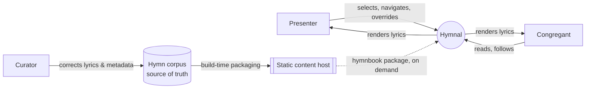
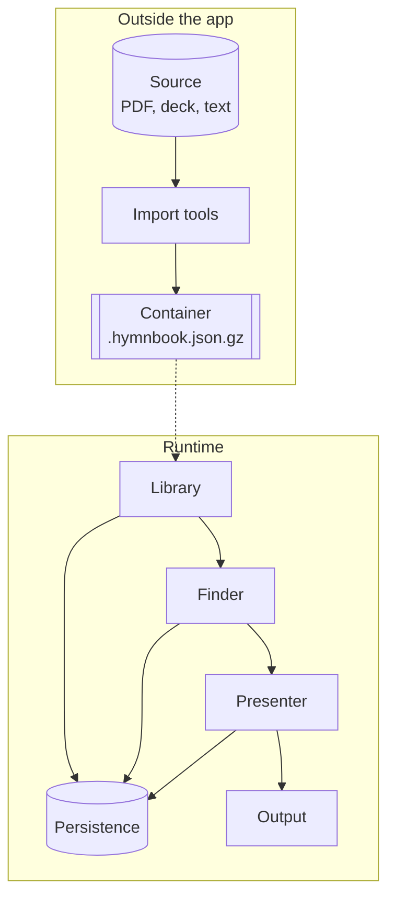
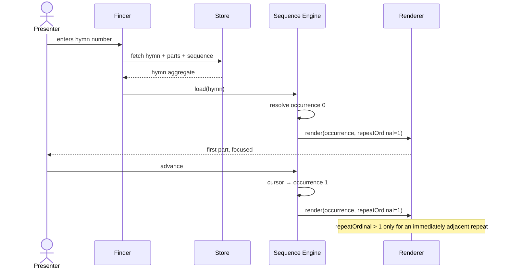
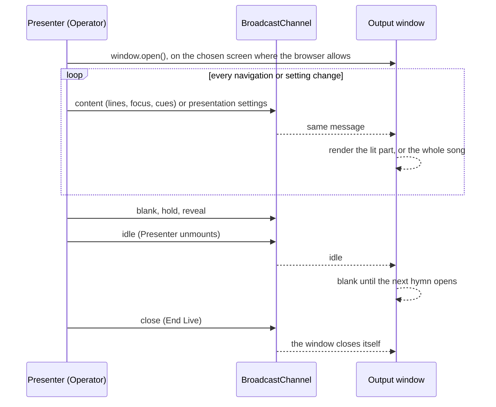
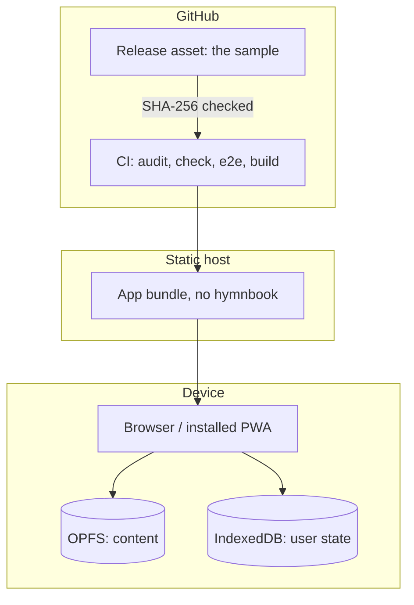

# Hymnal — Architecture

Following the [arc42](https://arc42.org) template. Sections are populated where
decided and marked `OPEN:` where not, so the gaps are visible rather than
implied.

- **Status:** Phase 1 built; in beta at
  [hymnal.sagaveracity.com](https://hymnal.sagaveracity.com)
- **Last updated:** 2026-10-08

---

## 1. Introduction and Goals

Hymnal presents hymn lyrics on a screen during corporate worship, and lets a
reader find and follow a hymn on their own device. It presents songs; it doesn't
publish them. Songs come from what the user imports, kept on their device, and
from books the user loads, never bundled with the app
([ADR-0020](../decisions/0020-present-songs-do-not-publish-them.md), ADR-0026).

The earlier implementation (since removed from the tree; it lives in git
history) generated 1,631 frozen HTML slide decks at build time. Every hymn was a
static file, the hymnal's name was compiled into a Rust binary, search matched
only on hymn number, and no state survived a page load. It proved the content
was worth having and that the presentation idea worked. It could not become the
system described here, which is why it was archived rather than refactored
([ADR-0002](../decisions/0002-rebuild-from-a-clean-slate.md)).

### 1.1 Requirements Overview

#### Phase 1 — this document's scope

| #   | Requirement                                                                            |
| --- | -------------------------------------------------------------------------------------- |
| R1  | Select among multiple hymnbooks, across multiple languages                             |
| R2  | Find a hymn quickly — by number, and by text within its lyrics                         |
| R3  | Present a hymn dynamically, following its **sung order** rather than its printed order |
| R4  | Make repeated parts legible _as repetitions_, with distinct visual treatment           |
| R5  | Move focus through the hymn — by part, and by line within a part                       |
| R6  | Allow the presenter to navigate freely at any time, overriding the expected order      |
| R7  | Persist content and user state on the device, and work fully offline                   |
| R8  | Adapt from a phone screen to a large display                                           |

#### Explicitly deferred

Recorded so scope creep stays visible:

| Deferred                                               | Rationale                                                                                                                                                                                                          |
| ------------------------------------------------------ | ------------------------------------------------------------------------------------------------------------------------------------------------------------------------------------------------------------------ |
| Multi-device live sync                                 | [ADR-0011](../decisions/0011-defer-multi-device-sync-and-projector-output.md)                                                                                                                                      |
| Audio follow — announcement detection, lyric alignment | Phase 2; [ADR-0010](../decisions/0010-model-liveness-as-pluggable-follow-sources.md)                                                                                                                               |
| Native app packaging                                   | [ADR-0006](../decisions/0006-defer-the-native-wrapper-decision.md)                                                                                                                                                 |
| Transliteration — search and display across scripts    | [ADR-0014](../decisions/0014-defer-transliteration.md)                                                                                                                                                             |
| Bookmarks                                              | [ADR-0012](../decisions/0012-drop-the-bookmark-helper.md)                                                                                                                                                          |
| Content authoring / editing UI                         | Books are built outside the app and reviewed without edit; [ADR-0029](../decisions/0029-others-build-their-books-the-format-is-the-contract.md), [ADR-0027](../decisions/0027-review-a-book-without-editing-it.md) |
| Importing a PDF or deck in the browser                 | The app loads format 1 only; import runs in the CLI, case by case — [ADR-0024](../decisions/0024-import-case-by-case.md)                                                                                           |

### 1.2 Quality Goals

Ordered. Where two conflict, the higher one wins — this ordering is the single
most useful thing in the document.

| #   | Goal                                         | Why it ranks here                                                                                                               | Concretely                                                                                      |
| --- | -------------------------------------------- | ------------------------------------------------------------------------------------------------------------------------------- | ----------------------------------------------------------------------------------------------- |
| 1   | **Lyrical correctness**                      | A wrong word projected in front of a congregation is the only truly unrecoverable failure. Everything else is an inconvenience. | Content is validated when packed and when loaded; the app never silently repairs malformed data |
| 2   | **Legibility in the room**                   | If it can't be read from the back, or in sunlight, it has failed at its one job                                                 | Malayalam shaped correctly at every size; contrast and scale are user-controlled                |
| 3   | **Offline reliability**                      | Venue networks are unreliable or absent, and the need is _during_ a service                                                     | No network call is on any critical path after install                                           |
| 4   | **Retrieval speed**                          | Hymns are announced with no warning and everyone waits for the operator                                                         | Number → on screen in under 3 seconds, no network                                               |
| 5   | **Extensibility across books and languages** | The corpus is one book today; the model is worthless if a second book requires reworking it                                     | A new hymnbook is data, not code                                                                |

Note what is _absent_: raw runtime performance, visual novelty, and feature
breadth. This is a reading and presenting tool used under mild time pressure by
people who are not thinking about software.

### 1.3 Stakeholders

| Role           | Expectation                                                                                                   |
| -------------- | ------------------------------------------------------------------------------------------------------------- |
| **Congregant** | Follows along on a personal device; wants the right hymn, readable, without fiddling                          |
| **Presenter**  | Drives the display during a service; needs speed, and needs to override the expected order without hesitation |
| **Curator**    | Maintains lyric accuracy and metadata; needs errors to be findable and fixable                                |
| **Maintainer** | Solo developer; needs a system one person can still understand in a year                                      |

---

## 2. Architecture Constraints

### 2.1 Technical

| Constraint                      | Consequence                                                                                     |
| ------------------------------- | ----------------------------------------------------------------------------------------------- |
| Local-first, no backend service | No accounts, no server-side search, no sync. All state is on-device                             |
| Static hosting only             | The app and the sample are plain files; no dynamic API exists. Books come from the user's files |
| Browser runtime                 | Storage, fonts and text rendering are subject to browser policy — notably storage eviction      |
| Malayalam script                | Requires correct complex-text shaping; rules out naive text measurement and hand-rolled layout  |
| Target device floor             | A mid-range Android phone, several years old — not a development laptop                         |

### 2.2 Organisational

| Constraint                   | Consequence                                                                                                                         |
| ---------------------------- | ----------------------------------------------------------------------------------------------------------------------------------- |
| Single maintainer            | Complexity is the binding cost. Every moving part must earn its place; two ways to do something is one too many                     |
| No infrastructure budget     | Rules out hosted services, relays and managed databases                                                                             |
| **Apache-2.0**               | Permissive; dependencies and wrappers need only permissive-license checks — [ADR-0016](../decisions/0016-license-under-apache-2.md) |
| Lyrics are third-party works | Redistribution rights are not established. See §11                                                                                  |

### 2.3 Conventions

- Documentation as in [`docs/README.md`](../README.md).
- Content is data. A new hymnbook must never require a code change.
- `OPEN:` marks deliberate gaps.

---

## 3. Context and Scope

### 3.1 Business Context


```mermaid
flowchart LR
    Presenter[Presenter]
    Congregant[Congregant]
    Curator[Curator]
    App(("Hymnal"))
    Host[[Static content host]]
    Corpus[(Hymn corpus<br/>source of truth)]

    Presenter -->|selects, navigates, overrides| App
    Congregant -->|reads, follows| App
    App -->|renders lyrics| Presenter
    App -->|renders lyrics| Congregant
    Curator -->|corrects lyrics & metadata| Corpus
    Corpus -->|build-time packaging| Host
    Host -.->|hymnbook package, on demand| App
```

The dotted edge is the only external dependency at runtime, and it is optional.
Superseded by SDD-0004 (ADR-0026): nothing is bundled, so no hymnbook ships
inside the application (was
[ADR-0007](../decisions/0007-bundle-the-core-hymnbook.md)); books are loaded
from container files through the Library. The one fetch left is the
public-domain sample, from the app's own site and only when asked (Try the
Sample, SDD-0004 §16).

### 3.2 Technical Context

| Interface      | Direction         | Protocol               | Notes                                        |
| -------------- | ----------------- | ---------------------- | -------------------------------------------- |
| Sample book    | Host → App        | HTTPS GET, static file | Only when asked (SDD-0004 §16)               |
| Content store  | App ↔ Device      | OPFS                   | Installed hymnbooks                          |
| User state     | App ↔ Device      | IndexedDB              | Preferences, recents, last position          |
| Container file | User → App        | File pick or drop      | A book loaded through the Library (SDD-0004) |
| Backup file    | App ↔ User        | Download, file pick    | Books and settings (SDD-0006)                |
| Output channel | Operator → Output | BroadcastChannel       | Two windows, one browser (§6.4)              |

### 3.3 Out of Scope

No backend, no accounts, no telemetry, no inter-device communication, no audio
input, no chord charts or sheet music, no in-app content editing. A book being
loaded is reviewed without edit: read, shown, never changed
([ADR-0027](../decisions/0027-review-a-book-without-editing-it.md)).

---

## 4. Solution Strategy

Five decisions carry the design. Each links its ADR.

**1. Separate a hymn's _structure_ from its _performance_.** The central
modelling insight, and the thing the old implementation could not express. A
hymn owns a set of **parts**; it separately owns a **sequence** of references to
those parts. A part may be referenced many times, so a chorus is stored once and
sung repeatedly.

This makes an **occurrence** — a specific position in the sequence — a distinct
addressable thing from the **part** whose text it shows. That distinction is
what makes R4 possible: the renderer knows this exact text has been seen before,
how many times, and what preceded it. It also makes R3 and R6 independent — the
sequence is the _expectation_, never a constraint on navigation. →
[ADR-0003](../decisions/0003-model-hymns-as-parts-and-an-occurrence-sequence.md),
and the [domain model SDD](../design/0001-domain-model.md).

**2. Web frontend now, native wrapper later.** Every candidate path — PWA,
Capacitor, Tauri — runs a web frontend. The frontend is therefore the
irreversible decision and the wrapper is late-binding. Phase 1 requires no
native capability whatsoever, so committing to a wrapper now would buy nothing
and cost flexibility. →
[ADR-0004](../decisions/0004-build-a-responsive-web-application.md),
[ADR-0006](../decisions/0006-defer-the-native-wrapper-decision.md)

**3. SQLite as the content store, one database per hymnbook.** Content is
read-heavy, immutable at runtime, and needs full-text search over Malayalam. The
app writes one SQLite per book when it loads a container, so a hymnbook is a
_file_ — loadable, removable, and independently distributable — which is what
makes R1 and quality goal 5 cheap. →
[ADR-0008](../decisions/0008-sqlite-as-the-on-device-content-store.md)

**4. "What is live" is an observable with pluggable sources.** Phase 1 ships
exactly one source: local user navigation. But the presentation layer subscribes
to an _abstraction_, not to the user's taps. Audio follow later becomes an
additional source rather than a rewrite of the renderer. This is one interface,
and it is the only concession Phase 1 makes to Phase 2. →
[ADR-0010](../decisions/0010-model-liveness-as-pluggable-follow-sources.md)

**5. Books are imports, not source.** No song is in the repository and none
ships with the app. A book is a format-1 file
([SDD-0002](../design/0002-content-format.md)) built outside the app — by the
CLI import, from text, or by hand with the authoring kit — and loaded through
the Library, where it is reviewed before it is kept. →
[ADR-0026](../decisions/0026-songs-leave-the-repository.md),
[ADR-0029](../decisions/0029-others-build-their-books-the-format-is-the-contract.md),
[ADR-0024](../decisions/0024-import-case-by-case.md)

---

## 5. Building Block View

### 5.1 Level 1 — Whitebox


```mermaid
flowchart TB
    subgraph Build["Outside the app"]
        Source[(Source<br/>PDF, deck, text)]
        Tools[Import tools]
        Pkg[[Container<br/>.hymnbook.json.gz]]
        Source --> Tools --> Pkg
    end

    subgraph App["Runtime"]
        Library[Library]
        Finder[Finder]
        Presenter[Presenter]
        Output[Output]
        Store[(Persistence)]
    end

    Pkg -.-> Library
    Library --> Store
    Finder --> Store
    Presenter --> Store
    Library --> Finder --> Presenter
    Presenter --> Output
```

| Block            | Responsibility                                                                                    | Deliberately not responsible for                    |
| ---------------- | ------------------------------------------------------------------------------------------------- | --------------------------------------------------- |
| **Import tools** | `scripts/`: read a PDF, parse song text, validate and pack a book into a container (SDD-0003)     | Anything at runtime — they are CLI tools            |
| **Library**      | List, load (after a review), remove, back up and restore books; flag a book whose file is missing | Hymn content                                        |
| **Finder**       | Retrieval by number and by lyric text; recents                                                    | Ranking beyond relevance; any notion of "favourite" |
| **Presenter**    | Walk a sequence, resolve occurrences to parts, render, hold focus                                 | The audience's screen — that is Output              |
| **Output**       | The audience's view, in its own window or full screen in the main one (SDD-0001 §16)              | Deciding what is live                               |
| **Shell**        | Panes, Settings, command menu, keymap, update prompt, one-tab lock (`src/shell/`)                 | Hymn logic                                          |
| **Persistence**  | Content store and user state, as two separate concerns                                            | Business rules                                      |

**Follow** (ADR-0010) is not built. Navigation by the user is the only source of
"what is live", and no follow interface exists in the code yet.

### 5.2 Level 2 — Presenter

The only block complex enough to decompose in Phase 1.

| Component               | Responsibility                                                                                                                     |
| ----------------------- | ---------------------------------------------------------------------------------------------------------------------------------- |
| **Sequence Engine**     | Holds the sequence, the cursor, and navigation. Answers "what is occurrence _n_", "what follows", "has this part been seen before" |
| **Occurrence Resolver** | Maps an occurrence to its part, its recurrence index, and its relationship to neighbours                                           |
| **Renderer**            | Lays out parts and lines responsively; owns typography                                                                             |
| **Focus Controller**    | Owns the active occurrence and active line; drives transitions                                                                     |

The Sequence Engine is deliberately pure — no rendering, no storage, no
framework. It is the one piece with genuinely intricate logic, and it should be
testable without a DOM.

Built in Board #9 (SDD-0001 §14): Occurrence Resolver turned out not to earn a
separate component — `SequenceEngine.occurrenceAt` already answers it, and
splitting it out bought nothing extra. Renderer and Focus Controller are one
`Presenter` component; the "active occurrence and active line" the Focus
Controller was meant to own is exactly the engine's own cursor, read through a
Solid signal bumped on each mutation.

The Presenter redesign (SDD-0001 §16) adds one more: **Output**, a second,
chrome-less renderer of the same cursor, reached via `BroadcastChannel` rather
than sharing `Presenter`'s Solid signals directly (different window, different
JS realm). Not a decomposition of Renderer — a second consumer of the same
state.

The Output shows one part, or the whole song at once on a landscape screen
([SDD-0005](../design/0005-full-song-output.md)). **Present here** renders the
same view in the main window, full screen, for one-screen setups (SDD-0001
§16.7).

The import tools and the Finder have no Level 2 here:
[SDD-0003](../design/0003-song-import.md) and SDD-0001 §13 hold their design.

---

## 6. Runtime View

### 6.1 Present a hymn


```mermaid
sequenceDiagram
    actor U as Presenter
    participant F as Finder
    participant S as Store
    participant SE as Sequence Engine
    participant R as Renderer

    U->>F: enters hymn number
    F->>S: fetch hymn + parts + sequence
    S-->>F: hymn aggregate
    F->>SE: load(hymn)
    SE->>SE: resolve occurrence 0
    SE->>R: render(occurrence, repeatOrdinal=1)
    R-->>U: first part, focused
    U->>SE: advance
    SE->>SE: cursor → occurrence 1
    SE->>R: render(occurrence, repeatOrdinal=1)
    Note over R: repeatOrdinal > 1 only for an immediately adjacent repeat
```

`repeatOrdinal` crossing above 1 is the mechanism behind R4 — but only for a
part repeating _immediately_, not for the hymn's ordinary verse-chorus structure
(revised in the Presenter redesign, SDD-0001 §16; §2.2/§5.2 have the corrected
definition and the corpus evidence behind it).

Implemented in Board #9 (SDD-0001 §14) with one change from this diagram: Finder
never fetches or loads the hymn — it only hands the number to Presenter, which
does the fetch, the `SequenceEngine.load`, and — once that succeeds — the
recents write. Picking a hymn and opening it turned out to be different moments
(a search result can be clicked by mistake), so only the latter should count as
"viewed."

### 6.2 Presenter overrides the sequence (R6)

The song leader skips a verse, goes back to one, or repeats a chorus
unexpectedly; the presenter follows at once. A jump to a part moves the cursor
within the song's order and leaves the path unchanged, so Next and Previous keep
following the song. A repeat is explicit and inserts an **ad-hoc occurrence**
right after the cursor (SDD-0001 §5.1), so the recurrence count stays truthful.
The stored sequence is never mutated by a live deviation.

Implemented in Board #9: a plain list of the hymn's parts next to the renderer,
one button per part, calling `jumpToPart` directly — no separate "override
mode," since freely jumping is the whole point (R6's "without hesitation").

### 6.3 Load a book

Pick a container → read, validate and hash → review → confirm → write to OPFS →
register in the Library → available offline (SDD-0004 §1). Failure at any step
leaves the previous state intact; a partially written book is never registered.
The sample goes the same way: fetched from the site when asked, then reviewed
like any file. A book whose file the browser has evicted is flagged in the
Library and can be loaded again (SDD-0004 §9).

`OPEN:` Eviction recovery on a real device (Board #50); Phase 2 audio follow.

### 6.4 Operator publishes to Output


```mermaid
sequenceDiagram
    participant P as Presenter (Operator)
    participant C as BroadcastChannel
    participant O as Output window

    P->>O: window.open(), on the chosen screen where the browser allows
    loop every navigation or setting change
        P->>C: content (lines, focus, cues) or presentation settings
        C-->>O: same message
        O-->>O: render the lit part, or the whole song
    end
    P->>C: blank, hold, reveal
    P->>C: idle (Presenter unmounts)
    C-->>O: idle
    O-->>O: blank until the next hymn opens
    P->>C: close (End Live)
    C-->>O: the window closes itself
```

Two windows, one browser, one device — not the deferred multi-device scenario
(ADR-0011). Where the browser has the Window Management API and a second screen
is attached, the Output opens there; elsewhere it is a popup the operator drags
([ADR-0028](../decisions/0028-put-the-output-on-the-projector-screen.md)). With
one screen, Go Live presents in the main window instead (SDD-0001 §16.7). The
channel is a module-level singleton (same shape as `userState`); the Output
window's lifecycle lives above `Presenter`, so it survives a different hymn
opening. Full mechanism: SDD-0001 §16.1.

---

## 7. Deployment View


```mermaid
flowchart TB
    subgraph GitHub["GitHub"]
        Sample[Release asset: the sample]
        Build[CI: audit, check, e2e, build]
    end
    subgraph Host["Static host"]
        AppBundle[App bundle, no hymnbook]
    end
    subgraph Device["Device"]
        Browser[Browser / installed PWA]
        OPFS[(OPFS: content)]
        IDB[(IndexedDB: user state)]
    end

    Sample -->|SHA-256 checked| Build
    Build --> AppBundle
    AppBundle --> Browser
    Browser --> OPFS
    Browser --> IDB
```

Single artifact, static hosting, no runtime infrastructure. A service worker
makes the app itself available offline; a first run has no book until one is
loaded from a file (ADR-0026), after which it works with no network.

Implemented in Board #10 (SDD-0001 §15): `.github/workflows/deploy.yml` builds
and deploys to GitHub Pages on every push to `main`, gated on a dependency audit
(ADR-0030), `bun run check` and the Playwright smoke suite on Chromium, Firefox
and WebKit (Board #52). It fetches the sample's containers from the release
named in `sample/RELEASE` and stops on any whose SHA-256 differs from
`sample/SHA256SUMS` (SDD-0004 §16). The site is served at an origin of its own,
`hymnal.sagaveracity.com`, never a project path on a shared host (ADR-0030). The
service worker (`vite-plugin-pwa`) precaches the app shell — including the
SQLite Wasm runtime, which the app can't function without — but never the
content package, which stays `ContentStore`'s job via OPFS. Verified against the
actual production build with the network cut off: the shell, the SQLite engine,
and a real hymn all load offline after one prior online visit.

An app update downloads and waits for a restart the operator chooses, never
while the Output is live; it replaces only the shell, never books (OPFS) or
settings (IndexedDB) (SDD-0001 §15).

`OPEN:` Wrapper deployment, once
[ADR-0006](../decisions/0006-defer-the-native-wrapper-decision.md) is resolved.

---

## 8. Cross-cutting Concepts

### 8.1 Domain model

Hymnbook → Hymn → Parts + Sequence, with Occurrence as a first-class addressable
position. Specified in full in the
[domain model SDD](../design/0001-domain-model.md).

### 8.2 Addressing

Any presentable location is `(hymnbook, hymn, occurrence, line)`. One scheme
serves navigation, persistence of last position, and — later — an audio follow
source reporting a position. Defining it once avoids three incompatible
addressing schemes appearing independently.

### 8.3 Typography and internationalisation

Malayalam requires correct complex-script shaping; conjuncts must not break
under size changes. Fonts are bundled, never fetched — a network-dependent font
would violate quality goal 3. Each hymnbook declares its language and script so
typography is data-driven. UI language is independent of content language.

One family serves both UI chrome and hymn content: **Hymnal Sans**, Google Sans
subset and renamed (OFL), with full Malayalam coverage, bundled as one woff2
([`src/fonts/README.md`](../../src/fonts/README.md)). Noto Sans and Serif
Malayalam stay in the font stack as fallbacks only. The rationale and the visual
token system (color, type scale, shape, elevation, components) live in
[`docs/visual/DESIGN.md`](../visual/DESIGN.md), not here — read it before
touching CSS. A second hymnbook's script gets its own font the same way, per
hymnbook data, when that need arrives.

### 8.4 Search

Number lookup is exact and must be instant. Text search runs over lyrics via
SQLite FTS5. Malayalam needs normalisation (Unicode NFC, chillu and ZWJ/ZWNJ
handling) before indexing — naive tokenisation will produce poor recall.

The tokeniser is `unicode61` with the Malayalam vowel signs, virama and joiners
as token characters; the default fragmented words (§11, R5). Queries are quoted
and prefix-matched, so near misses are not found; typo-tolerant search is Board
#40.

### 8.5 Persistence

Two stores with different lifecycles, deliberately not merged: **content**
(large, immutable, loaded from the user's own container files, in OPFS) and
**user state** (small, mutable, irreplaceable, in IndexedDB). Losing content is
an inconvenience; losing user state is data loss. A backup file holds both
(SDD-0006). One tab owns the content store at a time, through a Web Lock
(SDD-0001 §10.4). See §11 on eviction.

### 8.6 Handling imperfect content

The corpus is known-imperfect, and quality goal 1 says never silently repair.
Validation happens when a book is **packed** and again when it is **loaded**,
where a human can act on it. At runtime a malformed hymn renders as plainly as
possible and is flagged — it never crashes the presenter, and never guesses.
Contrast with the archived implementation, which called `panic!` on any hymn
shape its four templates did not anticipate.

### 8.7 Presentation and legibility

Responsive from phone to large display. User-controlled text scale and contrast.
Focus transitions must be smooth enough not to distract and fast enough not to
lag singing.

The recurrence cue (R4) is a text label, not color, so it stays legible in
bright venue light and for colorblind viewers — quality goal 2 ranks above
visual novelty. A toggle hides it, since a presenter deliberately departing from
the stored order finds a cue tracking that order misleading. The label is a
plain running count (`repeatOrdinal`), and only appears for an immediately
adjacent repeat — verse-chorus-verse-chorus is the hymn's normal printed form,
not a repeat (SDD-0001 §14, §16).

Responsive layout implemented in Board #10 (SDD-0001 §15), since narrowed to
content by [ADR-0017](../decisions/0017-fix-the-interface-scale.md) (the
interface is a fixed size times the user's text scale): a continuous
`clamp()`-based type scale rather than fixed breakpoints, so phone and large
display sit on one curve instead of jumping between layouts. User-controlled
scale and contrast is `Settings` (`src/shell/Settings.tsx`), applied globally as
`--font-scale` and `data-theme`, not per-view. One hard breakpoint caps line
length on a large display, so it doesn't run wall to wall.

**Reversed in the Presenter redesign** (SDD-0001 §16): Board #10 declined a
"presentation mode," reasoning it as the deferred multi-device/projector feature
(ADR-0011). That was wrong — researching how existing worship-presentation
software actually works (ProPresenter, EasyWorship, FreeShow, Proclaim) surfaced
a universal pattern missed here: an Operator view and a chrome-less **Output**
view, achieved as two windows from one browser on one device, not a second
device. Phase 1 is still single-device; the Output window is a second window,
not a second device. See §6.4 and SDD-0001 §16.1 for the mechanism.

### 8.8 Accessibility

Lyrics are semantic text, never images. Focus changes announced to assistive
technology. Full keyboard navigation — which also serves presenters using a
remote or clicker.

Arrow keys step a line or a part in `Presenter`; `PageUp`/`PageDown` do the
same, since that's what most presentation remotes and clickers send. The full
key table is data in `src/shell/keymap.ts` (SDD-0001 §16.5).

### 8.9 Security

A local-first threat model: no server, no accounts, nothing leaves the device
unless the user sends it. A strict Content Security Policy is built into the
deploy (`scripts/csp.ts`), the dependency audit gates the build, and the site
has an origin of its own. See
[ADR-0030](../decisions/0030-security-a-local-first-threat-model.md).

---

## 9. Architecture Decisions

| ADR                                                                              | Decision                                                   | Status                                                                                                       |
| -------------------------------------------------------------------------------- | ---------------------------------------------------------- | ------------------------------------------------------------------------------------------------------------ |
| [0001](../decisions/0001-record-architecture-decisions.md)                       | Record architecture decisions                              | Accepted                                                                                                     |
| [0002](../decisions/0002-rebuild-from-a-clean-slate.md)                          | Rebuild from a clean slate, archive the old implementation | Accepted                                                                                                     |
| [0003](../decisions/0003-model-hymns-as-parts-and-an-occurrence-sequence.md)     | Model hymns as parts plus an occurrence sequence           | Accepted                                                                                                     |
| [0004](../decisions/0004-build-a-responsive-web-application.md)                  | Build a responsive web application                         | Accepted                                                                                                     |
| [0005](../decisions/0005-use-solidjs.md)                                         | Use SolidJS as the frontend framework                      | Accepted                                                                                                     |
| [0006](../decisions/0006-defer-the-native-wrapper-decision.md)                   | Defer the native wrapper decision                          | Deferred                                                                                                     |
| [0007](../decisions/0007-bundle-the-core-hymnbook.md)                            | Bundle the core hymnbook, download additional books        | Superseded by [0026](../decisions/0026-songs-leave-the-repository.md)                                        |
| [0008](../decisions/0008-sqlite-as-the-on-device-content-store.md)               | SQLite as the on-device content store                      | Accepted; library superseded by [0015](../decisions/0015-use-official-sqlite-wasm-not-wa-sqlite.md)          |
| [0009](../decisions/0009-migrate-the-corpus-by-rule.md)                          | Migrate the corpus by rule, refine in place                | Superseded by [0026](../decisions/0026-songs-leave-the-repository.md)                                        |
| [0010](../decisions/0010-model-liveness-as-pluggable-follow-sources.md)          | Model liveness as pluggable follow sources                 | Accepted                                                                                                     |
| [0011](../decisions/0011-defer-multi-device-sync-and-projector-output.md)        | Defer multi-device sync and projector output               | Deferred; projector output superseded by [0028](../decisions/0028-put-the-output-on-the-projector-screen.md) |
| [0012](../decisions/0012-drop-the-bookmark-helper.md)                            | Drop the bookmark helper                                   | Accepted                                                                                                     |
| [0013](../decisions/0013-toolchain-bun-biome-prettier-markdownlint.md)           | Toolchain: bun, biome, prettier with markdownlint          | Accepted                                                                                                     |
| [0014](../decisions/0014-defer-transliteration.md)                               | Defer transliteration (search and display)                 | Deferred                                                                                                     |
| [0015](../decisions/0015-use-official-sqlite-wasm-not-wa-sqlite.md)              | Use the official SQLite Wasm build, not wa-sqlite          | Accepted                                                                                                     |
| [0016](../decisions/0016-license-under-apache-2.md)                              | License the project under Apache-2.0                       | Accepted                                                                                                     |
| [0017](../decisions/0017-fix-the-interface-scale.md)                             | Fix the interface scale; only content scales               | Accepted                                                                                                     |
| [0018](../decisions/0018-import-songs-through-a-layout-aware-pipeline.md)        | Import songs through a layout-aware pipeline, CLI first    | Accepted; browser path superseded by [0024](../decisions/0024-import-case-by-case.md)                        |
| [0019](../decisions/0019-version-the-content-format.md)                          | Version the content format; one gzipped file per book      | Accepted                                                                                                     |
| [0020](../decisions/0020-present-songs-do-not-publish-them.md)                   | Present songs; don't publish them                          | Accepted                                                                                                     |
| [0021](../decisions/0021-identify-books-by-the-store-that-holds-them.md)         | Identify books by the store that holds them                | Accepted                                                                                                     |
| [0022](../decisions/0022-publish-a-json-schema-for-the-format.md)                | Publish a JSON Schema for the content format               | Accepted                                                                                                     |
| [0023](../decisions/0023-recognise-the-document-and-infer-its-layout.md)         | Recognise what a document holds; infer its layout          | Superseded by [0024](../decisions/0024-import-case-by-case.md)                                               |
| [0024](../decisions/0024-import-case-by-case.md)                                 | Import case by case; the app loads only format 1           | Accepted                                                                                                     |
| [0025](../decisions/0025-call-it-the-chorus.md)                                  | Call it the chorus: screen, key, code and format           | Accepted                                                                                                     |
| [0026](../decisions/0026-songs-leave-the-repository.md)                          | Songs leave the repository; every book is an import        | Accepted                                                                                                     |
| [0027](../decisions/0027-review-a-book-without-editing-it.md)                    | Review a book without editing it                           | Accepted                                                                                                     |
| [0028](../decisions/0028-put-the-output-on-the-projector-screen.md)              | Put the Output on the projector screen                     | Accepted                                                                                                     |
| [0029](../decisions/0029-others-build-their-books-the-format-is-the-contract.md) | Others build their books: the format is the contract       | Accepted; point 4 withdrawn                                                                                  |
| [0030](../decisions/0030-security-a-local-first-threat-model.md)                 | Security: a local-first threat model                       | Accepted                                                                                                     |

Full index, with open questions, in [`docs/decisions/`](../decisions/README.md).

---

## 10. Quality Requirements

### 10.1 Quality Tree

```text
Hymnal
├── Correctness ......... lyrics match the printed book; no silent repair
├── Usability ........... legible in the room; fast retrieval; free navigation
├── Reliability ......... fully functional offline; degrades visibly, never silently
├── Modifiability ....... a new hymnbook is data, not code
└── Portability ......... phone to large display; web today, wrapped later
```

### 10.2 Scenarios

| #   | Scenario                                            | Response measure                                                                   |
| --- | --------------------------------------------------- | ---------------------------------------------------------------------------------- |
| Q1  | A hymn number is announced; the presenter enters it | On screen, correct, in < 3s with no network                                        |
| Q2  | A book contains a hymn with a malformed structure   | Pack and load refuse the book with the song identified; nothing is repaired        |
| Q3  | Device is fully offline for an entire service       | Every installed hymnbook works; no degraded behaviour                              |
| Q4  | The congregation repeats a chorus unexpectedly      | Presenter reaches any part in one action; recurrence cue stays correct             |
| Q5  | A second hymnbook in a new language is added        | No application code changes; typography follows the book's declared script         |
| Q6  | A reader views a 12-verse hymn on a small phone     | Readable without horizontal scrolling or broken conjuncts                          |
| Q7  | The browser evicts OPFS content                     | Loss is detected, reported plainly, and Load Again is offered; user state survives |

`OPEN:` Q1's budget needs validating against the device floor (§2.1) — a book of
1,631 hymns with FTS5 in WASM is unproven on old hardware (Board #50).

---

## 11. Risks and Technical Debt

| #   | Risk                                                                                                                                                              | Impact                                        | Mitigation                                                                                                                                                                                                                                                                                                                                                                                                                                                                                                                                                                                                  |
| --- | ----------------------------------------------------------------------------------------------------------------------------------------------------------------- | --------------------------------------------- | ----------------------------------------------------------------------------------------------------------------------------------------------------------------------------------------------------------------------------------------------------------------------------------------------------------------------------------------------------------------------------------------------------------------------------------------------------------------------------------------------------------------------------------------------------------------------------------------------------------- |
| R1  | **Book fidelity.** An imported book is wrong in places: sequences, part kinds and line breaks are inferred from a layout; the Malayalam book was migrated by rule | Directly threatens quality goal 1             | The importer reports what it guessed ([ADR-0024](../decisions/0024-import-case-by-case.md)); a book is reviewed before it is kept ([ADR-0027](../decisions/0027-review-a-book-without-editing-it.md)); a reviewed book is corrected in place, never regenerated                                                                                                                                                                                                                                                                                                                                             |
| R2  | **Lyrics copyright.** Redistribution rights are not established. The archived UI asserted "all songs are owned by their respective authors"                       | Legal exposure; blocks app store distribution | Narrowed by [ADR-0020](../decisions/0020-present-songs-do-not-publish-them.md): only public-domain or permitted books ship; imports stay on the device. For what ships, establish provenance **before** any store submission: per-book permission and a per-song rights record, served only where free or permitted — [SDD-0001 §8](../design/0001-domain-model.md#8-open-questions). The shipped sample is public domain, each song's record in [`docs/sample/RIGHTS.md`](../sample/RIGHTS.md); the app polices no loaded book, and About says users answer for what they load. Open for any store release |
| R3  | **AGPL vs app stores.** ~~AGPL-3.0 conflicts with Apple's App Store terms~~                                                                                       | Could invalidate the iOS target entirely      | **Resolved**: relicensed to Apache-2.0, which is App Store–compatible — [ADR-0016](../decisions/0016-license-under-apache-2.md)                                                                                                                                                                                                                                                                                                                                                                                                                                                                             |
| R4  | **Storage eviction.** Browsers may evict OPFS under pressure                                                                                                      | Content vanishes, possibly mid-service        | Request persistent storage; flag a missing book and offer Load Again; back up (SDD-0006); never store user state in OPFS                                                                                                                                                                                                                                                                                                                                                                                                                                                                                    |
| R5  | **Malayalam full-text search.** ~~FTS5's default tokeniser may handle Malayalam poorly~~ — confirmed: it fragments words to bare consonants                       | Text search unusable — half of R2             | **Resolved** (Board #3): `unicode61` with Malayalam marks in `tokenchars` validated against the real corpus — see [SDD-0001 §6](../design/0001-domain-model.md#6-storage-schema)                                                                                                                                                                                                                                                                                                                                                                                                                            |
| R6  | **Phase 2 is unproven.** Aligning against live congregational singing is research-grade, and unlike Metrolist there are no pre-made LRC files to fall back on     | Phase 2 may not be deliverable as imagined    | Phase 1 depends on it only through one interface. Treat announcement detection and lyric alignment as separate capabilities with very different risk                                                                                                                                                                                                                                                                                                                                                                                                                                                        |
| R7  | **SolidJS ecosystem.** Smallest community of the frameworks considered                                                                                            | Fewer libraries, fewer answers                | Accepted ([ADR-0005](../decisions/0005-use-solidjs.md)); keep domain logic framework-free so it stays portable                                                                                                                                                                                                                                                                                                                                                                                                                                                                                              |
| R8  | **Solo maintainer.** Every part must stay comprehensible to one person                                                                                            | Complexity is the dominant failure mode       | Deferral is a first-class tool — see the number of `Deferred` ADRs in §9                                                                                                                                                                                                                                                                                                                                                                                                                                                                                                                                    |

**Debt carried deliberately:** no content authoring UI; no automated lyric
verification against the printed source (the source check was withdrawn,
[ADR-0029](../decisions/0029-others-build-their-books-the-format-is-the-contract.md)).

---

## 12. Glossary

| Term                  | Meaning                                                                                                                                |
| --------------------- | -------------------------------------------------------------------------------------------------------------------------------------- |
| **Hymnbook**          | A published collection — language, edition, publisher, and its own numbering                                                           |
| **Hymn**              | One entry in a hymnbook, identified within it by number                                                                                |
| **Part**              | A unit of lyric text with a kind (stanza, chorus, bridge, tag) and lines. Stored once regardless of how often it is sung               |
| **Sequence**          | The ordered list of part references that constitutes the hymn's sung order                                                             |
| **Occurrence**        | A single position in the sequence. Distinct from the part it shows — the same chorus sung three times is three occurrences of one part |
| **Recurrence index**  | How many times a part has already been shown at a given occurrence. `0` is the first showing                                           |
| **Ad-hoc occurrence** | An occurrence inserted by a live repeat rather than drawn from the stored sequence                                                     |
| **Focus**             | The currently active occurrence, and the active line within it                                                                         |
| **Follow source**     | A producer of "what is live now". Phase 1 has exactly one: local navigation                                                            |
| **Container**         | A gzipped format-1 file (`.hymnbook.json.gz`) holding one hymnbook; what a user loads and shares                                       |
| **Package**           | The SQLite database the app writes on the device when it loads a container                                                             |
| **Operator / Output** | The presenter's private screen, and the audience-facing view it drives                                                                 |
| **Corpus**            | A book's source text, before it is packed; kept by whoever built it                                                                    |
