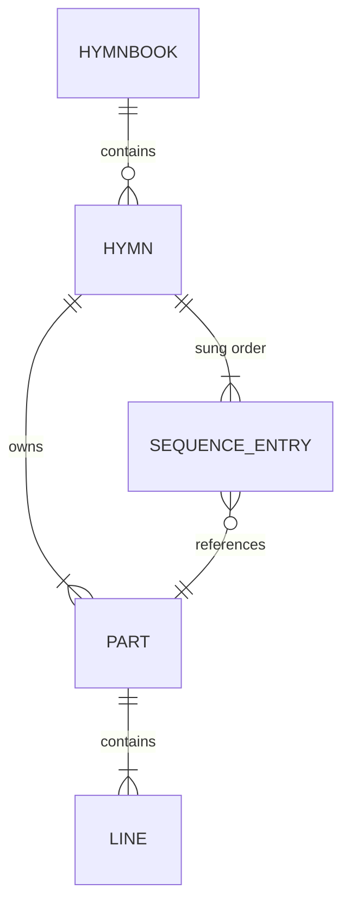

# SDD-0001 — Domain Model

- **Status:** Draft
- **Date:** 2026-09-20
- **Implements:** [ADR-0003](../decisions/0003-model-hymns-as-parts-and-an-occurrence-sequence.md),
  [ADR-0008](../decisions/0008-sqlite-as-the-on-device-content-store.md)

Detailed design for the core domain. Everything else depends on this, so it is
specified before anything is built.

---

## 1. Purpose

Define the entities, their identity, their invariants, and the address space
used to refer to a position within a hymn. Two things in particular have to be
unambiguous:

1. **A part is stored once and may be sung many times.**
2. **An occurrence — one position in the sung order — is addressable
   independently of the part whose text it shows.**

Everything the presentation layer needs in order to signal "this refrain again"
follows from the second point.

---

## 2. Entities



Note the cardinality on `SEQUENCE_ENTRY → PART`: **many-to-one**. That single
edge is the whole design.

### 2.1 Types

```ts
/**
 * Stable opaque slug, e.g. "mal-ymef-athmeeya-geethangal-16".
 * Never a display string.
 */
type HymnbookId = string;

/** Hymn number as printed. Unique within a hymnbook, not globally. */
type HymnNumber = number;

/** Unique within one hymn, e.g. "s1", "s2", "r". */
type PartId = string;

type PartKind = "stanza" | "refrain" | "bridge" | "tag";

interface Hymnbook {
  id: HymnbookId;
  title: string; // native-script title
  language: string; // BCP-47, e.g. "ml"
  script: string; // ISO 15924, e.g. "Mlym"
  publisher?: string;
  edition?: string;
  isbn?: string; // natural id for a published edition
  hymnCount: number;
}

interface Part {
  id: PartId;
  kind: PartKind;
  lines: string[];
  /** Display label, e.g. "1". Absent for refrains. */
  label?: string;
}

interface SequenceEntry {
  partId: PartId;
}

interface HymnMeta {
  author?: string;
  tune?: string;
  meter?: string;
  topics?: string[];
  scripture?: string[];
  copyright?: string;
}

interface Hymn {
  hymnbookId: HymnbookId;
  number: HymnNumber;
  title: string;
  parts: Part[];
  sequence: SequenceEntry[];
  meta: HymnMeta;
}
```

Everything in `HymnMeta` is optional. The corpus has almost none of it
([ADR-0009](../decisions/0009-migrate-the-corpus-by-rule.md)), and fields are
backfilled as they become available rather than invented.

`HymnbookId` stays a human slug, not a synthetic id (e.g. UUID), while the
content pipeline is the only publisher: a single writer can guarantee
uniqueness at build time the same way `HymnNumber` uniqueness is checked
(I7), so a coordination-free scheme buys nothing yet and would cost the
slug's legibility in URLs, filenames and debug output. Revisit this once
the CMS (Board #11) allows hymnbooks from more than one contributor — see
§8.

Slug convention: `<ISO 639-3 language>-<publisher>-<title>-<edition>[-<isbn>]`,
hyphen-separated, e.g. `mal-ymef-athmeeya-geethangal-16` (ISBN omitted when the
book has none). The id is **opaque**: it is used whole, as a filename, URL
segment and storage key, and never parsed. Publisher, edition and ISBN live in
their own fields. Slashes were rejected as separators because they would make
the id a path rather than a single token.

### 2.2 Occurrence — derived, never stored

```ts
interface Occurrence {
  /** Position in the effective sequence. */
  index: number;
  part: Part;
  /** Prior showings of this part. 0 is the first showing. */
  recurrenceIndex: number;
  /** Total showings of this part across the effective sequence. */
  totalRecurrences: number;
  /** True when produced by live navigation rather than stored data. */
  isAdHoc: boolean;
}
```

`recurrenceIndex` is the value the renderer needs. `> 0` means this text has
been shown before, and the visual treatment for repetition applies.

`totalRecurrences` allows a cue like "final time", which reads differently from
an intermediate repeat.

These are **computed from the sequence**, never persisted. Storing them would
create a second source of truth that could drift.

---

## 3. Address space

One scheme, used everywhere.

```ts
interface Position {
  hymnbookId: HymnbookId;
  hymnNumber: HymnNumber;
  occurrenceIndex: number;
  /** null focuses the whole part rather than a single line. */
  lineIndex: number | null;
}
```

Used by navigation, by restored position in user state, and — in Phase 2 — by
a follow source reporting where it believes the singing is
([ADR-0010](../decisions/0010-model-liveness-as-pluggable-follow-sources.md)).
Defining it once prevents three incompatible schemes appearing separately.

A `Position` addresses an **occurrence**, not a part. Pointing at a part would
be ambiguous the moment a refrain repeats — which is precisely the case that
matters.

---

## 4. Invariants

Enforced at **build time**, where a human can act on a failure. Violations fail
the content pipeline; they are never repaired silently
([arc42 §8.6](../architecture/arc42.md#86-handling-imperfect-content)).

| #   | Invariant                                                        | Rationale                                          |
| --- | ---------------------------------------------------------------- | -------------------------------------------------- |
| I1  | `PartId` is unique within a hymn                                 | References must resolve unambiguously              |
| I2  | Every `SequenceEntry.partId` resolves to a part in the same hymn | No dangling references                             |
| I3  | `sequence.length >= 1`                                           | A hymn with no sung order cannot be presented      |
| I4  | Every part has at least one line                                 | An empty part would render as a blank screen       |
| I5  | Every part is referenced by at least one sequence entry          | An unreferenced part is unreachable — a data error |
| I6  | Line text is non-empty after trimming                            | Blank lines are formatting, not content            |
| I7  | `HymnNumber` is unique within a hymnbook                         | It is the primary means of retrieval               |
| I8  | The sequence contains no unreferenced gaps in `idx`              | Ordering must be total and contiguous              |

I5 is worth stating explicitly: under the old model a chorus could exist while
no template branch ever displayed it. That failure becomes detectable here.

---

## 5. Sequence Engine

The one piece with genuinely intricate logic. **Pure** — no DOM, no framework,
no storage. It must be testable in isolation, and must not import SolidJS
([ADR-0005](../decisions/0005-use-solidjs.md)).

```ts
interface SequenceEngine {
  readonly hymn: Hymn;
  readonly cursor: Position;
  /** Length of the effective sequence, including ad-hoc entries. */
  readonly length: number;

  occurrenceAt(index: number): Occurrence | undefined;
  current(): Occurrence;

  next(): void;
  previous(): void;
  nextLine(): void;
  previousLine(): void;

  goTo(occurrenceIndex: number, lineIndex?: number | null): void;

  /** Append an ad-hoc occurrence of `partId` and move to it. */
  jumpToPart(partId: PartId): void;
}
```

### 5.1 Effective sequence

```text
effective = storedSequence ++ adHocEntries
```

The stored sequence is **never mutated**. Live deviation appends to a separate
list, so the corpus is not modified by presentation, and a hymn presented twice
starts identically both times.

### 5.2 Recurrence computation

For occurrence at index `i` with part `p`:

```text
recurrenceIndex(i)   = count of j < i  where effective[j].partId == p.id
totalRecurrences(p)  = count of j      where effective[j].partId == p.id
```

Computed over the **effective** sequence, so an ad-hoc repeat correctly
increments the count — the presenter jumping back to the chorus produces a
genuine fourth showing, and the cue reflects that.

### 5.3 Why append rather than rewind

`jumpToPart` appends rather than moving the cursor backwards. This keeps
history linear and monotonic, keeps `recurrenceIndex` truthful — rewinding
would show "third time" when it is really the fourth — and keeps a Phase 2
follow source and the local cursor in one consistent, forward-moving address
space.

### 5.4 Line navigation

`nextLine` advances within the current occurrence and rolls into the next
occurrence at its end. `lineIndex: null` means the whole part is focused, which
is the default when arriving at a new occurrence.

`OPEN:` Whether the default on arrival should be whole-part or first-line. This
is a feel question, answerable only with something on screen.

---

## 6. Storage schema

One SQLite database per hymnbook
([ADR-0008](../decisions/0008-sqlite-as-the-on-device-content-store.md)), so
`hymnbook` holds exactly one row and hymn numbers need no book qualifier.

```sql
CREATE TABLE hymnbook (
  id             TEXT PRIMARY KEY,
  title          TEXT NOT NULL,
  language       TEXT NOT NULL,   -- BCP-47
  script         TEXT NOT NULL,   -- ISO 15924
  publisher      TEXT,
  edition        TEXT,
  isbn           TEXT,
  schema_version INTEGER NOT NULL,
  content_hash   TEXT NOT NULL    -- SHA-256 of the source files, see §9
) STRICT;

CREATE TABLE hymn (
  number  INTEGER PRIMARY KEY,
  title   TEXT NOT NULL,
  author  TEXT,
  tune    TEXT,
  meter   TEXT
) STRICT;

CREATE TABLE part (
  hymn_number INTEGER NOT NULL REFERENCES hymn(number),
  id          TEXT NOT NULL,
  kind        TEXT NOT NULL CHECK (kind IN ('stanza','refrain','bridge','tag')),
  label       TEXT,
  PRIMARY KEY (hymn_number, id)
) STRICT;

CREATE TABLE line (
  hymn_number INTEGER NOT NULL,
  part_id     TEXT    NOT NULL,
  idx         INTEGER NOT NULL,
  text        TEXT    NOT NULL,
  PRIMARY KEY (hymn_number, part_id, idx),
  FOREIGN KEY (hymn_number, part_id) REFERENCES part(hymn_number, id)
) STRICT;

CREATE TABLE sequence_entry (
  hymn_number INTEGER NOT NULL,
  idx         INTEGER NOT NULL,
  part_id     TEXT    NOT NULL,
  PRIMARY KEY (hymn_number, idx),
  FOREIGN KEY (hymn_number, part_id) REFERENCES part(hymn_number, id)
) STRICT;

-- Search over whole hymns; retrieval is by number thereafter.
-- tokenchars: Malayalam dependent vowel signs (U+0D3E-U+0D4C), virama
-- (U+0D4D), and ZWJ/ZWNJ — unicode61 treats these as separators by
-- default, which fragments Malayalam words down to bare consonants. See
-- the note on risk R5 below.
CREATE VIRTUAL TABLE hymn_fts USING fts5(
  title,
  body,
  content = '',
  tokenize = 'unicode61 tokenchars ''ാിീുൂൃൄെേൈൊോൌ്‌‍'''
);
```

Notes:

- `STRICT` tables — type affinity errors in a content pipeline are exactly the
  class of bug that reaches a congregation as a wrong word.
- `sequence_entry` is the **only** place repetition is expressed. Nothing else
  in the schema knows about it.
- `hymn_fts` is contentless and rebuilt by the pipeline, not maintained by
  triggers; content is immutable at runtime.
- `schema_version` permits validating a downloaded package against the
  application before installing it; `content_hash` tells the application
  whether the lyrics themselves have changed (§9).

Resolved — risk R5 in
[arc42 §11](../architecture/arc42.md#11-risks-and-technical-debt). Spiked
against the real 1,631-hymn corpus (Board #3): the corpus is already NFC, and
chillu letters tokenise correctly by default (they're ordinary Letter-category
codepoints). Default `unicode61` fragments words at every vowel sign and
virama, though — `വാഴ്ത്തുക` ("praise") reduced to bare consonants `ക`/`ത`/`ഴ`/`വ`,
which would make search match almost everything. Adding those marks (plus
ZWJ/ZWNJ) to `tokenchars`, as above, fixed it: the same word survives whole,
and word and prefix search both work correctly across the full corpus. A
custom tokenizer or the `trigram` fallback proved unnecessary.

---

## 7. Migration from the legacy corpus

Per [ADR-0009](../decisions/0009-migrate-the-corpus-by-rule.md). Legacy record:

```jsonc
{
  "id": 1,
  "author": "KVS",
  "starts": "chorus",
  "chorus": [],
  "bridge": [],
  "verses": [[]],
}
```

| Legacy               | Becomes                                                     |
| -------------------- | ----------------------------------------------------------- |
| `id`                 | `hymn.number`                                               |
| `author`             | `hymn.author`, `NULL` when empty (325 hymns)                |
| `verses[i]`          | Part `s{i+1}`, kind `stanza`, label `{i+1}`                 |
| `chorus` (non-empty) | Part `r`, kind `refrain`                                    |
| `bridge`             | **Dropped.** Empty in all 1,631 records; survives as a kind |
| `starts`             | Determines the first sequence entry                         |
| —                    | `hymn.title` := first line of the first sequence entry      |

Sequence derivation:

| Legacy shape                     | Count | Sequence                     |
| -------------------------------- | ----- | ---------------------------- |
| Chorus + verses                  | 918   | `r, s1, r, s2, r, … sN, r`   |
| Verses + chorus, starts at verse | 270   | `s1, r, s2, r, … sN, r`      |
| Verses, no chorus                | 345   | `s1, s2, … sN`               |
| Chorus only, no verses           | 98    | `s1` — one stanza, no repeat |

The last row is a deliberate reinterpretation. A part that never repeats is not
a refrain; calling it one was an artefact of the old template switch. These
become a single stanza with a one-entry sequence.

**Migration output is source, not a build artifact.** It is committed, and
corrections are applied to it directly. Re-running the migration wholesale
would discard accumulated corrections, so it must not run as part of the build.

### 7.1 Output layout and script

```text
content/<hymnbook-id>/hymnbook.json   # Hymnbook metadata
content/<hymnbook-id>/0001.json …     # one hymn each
```

A hymn file is the domain `Hymn` minus `hymnbookId` (the directory supplies
it): `number`, `title`, `parts`, `sequence`, `meta`. Source and runtime types
are the same, so there is no second schema to maintain.

The conversion is a pure function in `scripts/legacy-convert.ts`, unit tested;
`scripts/migrate-legacy.ts` is the thin filesystem and git wrapper around it.
Both are kept in the repo as the record of how the corpus was derived:

- Reads the legacy JSON from git history (`155baea`), since `archive/` is gone.
- **Refuses to run if the output directory exists**, so accumulated corrections
  cannot be overwritten. This enforces the invariant in code.
- Text is otherwise copied verbatim (no Unicode normalisation; the corpus is
  already NFC), with two deliberate exceptions found by measuring the corpus:
  - **Leading and trailing whitespace is trimmed** (11 lines).
  - **Empty lines are dropped** (37 lines, all inside the choruses of 12 hymns:
    156, 666, 753, 856, 864, 890, 895, 901, 924, 930, 1066, 1335). Those
    choruses are multi-paragraph and every one of the 12 also has verses,
    e.g. 930 has 10 verses and 11 chorus paragraphs, which suggests a different
    refrain after each verse. The rules cannot infer that, so each becomes a
    single refrain and the report flags the 12 for hand correction. The original
    paragraphing remains in git history.
- Fails on any legacy shape the rules do not cover: non-empty `bridge`, an
  empty verse, an unknown `starts`, or a `starts` inconsistent with the shape.
- Reports shape counts, which must match the table above (918 / 270 / 345 / 98),
  and asserts every non-empty legacy line appears exactly once in the output,
  in order.

The first hymnbook is _Athmeeya Geethangal / Spiritual Hymns_, 16th edition,
General YMEF and Premier Bible Publication, 1,631 hymns. No ISBN was found in
any listing; `isbn` stays absent until the printed copy is checked.

---

## 8. Open questions

| Question                                            | Resolve by                                  |
| --------------------------------------------------- | ------------------------------------------- |
| Default focus on arrival — whole part or first line | Trying it on screen                         |
| Whether `tag` and `bridge` kinds are ever populated | A second hymnbook                           |
| Cross-book hymn identity for parallel translations  | Deferred until a second book exists         |
| Word-level addressing below `lineIndex`             | Phase 2, if lyric alignment proves feasible |
| Synthetic multi-publisher `HymnbookId` (e.g. UUID7) | CMS (Board #11), if publishing is opened up |

---

## 9. Content pipeline

Turns `content/<hymnbook-id>/` into `dist/content/<hymnbook-id>.sqlite`
(Board #5). Run as `bun run build:content`: a plain Bun script, independent of
Vite, so the future CMS (Board #11) can reuse it. It uses `bun:sqlite`: the
spike showed FTS5 tokenisation is identical to the browser's `wa-sqlite`, since
both are the same C code.

1. **Load** `hymnbook.json` and every `NNNN.json`.
2. **Validate everything** (below), collecting every violation.
3. **Build** the package per §6, only if validation found nothing.
4. **Hash** the source and record it in `hymnbook.content_hash`.

**Validation collects all violations**, each with hymn number and rule, and
exits non-zero if there are any: one pass shows everything to fix, and nothing
is ever repaired ([arc42 §8.6](../architecture/arc42.md#86-handling-imperfect-content)).
The rules are pure functions in `src/domain/validate.ts`, framework-free, so the
CMS can apply the same checks. They cover I1-I7, plus:

- The file name matches `number`, and the hymn count matches
  `hymnbook.hymnCount`.
- **Unsupported metadata fails.** §6 stores only `author`, `tune` and `meter`;
  a hymn carrying `topics`, `scripture` or `copyright` is a violation rather
  than a silent drop, until the schema is extended to hold them.
- I8 holds by construction: the pipeline assigns `idx` 0..n-1 from the
  sequence array, so gaps cannot occur.

**Full-text index.** One `hymn_fts` row per hymn, `rowid` = hymn number, `body`
= the lines of each part **once**, in part order and not in sung order, so a
repeated refrain is not weighted up.

**Versioning.** `schema_version` gates compatibility with the application.
`content_hash` is a SHA-256 over the source files (name and bytes, in a fixed
order), so any lyric correction changes it and the same source always yields the
same hash. It is deliberately not a build timestamp: rebuilding unchanged
content must not look like an update.
