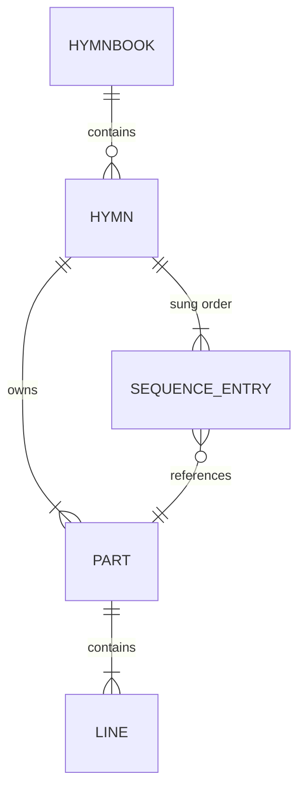

# SDD-0001 — Domain Model

- **Status:** Draft
- **Date:** 2026-09-20
- **Implements:** [ADR-0003](../decisions/0003-model-hymns-as-parts-and-an-occurrence-sequence.md),
  [ADR-0008](../decisions/0008-sqlite-as-the-on-device-content-store.md)

Detailed design for the core domain. Everything else depends on this, so it is
specified before anything is built.

---

## 1. Purpose

Define the entities, their identity, their invariants, and the address space
used to refer to a position within a hymn. Two things in particular have to be
unambiguous:

1. **A part is stored once and may be sung many times.**
2. **An occurrence — one position in the sung order — is addressable
   independently of the part whose text it shows.**

Everything the presentation layer needs in order to signal "this refrain again"
follows from the second point.

---

## 2. Entities



Note the cardinality on `SEQUENCE_ENTRY → PART`: **many-to-one**. That single
edge is the whole design.

### 2.1 Types

```ts
/**
 * Stable opaque slug, e.g. "mal-ymef-athmeeya-geethangal-16".
 * Never a display string.
 */
type HymnbookId = string;

/** Hymn number as printed. Unique within a hymnbook, not globally. */
type HymnNumber = number;

/** Unique within one hymn, e.g. "s1", "s2", "r". */
type PartId = string;

type PartKind = "stanza" | "refrain" | "bridge" | "tag";

interface Hymnbook {
  id: HymnbookId;
  title: string; // native-script title
  language: string; // BCP-47, e.g. "ml"
  script: string; // ISO 15924, e.g. "Mlym"
  publisher?: string;
  edition?: string;
  isbn?: string; // natural id for a published edition
  hymnCount: number;
}

interface Part {
  id: PartId;
  kind: PartKind;
  lines: string[];
  /** Display label, e.g. "1". Absent for refrains. */
  label?: string;
}

interface SequenceEntry {
  partId: PartId;
}

interface HymnMeta {
  author?: string;
  tune?: string;
  meter?: string;
  topics?: string[];
  scripture?: string[];
  copyright?: string;
}

interface Hymn {
  hymnbookId: HymnbookId;
  number: HymnNumber;
  title: string;
  parts: Part[];
  sequence: SequenceEntry[];
  meta: HymnMeta;
}
```

Everything in `HymnMeta` is optional. The corpus has almost none of it
([ADR-0009](../decisions/0009-migrate-the-corpus-by-rule.md)), and fields are
backfilled as they become available rather than invented.

`HymnbookId` stays a human slug, not a synthetic id (e.g. UUID), while the
content pipeline is the only publisher: a single writer can guarantee
uniqueness at build time the same way `HymnNumber` uniqueness is checked
(I7), so a coordination-free scheme buys nothing yet and would cost the
slug's legibility in URLs, filenames and debug output. Revisit this once
the CMS (Board #11) allows hymnbooks from more than one contributor — see
§8.

Slug convention: `<ISO 639-3 language>-<publisher>-<title>-<edition>[-<isbn>]`,
hyphen-separated, e.g. `mal-ymef-athmeeya-geethangal-16` (ISBN omitted when the
book has none). The id is **opaque**: it is used whole, as a filename, URL
segment and storage key, and never parsed. Publisher, edition and ISBN live in
their own fields. Slashes were rejected as separators because they would make
the id a path rather than a single token.

### 2.2 Occurrence — derived, never stored

```ts
interface Occurrence {
  /** Position in the effective sequence. */
  index: number;
  part: Part;
  /**
   * How many times in a row — including this one — the same part has now
   * shown back-to-back. 1 means "not a repeat." Only an *immediately
   * adjacent* recurrence counts; verse → chorus → verse → chorus is the
   * song's normal printed form, not a repeat (revised in the Presenter
   * redesign — see §16 — after the original "any prior occurrence
   * anywhere" definition proved wrong against the real corpus: 0 of 1,631
   * hymns ever repeat a part back-to-back in their stored sequence, while
   * 1,186 have the ordinary non-adjacent pattern, which the original
   * definition mistakenly flagged as a repeat on the majority of the
   * hymnal).
   */
  repeatOrdinal: number;
  /** True when produced by live navigation rather than stored data. */
  isAdHoc: boolean;
}
```

`repeatOrdinal > 1` is the value the renderer needs: this text is being sung
immediately again, and the visual treatment for repetition applies. In
practice this only ever fires for a live, ad-hoc jump back to a part already
showing — never during ordinary navigation through the stored sequence — so
the cue is effectively an operator-facing signal for R6 overrides, not a
structural feature of the hymn.

No `totalRecurrences` field: for a live ad-hoc repeat, how many more times
the presenter will jump back isn't knowable in advance, so a cue implying a
known total (e.g. "final time") would be lying. `repeatOrdinal` is a plain,
honest running count instead.

This is **computed from the sequence**, never persisted. Storing it would
create a second source of truth that could drift.

---

## 3. Address space

One scheme, used everywhere.

```ts
interface Position {
  hymnbookId: HymnbookId;
  hymnNumber: HymnNumber;
  occurrenceIndex: number;
  /** null focuses the whole part rather than a single line. */
  lineIndex: number | null;
}
```

Used by navigation, by restored position in user state, and — in Phase 2 — by
a follow source reporting where it believes the singing is
([ADR-0010](../decisions/0010-model-liveness-as-pluggable-follow-sources.md)).
Defining it once prevents three incompatible schemes appearing separately.

A `Position` addresses an **occurrence**, not a part. Pointing at a part would
be ambiguous the moment a refrain repeats — which is precisely the case that
matters.

---

## 4. Invariants

Enforced at **build time**, where a human can act on a failure. Violations fail
the content pipeline; they are never repaired silently
([arc42 §8.6](../architecture/arc42.md#86-handling-imperfect-content)).

| #   | Invariant                                                        | Rationale                                          |
| --- | ---------------------------------------------------------------- | -------------------------------------------------- |
| I1  | `PartId` is unique within a hymn                                 | References must resolve unambiguously              |
| I2  | Every `SequenceEntry.partId` resolves to a part in the same hymn | No dangling references                             |
| I3  | `sequence.length >= 1`                                           | A hymn with no sung order cannot be presented      |
| I4  | Every part has at least one line                                 | An empty part would render as a blank screen       |
| I5  | Every part is referenced by at least one sequence entry          | An unreferenced part is unreachable — a data error |
| I6  | Line text is non-empty after trimming                            | Blank lines are formatting, not content            |
| I7  | `HymnNumber` is unique within a hymnbook                         | It is the primary means of retrieval               |
| I8  | The sequence contains no unreferenced gaps in `idx`              | Ordering must be total and contiguous              |

I5 is worth stating explicitly: under the old model a chorus could exist while
no template branch ever displayed it. That failure becomes detectable here.

---

## 5. Sequence Engine

The one piece with genuinely intricate logic. **Pure** — no DOM, no framework,
no storage. It must be testable in isolation, and must not import SolidJS
([ADR-0005](../decisions/0005-use-solidjs.md)).

```ts
interface SequenceEngine {
  readonly hymn: Hymn;
  readonly cursor: Position;
  /** Length of the effective sequence, including ad-hoc entries. */
  readonly length: number;

  occurrenceAt(index: number): Occurrence | undefined;
  current(): Occurrence;

  next(): void;
  previous(): void;
  nextLine(): void;
  previousLine(): void;

  goTo(occurrenceIndex: number, lineIndex?: number | null): void;

  /** Append an ad-hoc occurrence of `partId` and move to it. */
  jumpToPart(partId: PartId): void;
}
```

### 5.1 Effective sequence

```text
effective = storedSequence ++ adHocEntries
```

The stored sequence is **never mutated**. Live deviation appends to a separate
list, so the corpus is not modified by presentation, and a hymn presented twice
starts identically both times.

### 5.2 Recurrence computation

For occurrence at index `i` with part `p`, walking backward only while the
part stays the same — **adjacency, not "anywhere earlier"**:

```text
repeatOrdinal(i) = 1 + count of consecutive j = i-1, i-2, ...
                       while effective[j].partId == p.id
```

Computed over the **effective** sequence, so a live jump back to a part
already showing correctly extends the streak — the presenter jumping back to
the chorus a second time in a row produces `repeatOrdinal = 2`, a third
`= 3`, and the cue reflects that. A single verse between two showings of the
chorus resets the streak to 1 (not a repeat) — that's the whole point of the
adjacency rule (§2.2).

### 5.3 Why append rather than rewind

`jumpToPart` appends rather than moving the cursor backwards. This keeps
history linear and monotonic, keeps `repeatOrdinal` truthful — rewinding
would show "second time" for what's really the third consecutive
showing — and keeps a Phase 2 follow source and the local cursor in one
consistent, forward-moving address space.

### 5.4 Line navigation

`nextLine` advances within the current occurrence and rolls into the next
occurrence at its end. `lineIndex: null` means the whole part is focused, which
is the default when arriving at a new occurrence.

`OPEN:` Whether the default on arrival should be whole-part or first-line. This
is a feel question, answerable only with something on screen.

---

## 6. Storage schema

One SQLite database per hymnbook
([ADR-0008](../decisions/0008-sqlite-as-the-on-device-content-store.md)), so
`hymnbook` holds exactly one row and hymn numbers need no book qualifier.

```sql
CREATE TABLE hymnbook (
  id             TEXT PRIMARY KEY,
  title          TEXT NOT NULL,
  language       TEXT NOT NULL,   -- BCP-47
  script         TEXT NOT NULL,   -- ISO 15924
  publisher      TEXT,
  edition        TEXT,
  isbn           TEXT,
  schema_version INTEGER NOT NULL,
  content_hash   TEXT NOT NULL    -- SHA-256 of the source files, see §9
) STRICT;

CREATE TABLE hymn (
  number  INTEGER PRIMARY KEY,
  title   TEXT NOT NULL,
  author  TEXT,
  tune    TEXT,
  meter   TEXT
) STRICT;

CREATE TABLE part (
  hymn_number INTEGER NOT NULL REFERENCES hymn(number),
  id          TEXT NOT NULL,
  kind        TEXT NOT NULL CHECK (kind IN ('stanza','refrain','bridge','tag')),
  label       TEXT,
  PRIMARY KEY (hymn_number, id)
) STRICT;

CREATE TABLE line (
  hymn_number INTEGER NOT NULL,
  part_id     TEXT    NOT NULL,
  idx         INTEGER NOT NULL,
  text        TEXT    NOT NULL,
  PRIMARY KEY (hymn_number, part_id, idx),
  FOREIGN KEY (hymn_number, part_id) REFERENCES part(hymn_number, id)
) STRICT;

CREATE TABLE sequence_entry (
  hymn_number INTEGER NOT NULL,
  idx         INTEGER NOT NULL,
  part_id     TEXT    NOT NULL,
  PRIMARY KEY (hymn_number, idx),
  FOREIGN KEY (hymn_number, part_id) REFERENCES part(hymn_number, id)
) STRICT;

-- Search over whole hymns; retrieval is by number thereafter.
-- tokenchars: Malayalam dependent vowel signs (U+0D3E-U+0D4C), virama
-- (U+0D4D), and ZWJ/ZWNJ — unicode61 treats these as separators by
-- default, which fragments Malayalam words down to bare consonants. See
-- the note on risk R5 below.
CREATE VIRTUAL TABLE hymn_fts USING fts5(
  title,
  body,
  content = '',
  tokenize = 'unicode61 tokenchars ''ാിീുൂൃൄെേൈൊോൌ്‌‍'''
);
```

Notes:

- `STRICT` tables — type affinity errors in a content pipeline are exactly the
  class of bug that reaches a congregation as a wrong word.
- `sequence_entry` is the **only** place repetition is expressed. Nothing else
  in the schema knows about it.
- `hymn_fts` is contentless and rebuilt by the pipeline, not maintained by
  triggers; content is immutable at runtime.
- `schema_version` permits validating a downloaded package against the
  application before installing it; `content_hash` tells the application
  whether the lyrics themselves have changed (§9).

Resolved — risk R5 in
[arc42 §11](../architecture/arc42.md#11-risks-and-technical-debt). Spiked
against the real 1,631-hymn corpus (Board #3): the corpus is already NFC, and
chillu letters tokenise correctly by default (they're ordinary Letter-category
codepoints). Default `unicode61` fragments words at every vowel sign and
virama, though — `വാഴ്ത്തുക` ("praise") reduced to bare consonants `ക`/`ത`/`ഴ`/`വ`,
which would make search match almost everything. Adding those marks (plus
ZWJ/ZWNJ) to `tokenchars`, as above, fixed it: the same word survives whole,
and word and prefix search both work correctly across the full corpus. A
custom tokenizer or the `trigram` fallback proved unnecessary.

---

## 7. Migration from the legacy corpus

Per [ADR-0009](../decisions/0009-migrate-the-corpus-by-rule.md). Legacy record:

```jsonc
{
  "id": 1,
  "author": "KVS",
  "starts": "chorus",
  "chorus": [],
  "bridge": [],
  "verses": [[]],
}
```

| Legacy               | Becomes                                                     |
| -------------------- | ----------------------------------------------------------- |
| `id`                 | `hymn.number`                                               |
| `author`             | `hymn.author`, `NULL` when empty (325 hymns)                |
| `verses[i]`          | Part `s{i+1}`, kind `stanza`, label `{i+1}`                 |
| `chorus` (non-empty) | Part `r`, kind `refrain`                                    |
| `bridge`             | **Dropped.** Empty in all 1,631 records; survives as a kind |
| `starts`             | Determines the first sequence entry                         |
| —                    | `hymn.title` := first line of the first sequence entry      |

Sequence derivation:

| Legacy shape                     | Count | Sequence                     |
| -------------------------------- | ----- | ---------------------------- |
| Chorus + verses                  | 918   | `r, s1, r, s2, r, … sN, r`   |
| Verses + chorus, starts at verse | 270   | `s1, r, s2, r, … sN, r`      |
| Verses, no chorus                | 345   | `s1, s2, … sN`               |
| Chorus only, no verses           | 98    | `s1` — one stanza, no repeat |

The last row is a deliberate reinterpretation. A part that never repeats is not
a refrain; calling it one was an artefact of the old template switch. These
become a single stanza with a one-entry sequence.

**Migration output is source, not a build artifact.** It is committed, and
corrections are applied to it directly. Re-running the migration wholesale
would discard accumulated corrections, so it must not run as part of the build.

### 7.1 Output layout and script

```text
content/<hymnbook-id>/hymnbook.json   # Hymnbook metadata
content/<hymnbook-id>/0001.json …     # one hymn each
```

A hymn file is the domain `Hymn` minus `hymnbookId` (the directory supplies
it): `number`, `title`, `parts`, `sequence`, `meta`. Source and runtime types
are the same, so there is no second schema to maintain.

The conversion is a pure function in `scripts/legacy-convert.ts`, unit tested;
`scripts/migrate-legacy.ts` is the thin filesystem and git wrapper around it.
Both are kept in the repo as the record of how the corpus was derived:

- Reads the legacy JSON from git history (`155baea`), since `archive/` is gone.
- **Refuses to run if the output directory exists**, so accumulated corrections
  cannot be overwritten. This enforces the invariant in code.
- Text is otherwise copied verbatim (no Unicode normalisation; the corpus is
  already NFC), with two deliberate exceptions found by measuring the corpus:
  - **Leading and trailing whitespace is trimmed** (11 lines).
  - **Empty lines are dropped** (37 lines, all inside the choruses of 12 hymns:
    156, 666, 753, 856, 864, 890, 895, 901, 924, 930, 1066, 1335). Those
    choruses are multi-paragraph and every one of the 12 also has verses,
    e.g. 930 has 10 verses and 11 chorus paragraphs, which suggests a different
    refrain after each verse. The rules cannot infer that, so each becomes a
    single refrain and the report flags the 12 for hand correction. The original
    paragraphing remains in git history.
- Fails on any legacy shape the rules do not cover: non-empty `bridge`, an
  empty verse, an unknown `starts`, or a `starts` inconsistent with the shape.
- Reports shape counts, which must match the table above (918 / 270 / 345 / 98),
  and asserts every non-empty legacy line appears exactly once in the output,
  in order.

The first hymnbook is _Athmeeya Geethangal / Spiritual Hymns_, 16th edition,
General YMEF and Premier Bible Publication, 1,631 hymns. No ISBN was found in
any listing; `isbn` stays absent until the printed copy is checked.

---

## 8. Open questions

| Question                                            | Resolve by                                  |
| --------------------------------------------------- | ------------------------------------------- |
| Default focus on arrival — whole part or first line | Trying it on screen                         |
| Whether `tag` and `bridge` kinds are ever populated | A second hymnbook                           |
| Cross-book hymn identity for parallel translations  | Deferred until a second book exists         |
| Word-level addressing below `lineIndex`             | Phase 2, if lyric alignment proves feasible |
| Synthetic multi-publisher `HymnbookId` (e.g. UUID7) | CMS (Board #11), if publishing is opened up |

---

## 9. Content pipeline

Turns `content/<hymnbook-id>/` into `public/content/<hymnbook-id>.sqlite`
(Board #5). Run as `bun run build:content`: a plain Bun script, independent of
Vite, so the future CMS (Board #11) can reuse it. It uses `bun:sqlite`: the
spike showed FTS5 tokenisation is identical to the browser's SQLite Wasm build
([ADR-0015](../decisions/0015-use-official-sqlite-wasm-not-wa-sqlite.md)),
since both are the same C code.

1. **Load** `hymnbook.json` and every `NNNN.json`.
2. **Validate everything** (below), collecting every violation.
3. **Build** the package per §6, only if validation found nothing.
4. **Hash** the source and record it in `hymnbook.content_hash`.

**Validation collects all violations**, each with hymn number and rule, and
exits non-zero if there are any: one pass shows everything to fix, and nothing
is ever repaired ([arc42 §8.6](../architecture/arc42.md#86-handling-imperfect-content)).
The rules are pure functions in `src/domain/validate.ts`, framework-free, so the
CMS can apply the same checks. They cover I1-I7, plus:

- The file name matches `number`, and the hymn count matches
  `hymnbook.hymnCount`.
- **Unsupported metadata fails.** §6 stores only `author`, `tune` and `meter`;
  a hymn carrying `topics`, `scripture` or `copyright` is a violation rather
  than a silent drop, until the schema is extended to hold them.
- I8 holds by construction: the pipeline assigns `idx` 0..n-1 from the
  sequence array, so gaps cannot occur.

**Full-text index.** One `hymn_fts` row per hymn, `rowid` = hymn number, `body`
= the lines of each part **once**, in part order and not in sung order, so a
repeated refrain is not weighted up.

**Versioning.** `schema_version` gates compatibility with the application.
`content_hash` is a SHA-256 over the source files (name and bytes, in a fixed
order), so any lyric correction changes it and the same source always yields the
same hash. It is deliberately not a build timestamp: rebuilding unchanged
content must not look like an update.

---

## 10. Persistence — content store

Board #6 part 1. Runtime counterpart to §9: opens the package §9 builds and
answers queries. Per [ADR-0015](../decisions/0015-use-official-sqlite-wasm-not-wa-sqlite.md),
`@sqlite.org/sqlite-wasm`'s `opfs-sahpool` VFS, not `wa-sqlite`.

### 10.1 Why a worker

OPFS's synchronous file access (`FileSystemSyncAccessHandle`, what
`opfs-sahpool` is built on) only exists inside a Worker — not a constraint
this project chose, a constraint of the platform. So the content store is a
dedicated Worker (`src/persistence/content-store.worker.ts`) that owns the
`sqlite3` module, the SAH pool, and every open database. The main thread never
touches SQLite directly.

The worker exposes a narrow class over [Comlink](https://github.com/GoogleChromeLabs/comlink)
(also used by `wa-sqlite`'s own demos, and still the right tool now that
sqlite-wasm's own Worker1/Promiser API is deprecated — its README says to
"load the module and interact with it as a library," which is exactly this
shape). A thin main-thread client wraps the Comlink proxy so Library, Finder
and Presenter (Board #7-9) see a plain async interface and never import
Comlink or know a worker is involved.

### 10.2 Provisioning

On worker startup: `sqlite3.installOpfsSAHPoolVfs()`, then check
`poolUtil.getFileNames()` for `<hymnbook-id>.sqlite3`. If present, open it
(`new poolUtil.OpfsSAHPoolDb(name)`). If absent — first run, or OPFS was
evicted (arc42 R4) — fetch the bundled package (a Vite build asset, the exact
file §9 produces) and hand its bytes to `poolUtil.importDb(name, bytes)`,
which writes it directly; no SQL involved. Phase 1 has one bundled book and no
download path (scope guard), so this only ever provisions from the build
asset, never a network fetch of a separate package. Fetched via Vite's
`import.meta.env.BASE_URL`, not a root-absolute path — the app must still work
when served from a subpath, e.g. a GitHub Pages project page.

A corrupt or partial file is a provisioning failure, reported as a distinct
state rather than thrown as a generic error, so the app can offer "reinstall
content" (re-run this same step) instead of crashing — consistent with
[arc42 §8.6](../architecture/arc42.md#86-handling-imperfect-content): never
silently repair, never guess.

### 10.3 Query surface

Read-only — content is immutable at runtime (an invariant, §4). The worker
exposes exactly what Library/Finder/Presenter need, nothing shaped like a
general SQL client:

```ts
interface ContentStore {
  getHymnbook(id: HymnbookId): Promise<Hymnbook>;
  listHymns(id: HymnbookId): Promise<{ number: number; title: string }[]>;
  getHymn(id: HymnbookId, number: number): Promise<HymnSource>;
  searchLyrics(
    id: HymnbookId,
    query: string,
  ): Promise<{ number: number; title: string; snippet: string }[]>;
}
```

Built on the OO1 API's `selectObjects()`/`exec()`, not raw
`prepare`/`step`/`finalize` — the official build's query surface is
object-returning, unlike `wa-sqlite`'s integer-pointer handles.

`searchLyrics`'s matching (per-word prefix, implicit AND, capped at 30
results) was settled in Board #8 — see §13.

### 10.4 Known limitation

`opfs-sahpool` does not support multiple simultaneous connections
(ADR-0015). Two tabs open at once on the same origin: the second fails to
acquire the store. Accepted for Phase 1 — the scope guard is single-_device_,
which doesn't promise single-tab. `OPEN:` revisit if reported.

### 10.5 Testing

OPFS, Workers and Wasm don't exist in the Bun/vitest environment §9's tests
run in — this can only be verified in a real browser, the same way Board #1's
scaffold was. Anything with no browser-only dependency (name mapping, request
shaping) is unit tested; the worker's OPFS/Wasm glue is not, and is checked by
hand each time it changes.

## 11. Persistence — user state

Board #6 part 2. The second store from [ADR-0008](../decisions/0008-sqlite-as-the-on-device-content-store.md):
small, mutable, irreplaceable, via `idb` on the main thread — no OPFS, no
Worker, plain `IndexedDB`. Per [ADR-0012](../decisions/0012-drop-the-bookmark-helper.md),
user state is preferences, recents, last position and installed hymnbooks.
This part builds the two Board #8/#9 already had a caller for — **last
position** and **recents** — plus **preferences**, added in Board #10 once
the display-settings board actually needed them (SDD-0001 §15).
Installed-hymnbook tracking still gets its own shape when a board needs it.

**One object store, one document.** A few hundred bytes, never queried, no
relations — an idb object store named `state` holding a single record at a
fixed key is simpler than one store per field and has no cross-store
consistency to maintain. Every accessor reads the whole document,
patches the one field it owns, and writes it back.

```ts
interface Preferences {
  theme: "system" | "light" | "dark";
  fontScale: number;
}

interface UserState {
  getLastPosition(): Promise<Position | undefined>;
  setLastPosition(position: Position): Promise<void>;
  getRecents(): Promise<RecentEntry[]>;
  addRecent(hymnbookId: HymnbookId, hymnNumber: HymnNumber): Promise<void>;
  getPreferences(): Promise<Preferences>;
  setPreferences(preferences: Preferences): Promise<void>;
}
```

`lastPosition` reuses the domain's own `Position` (§3) verbatim — it already
is "one address space, used everywhere," so persisting it is a straight
round-trip, not a new shape. A `RecentEntry` is coarser (`hymnbookId` +
`hymnNumber` + `viewedAt`): recents identify a hymn worth returning to, not a
Presenter resume point. `addRecent` de-duplicates by `(hymnbookId,
hymnNumber)`, moving a re-viewed hymn to the front, and caps the list at 20 —
a fixed, low-stakes bound rather than a configurable one.

`Preferences` is unconditionally readable — `getPreferences` always resolves,
defaulting to `DEFAULT_PREFERENCES` (`{ theme: "system", fontScale: 1 }`)
rather than `undefined`, because every render needs a value to apply and
there's no meaningful "unset" state to show. Unlike `lastPosition` when it was
first built (§11 originally, before Board #10), this write has an immediate
reader the moment it's added — `Settings` applies it on load — so persisting
it doesn't repeat the "write with no reader yet" mistake Board #9 avoided for
`setLastPosition` (§14). `setLastPosition` itself stays unwired regardless.

**Testing.** Unlike the content store, plain `IndexedDB` has a faithful
in-memory implementation (`fake-indexeddb`), so this is fully unit tested —
no browser-only gap here. `openUserState(dbName)` takes the database name as
a parameter precisely so tests can open an isolated instance per test rather
than sharing state through a module-level singleton; app code uses the
`userState` singleton export.

## 12. Library

Board #7. arc42 §5.1 defines Library as "list, install, remove hymnbooks;
know which are available offline" — but Phase 1 ships exactly one hymnbook,
bundled at build time, with no download path (§10.2). With nothing to choose
between, Library is narrowed to the one thing that's real today: the
first-run provisioning gate.

`src/library/Library.tsx` calls `ContentStore.ensureInstalled` for the one
bundled `HymnbookId` on mount (a Solid `createResource`), and renders one of
three states:

- **pending** — `Loading…`.
- **error** — a message specific to the failing `ContentStatus`
  (`missing-asset`, `corrupt`, `schema-mismatch`), plus a **Retry** button
  that re-runs provisioning. This is arc42 §8.6's "offer reinstall content
  instead of crashing," concretely.
- **ready** — the hymnbook's title, hymn count and edition. This is the
  entire "know which are available offline" answer while there's only one
  book to know about.

**Not built:** a list/picker UI, install, remove, or any persisted notion of
"installed hymnbooks" — user state's `installed` field (§11) stays
unbuilt for the same reason. All of it returns as its own decision once a
second hymnbook exists, rather than being guessed at now. Navigation to
Finder/Presenter (Board #8/#9) is also not wired yet — there is nothing to
navigate to.

**Navigation, once there is something to navigate to,** will be Solid signal
state (a `view` union swapping which component renders), not a router —
Phase 1 is single-device with no deep-linking requirement
([ADR-0012](../decisions/0012-drop-the-bookmark-helper.md) dropped
bookmarking in favour of recents + last position), and a router is a
dependency with nothing to spend it on yet.

**Testing.** `Library` takes `hymnbookId` and `store` as optional props,
defaulting to `BUNDLED_HYMNBOOK_ID` and `getContentStore()` — tests inject a
fake `ContentStore` instead of touching the real Worker/OPFS, so all four
states (pending, each error, ready, retry) are unit tested despite the
underlying store not being (§10.5).

`BUNDLED_HYMNBOOK_ID` itself lives in `src/config.ts`, not here — Finder
(§13) needs it too, and a UI component module is the wrong place for a
value other components import.

## 13. Finder

Board #8. arc42 §5.1: "retrieval by number and by lyric text; recents" —
explicitly not ranking beyond relevance, not favourites. `src/finder/Finder.tsx`
is one search box with no mode toggle: all-digit input is a hymn number
(`ContentStore.getHymn`), anything else is lyric text
(`ContentStore.searchLyrics`). The input shape decides the path, matching how
people actually search a hymnal ("I know it's 42" vs. "how does it start").

**Number lookup is direct, not a results list.** `getHymn` either succeeds —
in which case the hymn is immediately selected, no extra click — or fails,
reported as "No hymn numbered N." There is nothing to disambiguate: a number
identifies at most one hymn.

**Lyric search matching** (moved into `content-store.worker.ts`'s
`searchLyrics`, replacing the whole-phrase placeholder from §10.3): each word
becomes a quoted FTS5 prefix term (`"word"*`), joined with spaces for
implicit AND. A query matches lines containing all the words, regardless of
order, and matches as the user finishes typing a word. Each term is quoted
(not merely escaped) so FTS5 query-syntax characters in free text can't break
the query — the same defence the placeholder had, kept. **Capped at 30
results** (`SEARCH_LIMIT`): found by browser-testing against the real corpus
— a common word matches hundreds of hymns, and `rank` ordering doesn't help a
caller that renders every row. The snippet is the first line containing any
query word, since a multi-word query can match across different lines of the
same hymn.

**Picking a hymn** (from a number lookup, a search result, or a recent) hands
its number straight to an `onSelect(number)` callback and nothing else.
**Finder never opens or renders the hymn**, and — revised in Board #9 — it no
longer records it as recent either: `userState.addRecent` moved to Presenter,
because a hymn picked in Finder isn't necessarily opened, and a search result
clicked by mistake shouldn't count as "recently viewed." Recording happens
where a hymn is actually opened; see §14. `hymns()` off `ContentStore.listHymns`,
requested once per mount, still backs the title shown for each recent —
`RecentEntry` (§11) only carries `hymnNumber`.

**Navigation.** `App.tsx` holds the `view` signal promised in §12: `"library"
| "finder" | "presenter"`. `Library` gains an `onReady` callback prop — its
ready state now also renders a "Find a hymn" button that calls it — and `App`
uses it to flip `view` to `"finder"`. `Finder`'s `onSelect` flips `view` to
`"presenter"` and carries the chosen number in a second `App`-level signal.
Still no router (§12) — `Presenter`'s own "Back to search" flips `view` back
to `"finder"` directly, not through history.

**Testing.** `Finder` takes `hymnbookId`, `store` and `userState` as optional
props, same pattern as `Library` — tests inject fakes for both, covering
number lookup, lyric search (results and no-match), recents (empty and
populated, title-resolved), and that picking a hymn — by number, by search
result, or from recents — calls `onSelect` with its number. The FTS5 matching
and result-cap logic itself is worker code, not unit tested for the same
reason as the rest of `content-store.worker.ts` (§10.5) — verified by hand
against the real corpus, including confirming the 30-result cap holds for a
deliberately common word.

## 14. Presenter

Board #9. arc42 §5.2 decomposes Presenter into Sequence Engine (§5, already
built and pure), Occurrence Resolver (folded into the engine's
`occurrenceAt` — a separate component bought nothing extra), Renderer and
Focus Controller. `src/presenter/Presenter.tsx` covers the latter two: it
loads the picked hymn, wraps it in a `SequenceEngine`, and renders the
current occurrence.

**Opening records the recent, not picking.** Board #8 originally had Finder
call `userState.addRecent` on selection; trying it end to end showed that was
wrong — merely searching (or misclicking a result) isn't "viewing" a hymn.
`Presenter`'s `createResource` fetcher calls `store.getHymn`, and only once
that succeeds does it call `addRecent`. A hymn number that doesn't resolve
shows `No hymn numbered N.` and a way back to Finder, the same shape as
Library's error state (§12) — mirrored here since `Presenter`, not `Finder`,
is now the only place that actually knows whether a hymn opens.

**Reactivity over a plain engine.** `SequenceEngine` is deliberately not a
Solid primitive (§5: pure, no framework). `Presenter` wraps it with a
`version` signal bumped after every mutating call (`next`, `previous`,
`nextLine`, `previousLine`, `jumpToPart`); memos for the current occurrence
and cursor read `version()` first, so touching it invalidates them. This
keeps the engine importable and testable with zero DOM, at the cost of one
signal bump per navigation.

**Default focus on arrival is whole-part**, confirming §5.4's open question
now that there's something on screen to try it against: `lineIndex` stays
`null` until the presenter explicitly steps into a line with `nextLine`.

**Recurrence cue (R4) is a text label**, not a color or a background
change — legibility in the room (arc42 quality goal #2) rules out relying on
color at distance or in bright venue light. A repeated part's heading gets
`(repeat)`, or `(final repeat)` on its last showing (`recurrenceIndex + 1 ===
totalRecurrences`). A "Show repeat cues" checkbox hides the label entirely:
raised directly by the maintainer — a song leader deliberately skipping or
reordering parts finds a cue tracking the _stored_ order actively misleading
once they've departed from it. The toggle is a plain Solid signal, not
persisted — nothing yet reads a saved preference, and Board #11's
`installed`-style deferral (§11, §12) applies here too: don't build the
general mechanism before a second consumer needs it.

**Revised in §16**: this section's `recurrenceIndex`/`totalRecurrences`/
"final repeat" model fired on ordinary verse-chorus structure, not just
genuine repeats — see §2.2 and §5.2 for the corrected, evidenced
definition (`repeatOrdinal`, adjacency-only).

**Overriding the sequence (R6) is in scope now**, not deferred: a "Parts"
list next to the renderer calls `SequenceEngine.jumpToPart` directly, one
button per part. This is the same mechanism a presenter uses to jump ahead
past a chorus the leader skips, or back to one sung again unexpectedly — the
engine already appends an ad-hoc occurrence and recomputes recurrence
correctly for it (§5.2, §5.3), verified against the real corpus: jumping to a
stanza a second time correctly shows `(final repeat)` even though that part
never repeats in the stored sequence.

**Not built:** `setLastPosition` stays unwired — recording it on every
navigation would be write-only state with no reader, since nothing offers a
"resume" entry point yet (§11 already flagged this the same way for
`addRecent`, before Board #9 gave it one). Responsive layout and any real
typography are Board #10's "phone → large display" (arc42 §1.1 R8); this
board's markup is plain, semantic, and unstyled.

**Testing.** `Presenter` takes `hymnbookId`, `store` and `userState` as
optional props, same pattern as `Library`/`Finder` — unit tests cover
loading, the error state, opening on the first occurrence with the whole
part focused, `addRecent` firing once on open, part and line navigation,
the repeat cue appearing/hiding, and jump-to-part's recurrence math. Verified
by hand in a real browser against hymn 1 (a real 7-stanza hymn with an
8-times-repeated refrain): search does not touch recents, opening does,
recents survive a reload, and the cue and "final repeat" wording match the
engine's actual recurrence count end to end.

## 15. PWA shell, deployment, and responsive presentation

Board #10. arc42 R7 (offline), R8 (phone → large display) and §8.7
(user-controlled scale and contrast) — the last Phase 1 board, closing what
every prior board deliberately left unstyled and undeployed.

**Deployment.** There was no CI at all — the archived implementation's
GitHub Pages workflow wasn't carried over. `.github/workflows/deploy.yml`
adds one: `bun run check` (gate on it — the first CI this project has ever
had is not the place to skip that), `bun run build:content`, `bun run
build`, then the standard `actions/{configure-pages,upload-pages-artifact,
deploy-pages}` sequence. `vite.config.ts` sets `base: "/hymnal/"` for the
production build — GitHub Pages serves a project page from that subpath, not
the domain root, which is exactly what the `BASE_URL` fix in §10.2 already
anticipated for the content fetch. One thing this caught: `vite preview`
reports `command: "serve"`, same as dev, even though it serves the
already-built `dist/` output whose URLs are baked in at that base — the
config keys off `isPreview`, not `command`, or preview requests 404 on every
asset.

**Service worker and manifest via `vite-plugin-pwa`** (Workbox-based),
matching this project's habit of leaning on a maintained library over
hand-rolled infrastructure (`idb`, `comlink`, `@sqlite.org/sqlite-wasm`).
Its precache is the **app shell only** — JS, CSS, HTML, fonts, and
`sqlite3*.wasm` — never `public/content/*.sqlite`, excluded by
`globIgnores`. That split isn't cosmetic: the content package is `ContentStore`'s
job, fetched once and persisted to OPFS itself (§10.2), and at 5.5MB it would
bloat the shell's own install-time cache for no benefit. The wasm binary
_is_ shell, not content — sqlite3's own runtime, without which nothing else
works — and was missing from the precache glob on the first pass; caught
only by testing genuinely offline against the production build (`vite
preview`, `page.context().setOffline(true)`), the same "no faithful
polyfill, must verify by hand" limitation as the rest of the OPFS/Worker
layer (§10.5).

**CSS is plain, with custom properties** — no framework. Quality goal 5
ranks visual novelty and feature breadth below legibility and offline
reliability, and Phase 1 has three screens; a utility framework or component
library would be a dependency bought for iteration speed this project isn't
spending. `src/styles.css` defines the palette as custom properties, redefined
under `prefers-color-scheme: dark` and again under an explicit
`[data-theme]` override so a manual choice wins either direction — the same
three-state pattern (`system` defers to the OS; `light`/`dark` override it)
used anywhere a user preference should coexist with a system default.

**Responsive scaling is continuous, not breakpoint-driven**, for R8: the root
font size is `clamp(1rem, 0.85rem + 0.6vw, 1.75rem)`, so a phone and a large
display sit on the same curve rather than jumping between fixed layouts.
`Preferences.fontScale` multiplies that clamp directly, so the user's chosen
size and the viewport-driven size compose rather than fight — confirmed by
hand: a large viewport with a bumped scale produces a proportionally wider
reading column too, since the column's own max-width is set in `rem`. One hard
breakpoint exists at `60rem`, not to change the type scale but to cap line
length — a large display run wall-to-wall would violate legibility (quality
goal 2) by making lines too long to track, the opposite problem from a phone.

**`Settings` (`src/shell/Settings.tsx`) is the "user-controlled text scale and
contrast" (§8.7) UI** — a font-scale stepper and a theme cycle, rendered once
in `App.tsx` above the view `Switch`, not per-view, since legibility matters
in Library and Finder too, not only Presenter. It reads and writes
`UserState.preferences` (§11) and applies the result as `--font-scale` and
`data-theme` on `document.documentElement` — global CSS state, not
component-local, because every view's styling depends on it.

**Typography is data-driven, now for real.** Noto Serif Malayalam
(OFL-licensed, reused from the archived implementation, converted from its
variable-weight TTF to a single ~65KB woff2) is bundled as a
`@font-face` in `styles.css` and applied via a `.hymn-text` class scoped to
lyric content in `Presenter`, not the whole app — UI chrome (buttons, labels)
stays on a system font stack. Fonts are bundled, never fetched from a CDN
(arc42 §8.3), so this ships in the app-shell precache with everything else.
Malayalam is the only script Phase 1 has; a second hymnbook's script picks
its own font when that board arrives, per hymnbook data rather than hardcoded
here.

**Full keyboard navigation (§8.8)** was added to `Presenter`: arrow keys for
fine control (`ArrowDown`/`ArrowUp` step a line, `ArrowLeft`/`ArrowRight` step
a part), plus `PageUp`/`PageDown` since that's what most presentation
remotes and clickers actually send. A `window` keydown listener is
added/removed with the component's lifecycle (`onMount`/`onCleanup`); Space
was deliberately left unbound to avoid double-firing the "Show repeat cues"
checkbox when it has focus.

**Icons and favicon** (`public/icons/`, `public/favicon.svg`) are likewise
reused from the archived implementation, rasterized fresh from its SVG source
rather than hand-drawn new — a placeholder worth keeping until real branding
exists, not a design decision.

**Not built:** a distinct "presentation mode" that hides Presenter's own
controls for a large display facing a congregation — considered and
declined. Phase 1 is single-device (scope guard); whoever sees the screen is
the one operating it, and a chrome-less audience-facing view is really the
deferred projector-output feature (ADR-0011), not a responsive-layout
concern. True `maskable` icon variants (safe-zone padding, not just a square
PNG) are also deferred until real app icons exist to need it.

**Testing.** `Settings` and the `UserState.preferences` accessors are unit
tested the normal way (fakes, `fake-indexeddb`). Everything else here —
service worker registration, precache correctness, offline behavior, the
production `base` path, and responsive sizing at real viewport widths — has
no meaningful jsdom equivalent and was verified against an actual `vite
build` + `vite preview`, in a real browser, with the network cut off after
first load: the app shell, the SQLite engine, and a real hymn all load with
zero network requests once installed once.

## 16. Presenter redesign: Operator/Output split, corrected recurrence, visual design

Prompted by the maintainer comparing Board #10's shipped UI against the
archived implementation's screenshots: functionally complete, visually not
consumer-ready. What followed was a long, evidence-driven design
conversation (browser research into ProPresenter/EasyWorship/FreeShow/
Proclaim, a corpus audit, several interactive mockups) rather than a
straight reskin. Three real corrections came out of it.

### 16.1 Operator and Output are two different screens, not one

Researching how every worship-presentation tool actually works — cheap or
expensive, proprietary or FreeShow's GPL-3.0 — surfaced one universal
pattern missed in Board #10: an **Operator** view (private, full controls)
and a chrome-less **Output** view (audience-facing), even on a single
laptop. Declining a "presentation mode" in Board #10 was a mistake: it was
reasoned as the deferred multi-device/projector feature (ADR-0011), but
it's actually a same-origin, two-_window_ mechanism — squarely inside
Phase 1's single-device scope.

**Mechanism**: a second `window.open()`, positioned and fullscreened by the
operator manually (drag to the second display, native fullscreen) — not
the newer Window Management API (`getScreenDetails()`), which is
Chrome/Edge-only and needs an extra permission prompt. State flows
Operator → Output over a `BroadcastChannel`, a module-level singleton (the
same shape as the `userState`/`getContentStore()` singletons elsewhere in
`src/persistence/`), not App-level Solid state — the channel itself has no
reason to be a component.

**Lifecycle**: the Output connection lives above `Presenter` (opened once
per service from `App`-level state, or earlier from Library/Finder), not
owned by `Presenter`'s own mount/unmount. `Presenter` just **publishes**
its current position whenever it's mounted; Output shows a neutral/blank
state otherwise. A real service has many hymns — reopening and
repositioning an Output window between every single one would be a
genuine operational failure, not a minor inconvenience.

**Content rule — Mode 1, continuous scroll** (supersedes an earlier 2-line
sliding-window draft): Output renders the whole effective sequence as one
scrolling column of lines (`flattenLines()`), the focus brightened and
centred, everything else dimmed. The focus mirrors the Operator's exactly:
under whole-part focus the **whole part** is brightened, and a line step
narrows it to one line. An earlier draft brightened only the first line
under whole-part focus, and that made the first Down press after entering
a part invisible to the audience. A focus taller than the screen is aligned
to its first line instead of centred. Scrolling is native
`scrollTo({ behavior: "smooth" })` on a real overflow container, not
a hand-rolled transform: smooth scroll runs at roughly constant velocity,
so a one-line step and a whole-part jump both take a duration proportional
to their distance for free. A new hymn snaps instantly rather than
scrolling from the previous one. **No part label, no recurrence cue,
ever** — those are Operator aids; a cue tracking the _stored_ order has no
meaning to a congregation watching lyrics. Modes 2 (chorus in a persistent
parallel pane) and 3 (paginated, `scroll-snap` over the same scroll) are
Board #13, built after the MD3 visual language (§16.3) exists.

**Late join**: an Output window opened mid-hymn would otherwise stay blank
until the operator's next keypress. On mount it posts a `hello` on the
channel; the channel module replays the last message this window published.
The replay lives in `src/output/channel.ts`, not `Presenter` — the
publisher-side cache is a transport concern, and it also covers the case
where no Presenter is mounted (the cached message is then `idle`).

**Forward compatibility, deliberately not built yet**: `window.open()` +
`BroadcastChannel` is standard web API, per ADR-0004/0006's reversibility
reasoning (the frontend is committed, the wrapper is late-binding). If a
Tauri wrapper is ever adopted, its native multi-window API would replace
just this mechanism — real browsers can't _guarantee_ a chrome-less window
or reliable secondary-monitor placement (popup blockers, address-bar
security changes on popups, patchy Window Management API support), which
is the actual gap a native wrapper would close. No Tauri code exists yet;
this is the seam where it would go, mirroring how ADR-0010 modeled
liveness as a pluggable follow source for the same reason.

### 16.2 Recurrence redefined: adjacent-only, not "anywhere in history"

Covered fully in §2.2 and §5.2 — summarized here because it was the design
conversation's actual entry point. The original definition
(`recurrenceIndex`/`totalRecurrences`, "has this part appeared anywhere
before") fired on ordinary verse-chorus-verse-chorus structure: checked
against the real corpus, **0 of 1,631 hymns** ever have an adjacent repeat
in their stored sequence, while **1,186** have the normal non-adjacent
pattern the old definition mistakenly flagged as a repeat. The corrected
definition (`repeatOrdinal`, adjacency-only) only ever fires from a live,
ad-hoc jump back to a part already showing — which also fixed a real
display bug caught in review ("12 of 12" from repeatedly jumping to an
already-current part inflating a lifetime count that meant nothing).

### 16.3 Visual design: Material Design 3, specified in `visual/DESIGN.md`

The palette, typography, shape, elevation and component conventions live
in [`docs/visual/DESIGN.md`](../visual/DESIGN.md), **not** duplicated
here — it's a different kind of document (read before writing CSS, the design
equivalent of `CLAUDE.md`/`AGENTS.md`) and this file would drift out of
sync with it if the tokens existed in two places. In short: MD3's actual
tokens hand-implemented in plain CSS (the `@material/web` package's ES
module graph isn't practical to load without a bundler dependency this
project doesn't otherwise need), seeded from an amber/brass hue rather
than Google's default purple, with Google Sans — verified to carry full
Malayalam glyph coverage (U+0D00–U+0D7F) and shipped under OFL — unifying
both UI chrome and hymn content into one typeface, superseding Board #10's
Noto Serif Malayalam.

### 16.4 Testing

The two-window mechanism (`BroadcastChannel`, `window.open`, manual
fullscreen) has no meaningful jsdom equivalent, the same "browser-only
gap" as the rest of the OPFS/Worker/PWA layer (§10.5, §15) — verify by
hand in a real browser: Operator and Output in separate windows, state
flowing between them, Output surviving a hymn change. The `repeatOrdinal`
computation itself is pure domain logic and fully unit-testable like the
rest of `sequence-engine.ts`.
