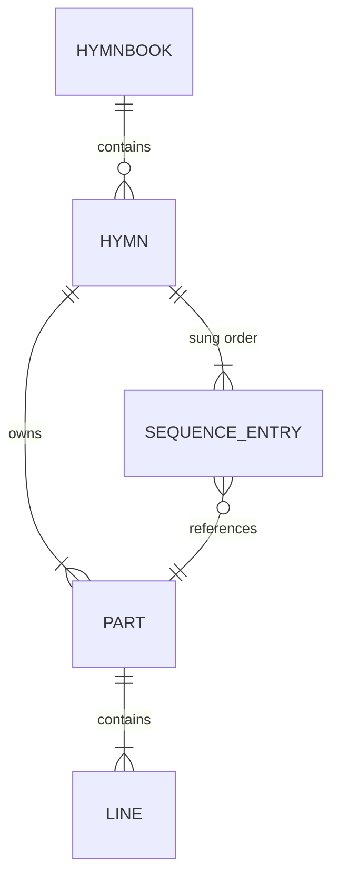

# SDD-0001 — Domain Model

- **Status:** Draft
- **Date:** 2026-09-20
- **Implements:**
  [ADR-0003](../decisions/0003-model-hymns-as-parts-and-an-occurrence-sequence.md),
  [ADR-0008](../decisions/0008-sqlite-as-the-on-device-content-store.md)

Detailed design for the core domain. Everything else depends on this, so it is
specified before anything is built.

---

## 1. Purpose

Define the entities, their identity, their invariants, and the address space
used to refer to a position within a hymn. Two things in particular have to be
unambiguous:

1. **A part is stored once and may be sung many times.**
2. **An occurrence — one position in the sung order — is addressable
   independently of the part whose text it shows.**

Everything the presentation layer needs in order to signal "this chorus again"
follows from the second point.

---

## 2. Entities


```mermaid
erDiagram
    HYMNBOOK ||--o{ HYMN : contains
    HYMN ||--|{ PART : owns
    HYMN ||--|{ SEQUENCE_ENTRY : "sung order"
    SEQUENCE_ENTRY }o--|| PART : references
    PART ||--|{ LINE : contains
```

Note the cardinality on `SEQUENCE_ENTRY → PART`: **many-to-one**. That single
edge is the whole design.

### 2.1 Types

```ts
/**
 * Stable opaque slug, e.g. "mal-ymef-athmeeya-geethangal-16".
 * Never a display string.
 */
type HymnbookId = string;

/** Hymn number as printed. Unique within a hymnbook, not globally. */
type HymnNumber = number;

/** Unique within one hymn, e.g. "s1", "s2", "r". */
type PartId = string;

/**
 * A part's role in the song, in the usual order of one. A chorus is also
 * called a chorus. An instrumental solo, an ad lib or an elision has no
 * lyrics of its own, so none is a part.
 */
type PartKind =
  | "intro"
  | "stanza"
  | "pre-chorus"
  | "chorus"
  | "post-chorus"
  | "bridge"
  | "outro"
  | "tag";

interface Hymnbook {
  id: HymnbookId;
  title: string; // native-script title
  language: string; // BCP-47, e.g. "ml"
  script: string; // ISO 15924, e.g. "Mlym"
  publisher?: string;
  edition?: string;
  isbn?: string; // natural id for a published edition
  hymnCount: number;
}

interface Part {
  id: PartId;
  kind: PartKind;
  lines: string[];
  /** Display label, e.g. "1". Absent for choruses. */
  label?: string;
}

interface SequenceEntry {
  partId: PartId;
}

interface HymnMeta {
  author?: string;
  tune?: string;
  meter?: string;
  topics?: string[];
  scripture?: string[];
  copyright?: string;
}

interface Hymn {
  hymnbookId: HymnbookId;
  number: HymnNumber;
  title: string;
  parts: Part[];
  sequence: SequenceEntry[];
  meta: HymnMeta;
}
```

Everything in `HymnMeta` is optional. The corpus has almost none of it
([ADR-0009](../decisions/0009-migrate-the-corpus-by-rule.md)), and fields are
backfilled as they become available rather than invented.

`HymnbookId` stays a human slug, not a synthetic id (e.g. UUID), while the
content pipeline is the only publisher: a single writer can guarantee uniqueness
at build time the same way `HymnNumber` uniqueness is checked (I7), so a
coordination-free scheme buys nothing yet and would cost the slug's legibility
in URLs, filenames and debug output. Revisit this once the CMS (Board #11)
allows hymnbooks from more than one contributor — see §8.

Slug convention: `<ISO 639-3 language>-<publisher>-<title>-<edition>[-<isbn>]`,
hyphen-separated, e.g. `mal-ymef-athmeeya-geethangal-16` (ISBN omitted when the
book has none). The id is **opaque**: it is used whole, as a filename, URL
segment and storage key, and never parsed. Publisher, edition and ISBN live in
their own fields. Slashes were rejected as separators because they would make
the id a path rather than a single token.

### 2.2 Occurrence — derived, never stored

```ts
interface Occurrence {
  /** Position in the effective sequence. */
  index: number;
  part: Part;
  /**
   * How many times in a row — including this one — the same part has now
   * shown back-to-back. 1 means "not a repeat." Only an *immediately
   * adjacent* recurrence counts; verse → chorus → verse → chorus is the
   * song's normal printed form, not a repeat (revised in the Presenter
   * redesign — see §16 — after the original "any prior occurrence
   * anywhere" definition proved wrong against the real corpus: 0 of 1,631
   * hymns ever repeat a part back-to-back in their stored sequence, while
   * 1,186 have the ordinary non-adjacent pattern, which the original
   * definition mistakenly flagged as a repeat on the majority of the
   * hymnal).
   */
  repeatOrdinal: number;
  /** True when produced by live navigation rather than stored data. */
  isAdHoc: boolean;
}
```

`repeatOrdinal > 1` is the value the renderer needs: this text is being sung
immediately again, and the visual treatment for repetition applies. In practice
this only ever fires for an explicit, live repeat (`repeatCurrent`, §5.1) —
never during ordinary navigation through the stored sequence, nor from a chip
jump — so the cue is effectively an operator-facing signal for R6 overrides, not
a structural feature of the hymn.

No `totalRecurrences` field: for a live ad-hoc repeat, how many more times the
presenter will jump back isn't knowable in advance, so a cue implying a known
total (e.g. "final time") would be lying. `repeatOrdinal` is a plain, honest
running count instead.

This is **computed from the sequence**, never persisted. Storing it would create
a second source of truth that could drift.

---

## 3. Address space

One scheme, used everywhere.

```ts
interface Position {
  hymnbookId: HymnbookId;
  hymnNumber: HymnNumber;
  occurrenceIndex: number;
  /** null focuses the whole part rather than a single line. */
  lineIndex: number | null;
}
```

Used by navigation, by restored position in user state, and — in Phase 2 — by a
follow source reporting where it believes the singing is
([ADR-0010](../decisions/0010-model-liveness-as-pluggable-follow-sources.md)).
Defining it once prevents three incompatible schemes appearing separately.

A `Position` addresses an **occurrence**, not a part. Pointing at a part would
be ambiguous the moment a chorus repeats — which is precisely the case that
matters.

---

## 4. Invariants

Enforced at **build time**, where a human can act on a failure. Violations fail
the content pipeline; they are never repaired silently
([arc42 §8.6](../architecture/arc42.md#86-handling-imperfect-content)).

| #   | Invariant                                                        | Rationale                                          |
| --- | ---------------------------------------------------------------- | -------------------------------------------------- |
| I1  | `PartId` is unique within a hymn                                 | References must resolve unambiguously              |
| I2  | Every `SequenceEntry.partId` resolves to a part in the same hymn | No dangling references                             |
| I3  | `sequence.length >= 1`                                           | A hymn with no sung order cannot be presented      |
| I4  | Every part has at least one line                                 | An empty part would render as a blank screen       |
| I5  | Every part is referenced by at least one sequence entry          | An unreferenced part is unreachable — a data error |
| I6  | Line text is non-empty after trimming                            | Blank lines are formatting, not content            |
| I7  | `HymnNumber` is unique within a hymnbook                         | It is the primary means of retrieval               |
| I8  | The sequence contains no unreferenced gaps in `idx`              | Ordering must be total and contiguous              |

I5 is worth stating explicitly: under the old model a chorus could exist while
no template branch ever displayed it. That failure becomes detectable here.

---

## 5. Sequence Engine

The one piece with genuinely intricate logic. **Pure** — no DOM, no framework,
no storage. It must be testable in isolation, and must not import SolidJS
([ADR-0005](../decisions/0005-use-solidjs.md)).

```ts
interface SequenceEngine {
  readonly hymn: Hymn;
  readonly cursor: Position;
  /** Length of the effective sequence, including ad-hoc entries. */
  readonly length: number;

  occurrenceAt(index: number): Occurrence | undefined;
  current(): Occurrence;

  next(): void;
  previous(): void;
  nextLine(): void;
  previousLine(): void;

  goTo(occurrenceIndex: number, lineIndex?: number | null): void;

  /** Move to an occurrence of `partId` in the path; never changes it. */
  jumpToPart(partId: PartId): void;
}
```

### 5.1 Effective sequence

The effective sequence (the **path**) starts as a copy of the stored sequence.
Only an explicit repeat changes it (below). The stored sequence is **never
mutated**, so the corpus is not modified by presentation, and a hymn presented
twice starts identically both times.

`jumpToPart(p)` moves the cursor within the path and never changes it — a part
chip means "go to that part of the song", and Next and Previous then walk the
song's order from there (revised in review, after the earlier rule, which
rewrote the path ahead of the cursor, sent Previous back to where the operator
had been rather than to the part before `p` in the song):

- **Restart**: `p` is the current part. The cursor returns to its start
  (whole-part focus). Revised after review: when this repeated instead, a few
  stray taps on an already-selected chip silently queued the same verse again
  and again.
- **Forward**: `p` appears later in the path. The cursor moves to its next
  occurrence. Nothing is skipped out of the path: Previous goes to the part
  before `p` in the song.
- **Back**: `p` appears only earlier. The cursor moves to its most recent
  occurrence, and the song carries on from there.

A repeat is its own, explicit action, `repeatCurrent()` (exposed in the UI with
part 4, Presentation, together with on-screen cues): an ad-hoc occurrence of the
current part is inserted right after the cursor and the cursor moves to it
(`repeatOrdinal` then reads 2, 3, …). `undoRepeat()` takes back the repeat the
cursor is on: it only applies to an ad-hoc occurrence immediately repeating the
one before it, removes that entry and returns the cursor to the previous
showing, on the same line, so the Output (which shows a run of repeats once,
§16.1) doesn't move. `resetRepeats()` takes back every repeat of the current run
at once, from any showing in it, likewise keeping the line.

```text
stored: 1 R 2 R 3 R
at 1, jump 3:          1 R 2 R [3] R      (Previous → the R after 2)
at R after 2, repeat:  1 R 2 R [R] 3 R    (Repeat 2)
at 3, jump 1:          [1] R 2 R 3 R      (Next → R, then 2 …)
```

### 5.2 Recurrence computation

For occurrence at index `i` with part `p`, walking backward only while the part
stays the same — **adjacency, not "anywhere earlier"**:

```text
repeatOrdinal(i) = 1 + count of consecutive j = i-1, i-2, ...
                       while effective[j].partId == p.id
```

Computed over the **effective** sequence, so a live jump back to a part already
showing correctly extends the streak — the presenter jumping back to the chorus
a second time in a row produces `repeatOrdinal = 2`, a third `= 3`, and the cue
reflects that. A single verse between two showings of the chorus resets the
streak to 1 (not a repeat) — that's the whole point of the adjacency rule
(§2.2).

### 5.3 Why move rather than rewrite

A jump moves the cursor and leaves the path alone, so the path always reads as
the song, plus any repeats the operator asked for. The arrows, the Lyrics list
and the Output all walk that one order, and a chip is simply a shortcut into it.

The earlier rule rewrote the plan instead — skipping ahead removed the entries
in between, and going back inserted an ad-hoc occurrence — to keep history
linear. That made the path "the route actually taken", which suits a recording
but not a live screen: after a skip, Previous landed on the part the operator
had just left, not on the one the song puts there, and the Lyrics list no longer
matched the hymn on the page.

What it gave up: history is no longer monotonic, since a jump back revisits an
index already shown. Nothing depended on that. `repeatOrdinal` counts adjacency
in the path, which a jump doesn't change, and a Phase 2 follow source still
shares one address space, since indices shift only on an explicit repeat or
undo, and those are events it receives too.

### 5.4 Line navigation

`nextLine` advances within the current occurrence and rolls into the next
occurrence at its end. `lineIndex: null` means the whole part is focused, which
is the default when arriving at a new occurrence.

A part step (`next`, `previous`) always lands on a whole part. At either end of
the path there's no part to go to, but from line focus it still widens to the
whole current part rather than doing nothing, so Previous on the first part's
line and Next on the last part's line light that part whole, as the step would
anywhere else. The dock's part buttons stay enabled in that state for the same
reason.

`OPEN:` Whether the default on arrival should be whole-part or first-line. This
is a feel question, answerable only with something on screen.

---

## 6. Storage schema

One SQLite database per hymnbook
([ADR-0008](../decisions/0008-sqlite-as-the-on-device-content-store.md)), so
`hymnbook` holds exactly one row and hymn numbers need no book qualifier.

```sql
CREATE TABLE hymnbook (
  id             TEXT PRIMARY KEY,   -- the key (SDD-0004 §7)
  origin         TEXT NOT NULL,      -- the id the file declared (SDD-0004 §7)
  title          TEXT NOT NULL,
  language       TEXT NOT NULL,   -- BCP-47
  script         TEXT NOT NULL,   -- ISO 15924
  publisher      TEXT,
  edition        TEXT,
  isbn           TEXT,
  schema_version INTEGER NOT NULL,
  content_hash   TEXT NOT NULL,   -- SHA-256 of the source files, see §9
  sources        TEXT NOT NULL    -- JSON array of container hashes (SDD-0004 §7)
) STRICT;

CREATE TABLE hymn (
  number  INTEGER PRIMARY KEY,
  title   TEXT NOT NULL,
  author  TEXT,
  tune    TEXT,
  meter   TEXT
) STRICT;

CREATE TABLE part (
  hymn_number INTEGER NOT NULL REFERENCES hymn(number),
  id          TEXT NOT NULL,
  position    INTEGER NOT NULL,   -- printed order (SDD-0004 §7)
  kind        TEXT NOT NULL CHECK (kind IN ('intro','stanza','pre-chorus','chorus','post-chorus','bridge','outro','tag')),
  label       TEXT,
  PRIMARY KEY (hymn_number, id),
  UNIQUE (hymn_number, position)
) STRICT;

CREATE TABLE line (
  hymn_number INTEGER NOT NULL,
  part_id     TEXT    NOT NULL,
  idx         INTEGER NOT NULL,
  text        TEXT    NOT NULL,
  PRIMARY KEY (hymn_number, part_id, idx),
  FOREIGN KEY (hymn_number, part_id) REFERENCES part(hymn_number, id)
) STRICT;

CREATE TABLE sequence_entry (
  hymn_number INTEGER NOT NULL,
  idx         INTEGER NOT NULL,
  part_id     TEXT    NOT NULL,
  PRIMARY KEY (hymn_number, idx),
  FOREIGN KEY (hymn_number, part_id) REFERENCES part(hymn_number, id)
) STRICT;

-- Search over whole hymns; retrieval is by number thereafter.
-- tokenchars: Malayalam dependent vowel signs (U+0D3E-U+0D4C), virama
-- (U+0D4D), and ZWJ/ZWNJ — unicode61 treats these as separators by
-- default, which fragments Malayalam words down to bare consonants. See
-- the note on risk R5 below.
CREATE VIRTUAL TABLE hymn_fts USING fts5(
  title,
  body,
  content = '',
  tokenize = 'unicode61 tokenchars ''ാിീുൂൃൄെേൈൊോൌ്‌‍'''
);
```

Notes:

- `STRICT` tables — type affinity errors in a content pipeline are exactly the
  class of bug that reaches a congregation as a wrong word.
- `sequence_entry` is the **only** place repetition is expressed. Nothing else
  in the schema knows about it.
- `hymn_fts` is contentless and rebuilt by the pipeline, not maintained by
  triggers; content is immutable at runtime.
- `schema_version` permits validating a downloaded package against the
  application before installing it; `content_hash` tells the application whether
  the lyrics themselves have changed (§9).

Resolved — risk R5 in
[arc42 §11](../architecture/arc42.md#11-risks-and-technical-debt). Spiked
against the real 1,631-hymn corpus (Board #3): the corpus is already NFC, and
chillu letters tokenise correctly by default (they're ordinary Letter-category
codepoints). Default `unicode61` fragments words at every vowel sign and virama,
though — `വാഴ്ത്തുക` ("praise") reduced to bare consonants `ക`/`ത`/`ഴ`/`വ`,
which would make search match almost everything. Adding those marks (plus
ZWJ/ZWNJ) to `tokenchars`, as above, fixed it: the same word survives whole, and
word and prefix search both work correctly across the full corpus. A custom
tokenizer or the `trigram` fallback proved unnecessary.

---

## 7. Migration from the legacy corpus

Per [ADR-0009](../decisions/0009-migrate-the-corpus-by-rule.md). Legacy record:

```jsonc
{
  "id": 1,
  "author": "KVS",
  "starts": "chorus",
  "chorus": [],
  "bridge": [],
  "verses": [[]],
}
```

| Legacy               | Becomes                                                     |
| -------------------- | ----------------------------------------------------------- |
| `id`                 | `hymn.number`                                               |
| `author`             | `hymn.author`, `NULL` when empty (325 hymns)                |
| `verses[i]`          | Part `s{i+1}`, kind `stanza`, label `{i+1}`                 |
| `chorus` (non-empty) | Part `r`, kind `chorus`                                     |
| `bridge`             | **Dropped.** Empty in all 1,631 records; survives as a kind |
| `starts`             | Determines the first sequence entry                         |
| —                    | `hymn.title` := first line of the first sequence entry      |

Sequence derivation:

| Legacy shape                     | Count | Sequence                     |
| -------------------------------- | ----- | ---------------------------- |
| Chorus + verses                  | 918   | `r, s1, r, s2, r, … sN, r`   |
| Verses + chorus, starts at verse | 270   | `s1, r, s2, r, … sN, r`      |
| Verses, no chorus                | 345   | `s1, s2, … sN`               |
| Chorus only, no verses           | 98    | `s1` — one stanza, no repeat |

The last row is a deliberate reinterpretation. A part that never repeats is not
a chorus; calling it one was an artefact of the old template switch. These
become a single stanza with a one-entry sequence.

**Migration output is source, not a build artifact.** It is committed, and
corrections are applied to it directly. Re-running the migration wholesale would
discard accumulated corrections, so it must not run as part of the build.

### 7.1 Output layout and script

```text
content/<hymnbook-id>/hymnbook.json   # Hymnbook metadata
content/<hymnbook-id>/0001.json …     # one hymn each
```

A hymn file is the domain `Hymn` minus `hymnbookId` (the directory supplies it):
`number`, `title`, `parts`, `sequence`, `meta`. Source and runtime types are the
same, so there is no second schema to maintain.

The conversion was a one-time step: a pure function in
`scripts/legacy-convert.ts` with a thin filesystem and git wrapper,
`scripts/migrate-legacy.ts`. Both are now gone, kept in git history as the
record of how the corpus was derived:

- Reads the legacy JSON from git history (`155baea`), since `archive/` is gone.
- **Refuses to run if the output directory exists**, so accumulated corrections
  cannot be overwritten. This enforces the invariant in code.
- Text is otherwise copied verbatim (no Unicode normalisation; the corpus is
  already NFC), with two deliberate exceptions found by measuring the corpus:
  - **Leading and trailing whitespace is trimmed** (11 lines).
  - **Empty lines are dropped** (37 lines, all inside the choruses of 12 hymns:
    156, 666, 753, 856, 864, 890, 895, 901, 924, 930, 1066, 1335). Those
    choruses are multi-paragraph and every one of the 12 also has verses, e.g.
    930 has 10 verses and 11 chorus paragraphs, which suggests a different
    chorus after each verse. The rules cannot infer that, so each becomes a
    single chorus and the report flags the 12 for hand correction. The original
    paragraphing remains in git history.
- Fails on any legacy shape the rules do not cover: non-empty `bridge`, an empty
  verse, an unknown `starts`, or a `starts` inconsistent with the shape.
- Reports shape counts, which must match the table above (918 / 270 / 345 / 98),
  and asserts every non-empty legacy line appears exactly once in the output, in
  order.

The first hymnbook is _Athmeeya Geethangal / Spiritual Hymns_, 16th edition,
General YMEF and Premier Bible Publication, 1,631 hymns. No ISBN was found in
any listing; `isbn` stays absent until the printed copy is checked.

---

## 8. Open questions

| Question                                                | Resolve by                                                                             |
| ------------------------------------------------------- | -------------------------------------------------------------------------------------- |
| Default focus on arrival — whole part or first line     | Trying it on screen                                                                    |
| Which kinds besides stanza and chorus books really use  | Hymns of Fellowship, the second hymnbook (Board #27)                                   |
| Cross-book song identity (shared songs, translations)   | Deferred until a second book exists; see below                                         |
| Word-level addressing below `lineIndex`                 | Phase 2, if lyric alignment proves feasible                                            |
| ~~Synthetic multi-publisher `HymnbookId` (e.g. UUID7)~~ | Resolved: [ADR-0021](../decisions/0021-identify-books-by-the-store-that-holds-them.md) |

**Songs shared across books (2026-09-26, noted, not built).** Current leaning:
each book keeps its own copy of a shared song, as printed, and the copies are
linked by a song id (hymnary.org's text vs instance). The build suggests likely
pairs by first line and title; a human confirms each one (ADR-0009). Duplicate
copies are deliberate: permission to publish is granted per book, and a
publisher can license only the songs it owns or that are in the public domain. A
per-book copy keeps its provenance; a shared text would not.

Each song will also need a rights record: the author's death year, the
publication year and who gave permission. Copyright follows where lyrics are
made available, not where the server is. Terms differ: life + 60 years in India,
life + 70 in the EU, and in the US by publication date. From that record the
build can work out where a book may be served, so a regional host (EU, US,
India) serves only what is free or permitted there. Personal data is separate:
none leaves the device today, but any server-side state (Board #18) needs a
region chosen for GDPR (EU) and the DPDP Act (India).

**Song, arrangement, singing (2026-09-26, noted, not built).** Three layers,
each owning its own order. The **song** keeps only its printed sequence, never
mutated (§5.1). An **arrangement** (Board #23) is a saved way of singing it
("v1, v2, chorus ×2, v4"), chosen per service; a service queue item (#22) is a
song plus an optional arrangement. A **singing** is one occasion: the path
actually sung, live repeats and jumps included, and its timestamps when recorded
(#24). Today a live repeat lives only in the engine for that sitting and is lost
on a swap; it belongs to a singing, as timestamps do.

---

## 9. Content pipeline

Turns `content/<hymnbook-id>/` into `public/content/<hymnbook-id>.sqlite` (Board
#5). Run as `bun run build:content` (superseded by SDD-0004 (ADR-0026): the
songs left the repo and the deploy no longer runs it; the script remains for
building containers): a plain Bun script, independent of Vite, so the future CMS
(Board #11) can reuse it. It uses `bun:sqlite`: the spike showed FTS5
tokenisation is identical to the browser's SQLite Wasm build
([ADR-0015](../decisions/0015-use-official-sqlite-wasm-not-wa-sqlite.md)), since
both are the same C code.

1. **Load** `hymnbook.json` and every `NNNN.json`.
2. **Validate everything** (below), collecting every violation.
3. **Build** the package per §6, only if validation found nothing.
4. **Hash** the source and record it in `hymnbook.content_hash`.

**Validation collects all violations**, each with hymn number and rule, and
exits non-zero if there are any: one pass shows everything to fix, and nothing
is ever repaired
([arc42 §8.6](../architecture/arc42.md#86-handling-imperfect-content)). The
rules are pure functions in `src/domain/validate.ts`, framework-free, so the CMS
can apply the same checks. They cover I1-I7, plus:

- The file name matches `number`, and the hymn count matches
  `hymnbook.hymnCount`.
- **Unknown fields fail**, at every level, and so does a `format` other than the
  one the reader knows ([SDD-0002 §4](0002-content-format.md#4-rules)). §6
  stores only `author`, `tune` and `meter`, so a hymn carrying `topics`,
  `scripture` or `copyright` is a violation rather than a silent drop, until a
  new format version adds them.
- I8 holds by construction: the pipeline assigns `idx` 0..n-1 from the sequence
  array, so gaps cannot occur.

**Full-text index.** One `hymn_fts` row per hymn, `rowid` = hymn number, `body`
= the lines of each part **once**, in part order and not in sung order, so a
repeated chorus is not weighted up.

**Versioning.** `schema_version` gates compatibility with the application. An
installed copy older than the app's is replaced by the app's own bundled one,
once (superseded by SDD-0004 (ADR-0026): nothing is bundled); a copy newer than
the app says the app needs an update (ADR-0025, which took it to 2).
`content_hash` is a SHA-256 over the source files (name and bytes, in a fixed
order), so any lyric correction changes it and the same source always yields the
same hash. It is deliberately not a build timestamp: rebuilding unchanged
content must not look like an update.

---

## 10. Persistence — content store

Board #6 part 1. Runtime counterpart to §9: opens the package §9 builds and
answers queries. Per
[ADR-0015](../decisions/0015-use-official-sqlite-wasm-not-wa-sqlite.md),
`@sqlite.org/sqlite-wasm`'s `opfs-sahpool` VFS, not `wa-sqlite`.

### 10.1 Why a worker

OPFS's synchronous file access (`FileSystemSyncAccessHandle`, what
`opfs-sahpool` is built on) only exists inside a Worker — not a constraint this
project chose, a constraint of the platform. So the content store is a dedicated
Worker (`src/persistence/content-store.worker.ts`) that owns the `sqlite3`
module, the SAH pool, and every open database. The main thread never touches
SQLite directly.

The worker exposes a narrow class over
[Comlink](https://github.com/GoogleChromeLabs/comlink) (also used by
`wa-sqlite`'s own demos, and still the right tool now that sqlite-wasm's own
Worker1/Promiser API is deprecated — its README says to "load the module and
interact with it as a library," which is exactly this shape). A thin main-thread
client wraps the Comlink proxy so Library, Finder and Presenter (Board #7-9) see
a plain async interface and never import Comlink or know a worker is involved.

### 10.2 Provisioning

On worker startup: `sqlite3.installOpfsSAHPoolVfs()`, then check
`poolUtil.getFileNames()` for `<hymnbook-id>.sqlite3`. If present, open it
(`new poolUtil.OpfsSAHPoolDb(name)`). If absent — first run, or OPFS was evicted
(arc42 R4) — fetch the bundled package (a Vite build asset, the exact file §9
produces) and hand its bytes to `poolUtil.importDb(name, bytes)`, which writes
it directly; no SQL involved. Superseded by SDD-0004 (ADR-0026): nothing is
bundled, so there is no build asset to provision from; a book arrives as a
container through the Library. As first written, Phase 1 had one bundled book
and no download path, so this only ever provisioned from the build asset.
Fetched via Vite's `import.meta.env.BASE_URL`, not a root-absolute path — the
app must still work when served from a subpath, e.g. a GitHub Pages project
page.

A corrupt or partial file is a provisioning failure, reported as a distinct
state rather than thrown as a generic error, so the app can offer "reinstall
content" (re-run this same step) instead of crashing — consistent with
[arc42 §8.6](../architecture/arc42.md#86-handling-imperfect-content): never
silently repair, never guess.

**Decided: the pool is started behind three guards.** sqlite-wasm's
`installOpfsSAHPoolVfs` has a destructive failure path: when it cannot take a
handle on every pool file (the tab's previous worker is still dying after a
reload, another tab holds them) it calls `removeVfs()`, which runs
`removeEntry(".opaque", { recursive: true })` and deletes every book if no
handle is held by then. A reload during a write reached the first half of this
(ten `NoModificationAllowedError`s, then a registry unavailable for the page
load); only the old worker's locks stopped the delete. The library has no option
to turn this off, so `pool-init.ts` guards it, in the worker, before the
install:

1. `removeEntry` of `.hymnal` or `.opaque` is refused. Nothing legitimate
   removes a directory (the pool removes single files by their random names), so
   a failed install can never become a delete. A future "reset all data" must go
   around this guard on purpose (a wipe through the pool's own `wipeFiles`, or
   lifting the guard for that one call), never by removing the directory with it
   in place.
2. The worker holds the Web Lock `hymnal-pool` for its life, so a new worker
   waits for the old one; it waits at most 20 s and then the store is
   unavailable this session ("another tab or worker still holds the books"), as
   it is when the browser refuses the request. The tab holds `hymnal-store` on
   the main thread (tabs, Board #36): the tab owns `hymnal-store`, the worker
   owns `hymnal-pool`. On release the worker ends, freeing `hymnal-pool`, before
   the tab drops `hymnal-store`; the names differ because a worker that asked
   for the tab's own name would wait for it for ever.
3. The lock is released a moment before the old worker's handles are, so the
   worker takes and drops a handle on every pool file until all can be taken (20
   s at most; any error reads as "not free"). Only when they are free does it
   call the install. If they are not by the cap it does not install: the store
   is unavailable this session, with that message, and the next start tries
   again.

### 10.3 Query surface

Read-only — content is immutable at runtime (an invariant, §4). The worker
exposes exactly what Library/Finder/Presenter need, nothing shaped like a
general SQL client:

```ts
interface ContentStore {
  getHymnbook(id: HymnbookId): Promise<Hymnbook>;
  listHymns(id: HymnbookId): Promise<{ number: number; title: string }[]>;
  getHymn(id: HymnbookId, number: number): Promise<HymnSource>;
  searchLyrics(
    id: HymnbookId,
    query: string,
  ): Promise<{ number: number; title: string; snippet: string }[]>;
}
```

Built on the OO1 API's `selectObjects()`/`exec()`, not raw
`prepare`/`step`/`finalize` — the official build's query surface is
object-returning, unlike `wa-sqlite`'s integer-pointer handles.

`searchLyrics`'s matching (per-word prefix, implicit AND, capped at 30 results)
was settled in Board #8 — see §13.

### 10.4 One tab owns the store

`opfs-sahpool` does not support multiple simultaneous connections (ADR-0015), so
two tabs cannot both open the books. Board #36: the tab that holds the store
owns it through an exclusive Web Lock (`navigator.locks`, name `hymnal-store`),
held for the store's life. `src/shell/tabLock.ts` is the protocol (the locks and
the channel are passed in, so it is unit tested with fakes); `TabGate` is the
shell's use of it.

- The Operator asks for the lock before it shows the app, and before any worker
  starts. A tab that cannot get it shows the full-page note "Hymnal is open in
  another tab" with **Use here** (DESIGN.md § Another tab).
- **Use here** queues for the lock and sends `release-request` on a
  `BroadcastChannel` (`hymnal-tabs`). The holder, unless it is live, closes the
  store (`releaseContent()`: every connection closed, the pool paused, the
  worker ended), then lets the lock go, and shows the same note itself with its
  own Use here. The lock is not given up until the store is closed.
- A holder that is **live** (an Output window is open, or not yet known not to
  be: the same `presence.live` the update gate uses) refuses with
  `release-refused`; the asking tab says the other tab is presenting and keeps
  Use here for when the Output has closed.
- A holder that is **writing** (a Library load, replace or remove in flight, or
  a first install) refuses the same way (reason `saving`); a store is never let
  go mid-write. A review not yet committed is thrown away on release: nothing
  was written. The holder answers with `release-ack` as soon as it starts
  letting go; an asking tab that hears nothing in 5s withdraws its queued lock
  request (so it cannot take the lock later) and says the other tab did not
  answer. Use here stays offered after each.
- The Output window is not an app tab: it never opens the store and never takes
  the lock.
- #32's update takeover is unchanged: presence and `createAppUpdates` live in
  `TabGate`, above the lock, so a tab showing the note reloads on
  `controllerchange` like any other that is not live.
- A browser without `navigator.locks` (or `BroadcastChannel`) shows the app as
  before: the second tab fails to open the store.

### 10.5 Testing

OPFS, Workers and Wasm don't exist in the Bun/vitest environment §9's tests run
in — this can only be verified in a real browser, the same way Board #1's
scaffold was. Anything with no browser-only dependency (name mapping, request
shaping) is unit tested; the worker's OPFS/Wasm glue is not, and is checked by
hand each time it changes.

## 11. Persistence — user state

Board #6 part 2. The second store from
[ADR-0008](../decisions/0008-sqlite-as-the-on-device-content-store.md): small,
mutable, irreplaceable, via `idb` on the main thread — no OPFS, no Worker, plain
`IndexedDB`. Per [ADR-0012](../decisions/0012-drop-the-bookmark-helper.md), user
state is preferences, recents, last position and installed hymnbooks. This part
builds the two Board #8/#9 already had a caller for — **last position** and
**recents** — plus **preferences**, added in Board #10 once the display-settings
board actually needed them (SDD-0001 §15). Installed-hymnbook tracking still
gets its own shape when a board needs it.

**One object store, one document.** A few hundred bytes, never queried, no
relations — an idb object store named `state` holding a single record at a fixed
key is simpler than one store per field and has no cross-store consistency to
maintain. Every accessor reads the whole document, patches the one field it
owns, and writes it back.

```ts
interface Preferences {
  theme: "system" | "light" | "dark";
  fontScale: number;
}

interface UserState {
  getLastPosition(): Promise<Position | undefined>;
  setLastPosition(position: Position): Promise<void>;
  getRecents(): Promise<RecentEntry[]>;
  addRecent(hymnbookId: HymnbookId, hymnNumber: HymnNumber): Promise<void>;
  getPreferences(): Promise<Preferences>;
  setPreferences(preferences: Preferences): Promise<void>;
}
```

`lastPosition` reuses the domain's own `Position` (§3) verbatim — it already is
"one address space, used everywhere," so persisting it is a straight round-trip,
not a new shape. A `RecentEntry` is coarser (`hymnbookId` + `hymnNumber` +
`viewedAt`): recents identify a hymn worth returning to, not a Presenter resume
point. `addRecent` de-duplicates by `(hymnbookId, hymnNumber)`, moving a
re-viewed hymn to the front, and caps the list at 20 — a fixed, low-stakes bound
rather than a configurable one.

`Preferences` is unconditionally readable — `getPreferences` always resolves,
defaulting to `DEFAULT_PREFERENCES` (`{ theme: "system", fontScale: 1 }`) rather
than `undefined`, because every render needs a value to apply and there's no
meaningful "unset" state to show. Unlike `lastPosition` when it was first built
(§11 originally, before Board #10), this write has an immediate reader the
moment it's added — `Settings` applies it on load — so persisting it doesn't
repeat the "write with no reader yet" mistake Board #9 avoided for
`setLastPosition` (§14). `setLastPosition` itself stays unwired regardless.

**Testing.** Unlike the content store, plain `IndexedDB` has a faithful
in-memory implementation (`fake-indexeddb`), so this is fully unit tested — no
browser-only gap here. `openUserState(dbName)` takes the database name as a
parameter precisely so tests can open an isolated instance per test rather than
sharing state through a module-level singleton; app code uses the `userState`
singleton export.

## 12. Library

Board #7. arc42 §5.1 defines Library as "list, install, remove hymnbooks; know
which are available offline" — but Phase 1 shipped exactly one hymnbook, bundled
at build time, with no download path (§10.2; superseded by SDD-0004 (ADR-0026):
nothing is bundled, every book is loaded through the Library). With nothing to
choose between, Library is narrowed to the one thing that's real today: the
first-run provisioning gate.

`src/library/Library.tsx` calls `ContentStore.ensureInstalled` for the one
bundled `HymnbookId` on mount (a Solid `createResource`), and renders one of
three states:

- **pending** — `Loading…`.
- **error** — a message specific to the failing `ContentStatus`
  (`missing-asset`, `corrupt`, `schema-mismatch`), plus a **Retry** button that
  re-runs provisioning. This is arc42 §8.6's "offer reinstall content instead of
  crashing," concretely.
- **ready** — the hymnbook's title, hymn count and edition. This is the entire
  "know which are available offline" answer while there's only one book to know
  about.

**Not built:** a list/picker UI, install, remove, or any persisted notion of
"installed hymnbooks" — user state's `installed` field (§11) stays unbuilt for
the same reason. All of it returns as its own decision once a second hymnbook
exists, rather than being guessed at now. Navigation to Finder/Presenter (Board
#8/#9) is also not wired yet — there is nothing to navigate to.

**Navigation, once there is something to navigate to,** will be Solid signal
state (a `view` union swapping which component renders), not a router — Phase 1
is single-device with no deep-linking requirement
([ADR-0012](../decisions/0012-drop-the-bookmark-helper.md) dropped bookmarking
in favour of recents + last position), and a router is a dependency with nothing
to spend it on yet.

**Testing.** `Library` takes the `Books` list, the current key, and an `admin`
and `userState` as optional props, defaulting to `getContentAdmin()` and the
`userState` singleton: tests inject fakes instead of touching the real
Worker/OPFS, so every state (loading, installing, each failure, empty, listed,
unreadable, each review verdict, remove) is unit tested despite the underlying
store not being (§10.5). `BUNDLED_HYMNBOOK_ID` is gone: nothing assumes one book
(SDD-0004 §10).

## 13. Finder

Board #8. arc42 §5.1: "retrieval by number and by lyric text; recents" —
explicitly not ranking beyond relevance, not favourites. `src/finder/Finder.tsx`
is one search box with no mode toggle: all-digit input is a hymn number
(`ContentStore.getHymn`), anything else is lyric text
(`ContentStore.searchLyrics`). The input shape decides the path, matching how
people actually search a hymnal ("I know it's 42" vs. "how does it start").

**Number lookup is direct, not a results list.** `getHymn` either succeeds — in
which case the hymn is immediately selected, no extra click — or fails, reported
as "No hymn numbered N." There is nothing to disambiguate: a number identifies
at most one hymn.

**Lyric search matching** (moved into `content-store.worker.ts`'s
`searchLyrics`, replacing the whole-phrase placeholder from §10.3): each word
becomes a quoted FTS5 prefix term (`"word"*`), joined with spaces for implicit
AND. A query matches lines containing all the words, regardless of order, and
matches as the user finishes typing a word. Each term is quoted (not merely
escaped) so FTS5 query-syntax characters in free text can't break the query —
the same defence the placeholder had, kept. **Capped at 30 results**
(`SEARCH_LIMIT`): found by browser-testing against the real corpus — a common
word matches hundreds of hymns, and `rank` ordering doesn't help a caller that
renders every row. The snippet is the first line containing any query word,
since a multi-word query can match across different lines of the same hymn.

**Search as you type** (revised in Board #12, at the maintainer's request: "what
if I want to see the options while I type"). The box is an ARIA combobox over a
live results list; the fast path is unchanged — type `11`, Enter, and hymn 11
opens.

- **Numbers** suggest instantly from `listHymns` (already loaded for recents):
  the exact number first, then numbers that start with what's typed, ascending,
  eight at most — each with its title, so the right hymn is visible before
  choosing. A number with no hymn still opens on Enter, and Presenter reports
  it, as before.
- **Lyrics** search as the typing pauses (about 200ms), or at once on Enter; the
  previous results stay up while the next load, so the list doesn't flicker.
- **Keys:** ↑/↓ move the highlighted option, Enter (or Find) takes it — the top
  one unless moved — and Escape clears the query. While the box is empty the
  Finder shows Recents (this book's, when there are any) and, below them, the
  book's first songs by number (twenty: "From the start", or "Songs" when the
  book has no more), each opening on a tap. With no recents the Recents heading
  and its "No recent songs yet" line are not shown; they stay where the book has
  no song list to show instead. A line under the field says which book is
  searched.
- While focus is in the box, the Presenter's shortcuts are off (§16.5): arrow
  keys that move the highlight must never also move the Output.

**Picking a hymn** (from a number lookup, a search result, or a recent) hands
its number straight to an `onSelect(number)` callback and nothing else. **Finder
never opens or renders the hymn**, and — revised in Board #9 — it no longer
records it as recent either: `userState.addRecent` moved to Presenter, because a
hymn picked in Finder isn't necessarily opened, and a search result clicked by
mistake shouldn't count as "recently viewed." Recording happens where a hymn is
actually opened; see §14. `hymns()` off `ContentStore.listHymns`, requested once
per mount, still backs the title shown for each recent — `RecentEntry` (§11)
only carries `hymnNumber`.

**Navigation.** `App.tsx` holds the `view` signal promised in §12:
`"library" | "finder" | "presenter"`. `Library` gains an `onReady` callback prop
— its ready state now also renders a "Find a hymn" button that calls it — and
`App` uses it to flip `view` to `"finder"`. `Finder`'s `onSelect` flips `view`
to `"presenter"` and carries the chosen number in a second `App`-level signal.
Still no router (§12) — `Presenter`'s own "Back to search" flips `view` back to
`"finder"` directly, not through history.

**Testing.** `Finder` takes `hymnbookId`, `store` and `userState` as optional
props, same pattern as `Library` — tests inject fakes for both, covering number
lookup, lyric search (results and no-match), recents (empty and populated,
title-resolved), and that picking a hymn — by number, by search result, or from
recents — calls `onSelect` with its number. The FTS5 matching and result-cap
logic itself is worker code, not unit tested for the same reason as the rest of
`content-store.worker.ts` (§10.5) — verified by hand against the real corpus,
including confirming the 30-result cap holds for a deliberately common word.

## 14. Presenter

Board #9. arc42 §5.2 decomposes Presenter into Sequence Engine (§5, already
built and pure), Occurrence Resolver (folded into the engine's `occurrenceAt` —
a separate component bought nothing extra), Renderer and Focus Controller.
`src/presenter/Presenter.tsx` covers the latter two: it loads the picked hymn,
wraps it in a `SequenceEngine`, and renders the current occurrence.

**Opening records the recent, not picking.** Board #8 originally had Finder call
`userState.addRecent` on selection; trying it end to end showed that was wrong —
merely searching (or misclicking a result) isn't "viewing" a hymn. `Presenter`'s
`createResource` fetcher calls `store.getHymn`, and only once that succeeds does
it call `addRecent`. A hymn number that doesn't resolve shows
`No hymn numbered N.` and a way back to Finder, the same shape as Library's
error state (§12) — mirrored here since `Presenter`, not `Finder`, is now the
only place that actually knows whether a hymn opens.

**Reactivity over a plain engine.** `SequenceEngine` is deliberately not a Solid
primitive (§5: pure, no framework). `Presenter` wraps it with a `version` signal
bumped after every mutating call (`next`, `previous`, `nextLine`,
`previousLine`, `jumpToPart`); memos for the current occurrence and cursor read
`version()` first, so touching it invalidates them. This keeps the engine
importable and testable with zero DOM, at the cost of one signal bump per
navigation.

**Default focus on arrival is whole-part**, confirming §5.4's open question now
that there's something on screen to try it against: `lineIndex` stays `null`
until the presenter explicitly steps into a line with `nextLine`.

**Recurrence cue (R4) is a text label**, not a color or a background change —
legibility in the room (arc42 quality goal #2) rules out relying on color at
distance or in bright venue light. A repeated part's heading gets `(repeat)`, or
`(final repeat)` on its last showing
(`recurrenceIndex + 1 === totalRecurrences`). A "Show repeat cues" checkbox
hides the label entirely: raised directly by the maintainer — a song leader
deliberately skipping or reordering parts finds a cue tracking the _stored_
order actively misleading once they've departed from it. The toggle is a plain
Solid signal, not persisted — nothing yet reads a saved preference, and Board
#11's `installed`-style deferral (§11, §12) applies here too: don't build the
general mechanism before a second consumer needs it.

**Revised in §16**: this section's `recurrenceIndex`/`totalRecurrences`/ "final
repeat" model fired on ordinary verse-chorus structure, not just genuine repeats
— see §2.2 and §5.2 for the corrected, evidenced definition (`repeatOrdinal`,
adjacency-only).

**Overriding the sequence (R6) is in scope now**, not deferred: a "Parts" list
next to the renderer calls `SequenceEngine.jumpToPart` directly, one button per
part. This is the same mechanism a presenter uses to jump ahead past a chorus
the leader skips, or back to one sung again unexpectedly — the engine already
inserts an ad-hoc occurrence and recomputes recurrence correctly for it (§5.2,
§5.3), verified against the real corpus: jumping to a stanza a second time
correctly shows `(final repeat)` even though that part never repeats in the
stored sequence.

**Not built:** `setLastPosition` stays unwired — recording it on every
navigation would be write-only state with no reader, since nothing offers a
"resume" entry point yet (§11 already flagged this the same way for `addRecent`,
before Board #9 gave it one). Responsive layout and any real typography are
Board #10's "phone → large display" (arc42 §1.1 R8); this board's markup is
plain, semantic, and unstyled.

**Testing.** `Presenter` takes `hymnbookId`, `store` and `userState` as optional
props, same pattern as `Library`/`Finder` — unit tests cover loading, the error
state, opening on the first occurrence with the whole part focused, `addRecent`
firing once on open, part and line navigation, the repeat cue appearing/hiding,
and jump-to-part's recurrence math. Verified by hand in a real browser against
hymn 1 (a real 7-stanza hymn with an 8-times-repeated chorus): search does not
touch recents, opening does, recents survive a reload, and the cue and "final
repeat" wording match the engine's actual recurrence count end to end.

## 15. PWA shell, deployment, and responsive presentation

Board #10. arc42 R7 (offline), R8 (phone → large display) and §8.7
(user-controlled scale and contrast) — the last Phase 1 board, closing what
every prior board deliberately left unstyled and undeployed.

**Deployment.** There was no CI at all — the archived implementation's GitHub
Pages workflow wasn't carried over. `.github/workflows/deploy.yml` adds one:
`bun run check` (gate on it — the first CI this project has ever had is not the
place to skip that), `bun run build:content` (superseded by SDD-0004 (ADR-0026):
dropped from the deploy), `bun run build`, then the standard
`actions/{configure-pages,upload-pages-artifact, deploy-pages}` sequence.
`vite.config.ts` sets `base: "/hymnal/"` for the production build — GitHub Pages
serves a project page from that subpath, not the domain root, which is exactly
what the `BASE_URL` fix in §10.2 already anticipated for the content fetch. One
thing this caught: `vite preview` reports `command: "serve"`, same as dev, even
though it serves the already-built `dist/` output whose URLs are baked in at
that base — the config keys off `isPreview`, not `command`, or preview requests
404 on every asset.

**Service worker and manifest via `vite-plugin-pwa`** (Workbox-based), matching
this project's habit of leaning on a maintained library over hand-rolled
infrastructure (`idb`, `comlink`, `@sqlite.org/sqlite-wasm`). Its precache is
the **app shell only** — JS, CSS, HTML, fonts, and `sqlite3*.wasm` — never
`public/content/*.sqlite`, excluded by `globIgnores`. That split isn't cosmetic:
the content package is `ContentStore`'s job, fetched once and persisted to OPFS
itself (§10.2), and at 5.5MB it would bloat the shell's own install-time cache
for no benefit. The wasm binary _is_ shell, not content — sqlite3's own runtime,
without which nothing else works — and was missing from the precache glob on the
first pass; caught only by testing genuinely offline against the production
build (`vite preview`, `page.context().setOffline(true)`), the same "no faithful
polyfill, must verify by hand" limitation as the rest of the OPFS/Worker layer
(§10.5).

**Updates (Board #32).** `registerType` is `"prompt"`, not `"autoUpdate"`, which
skipped waiting and reloaded at once, deleting the old version's files under a
page that might be mid-service. Now a new version downloads quietly and waits;
the old worker keeps serving the open page, so no page is ever left on deleted
chunks. `createAppUpdates` (`src/shell/updates.ts`) registers through
`virtual:pwa-register`, and `onNeedRefresh` raises the shell's **Update ready,
Restart** snackbar (DESIGN.md § Snackbar); Restart calls
`updateServiceWorker(true)`, which activates the waiting worker and reloads
(`cleanupOutdatedCaches` then drops the old precache). It checks hourly while
open and whenever the tab becomes visible, so a long-open Operator still learns
of a deploy. **Never while the Output is live:** `updateGate` withholds both the
prompt and the apply while an Output window is open (Go live pressed: On Air or
Blanked); the prompt appears when it closes, and "Later" hides it for the
session. If it is never taken, the update applies once every tab and window of
the app is closed and it is opened again; a plain reload does not apply it,
because the old worker still controls the page. Until the Output has answered
the presence ping (or ~1s has passed with no answer) the Operator counts as
live, so a fresh load cannot restart under an Output it has not heard from. When
one tab restarts, the others are on a replaced worker whose old precache is
gone: those not live reload on `controllerchange`; a live one never does, and
keeps running what it loaded. **Books and settings are untouched:** books live
in OPFS and settings and recents in IndexedDB, neither in the service worker's
caches (above), so an update replaces the shell and nothing else. **Safari:**
WebKit clears script-writable storage, OPFS and IndexedDB included, after 7 days
without use unless the site is installed (its ITP cap). In Safari, in a tab and
not as an installed app, once the first book is loaded (and never while live), a
snackbar says so and suggests Add to Home Screen (iPhone, iPad) or Add to Dock
(Mac); "Got it" is remembered as `Preferences.homeScreenHintDismissed`. One
notice shows at a time, the update first. Verified on a production build with a
second build swapped in: no prompt while On Air or Blanked, prompt after the
Output closed, Restart applied it, the book and recents survived, and offline
reload worked before and after.

**CSS is plain, with custom properties** — no framework. Quality goal 5 ranks
visual novelty and feature breadth below legibility and offline reliability, and
Phase 1 has three screens; a utility framework or component library would be a
dependency bought for iteration speed this project isn't spending.
`src/styles.css` defines the palette as custom properties, redefined under
`prefers-color-scheme: dark` and again under an explicit `[data-theme]` override
so a manual choice wins either direction — the same three-state pattern
(`system` defers to the OS; `light`/`dark` override it) used anywhere a user
preference should coexist with a system default.

**Responsive scaling is continuous, not breakpoint-driven**, for R8 — for
content only since [ADR-0017](../decisions/0017-fix-the-interface-scale.md),
which fixes the interface at the browser's size times `fontScale`. As first
built, the root font size was `clamp(1rem, 0.85rem + 0.6vw, 1.75rem)`, so a
phone and a large display sit on the same curve rather than jumping between
fixed layouts. `Preferences.fontScale` multiplies that clamp directly, so the
user's chosen size and the viewport-driven size compose rather than fight —
confirmed by hand: a large viewport with a bumped scale produces a
proportionally wider reading column too, since the column's own max-width is set
in `rem`. One hard breakpoint exists at `60rem`, not to change the type scale
but to cap line length — a large display run wall-to-wall would violate
legibility (quality goal 2) by making lines too long to track, the opposite
problem from a phone.

**`Settings` (`src/shell/Settings.tsx`) is the "user-controlled text scale and
contrast" (§8.7) UI** — a font-scale stepper and a theme cycle, rendered once in
`App.tsx` above the view `Switch`, not per-view, since legibility matters in
Library and Finder too, not only Presenter. It reads and writes
`UserState.preferences` (§11) and applies the result as `--font-scale` and
`data-theme` on `document.documentElement` — global CSS state, not
component-local, because every view's styling depends on it.

**Typography is data-driven, now for real.** Noto Serif Malayalam (OFL-licensed,
reused from the archived implementation, converted from its variable-weight TTF
to a single ~65KB woff2) is bundled as a `@font-face` in `styles.css` and
applied via a `.hymn-text` class scoped to lyric content in `Presenter`, not the
whole app — UI chrome (buttons, labels) stays on a system font stack. Fonts are
bundled, never fetched from a CDN (arc42 §8.3), so this ships in the app-shell
precache with everything else. Malayalam is the only script Phase 1 has; a
second hymnbook's script picks its own font when that board arrives, per
hymnbook data rather than hardcoded here.

**Full keyboard navigation (§8.8)** was added to `Presenter`: arrow keys for
fine control (`ArrowDown`/`ArrowUp` step a line, `ArrowLeft`/`ArrowRight` step a
part), plus `PageUp`/`PageDown` since that's what most presentation remotes and
clickers actually send. A `window` keydown listener is added/removed with the
component's lifecycle (`onMount`/`onCleanup`); Space was deliberately left
unbound to avoid double-firing the "Show repeat cues" checkbox when it has
focus.

**Icons and favicon** (`public/icons/`, `public/favicon.svg`) are likewise
reused from the archived implementation, rasterized fresh from its SVG source
rather than hand-drawn new — a placeholder worth keeping until real branding
exists, not a design decision.

**Not built:** a distinct "presentation mode" that hides Presenter's own
controls for a large display facing a congregation — considered and declined.
Phase 1 is single-device (scope guard); whoever sees the screen is the one
operating it, and a chrome-less audience-facing view is really the deferred
projector-output feature (ADR-0011), not a responsive-layout concern. True
`maskable` icon variants (safe-zone padding, not just a square PNG) are also
deferred until real app icons exist to need it.

**Testing.** `Settings` and the `UserState.preferences` accessors are unit
tested the normal way (fakes, `fake-indexeddb`). Everything else here — service
worker registration, precache correctness, offline behavior, the production
`base` path, and responsive sizing at real viewport widths — has no meaningful
jsdom equivalent and was verified against an actual `vite build` +
`vite preview`, in a real browser, with the network cut off after first load:
the app shell, the SQLite engine, and a real hymn all load with zero network
requests once installed once.

## 16. Presenter redesign: Operator/Output split, corrected recurrence, visual design

Prompted by the maintainer comparing Board #10's shipped UI against the archived
implementation's screenshots: functionally complete, visually not
consumer-ready. What followed was a long, evidence-driven design conversation
(browser research into ProPresenter/EasyWorship/FreeShow/ Proclaim, a corpus
audit, several interactive mockups) rather than a straight reskin. Three real
corrections came out of it.

### 16.1 Operator and Output are two different screens, not one

Researching how every worship-presentation tool actually works — cheap or
expensive, proprietary or FreeShow's GPL-3.0 — surfaced one universal pattern
missed in Board #10: an **Operator** view (private, full controls) and a
chrome-less **Output** view (audience-facing), even on a single laptop.
Declining a "presentation mode" in Board #10 was a mistake: it was reasoned as
the deferred multi-device/projector feature (ADR-0011), but it's actually a
same-origin, two-_window_ mechanism — squarely inside Phase 1's single-device
scope.

**Mechanism**: a second `window.open()`. Where the browser has the Window
Management API and a second screen is attached, the Output opens on the chosen
screen (below); everywhere else it is a plain popup the operator drags to the
display and makes fullscreen. State flows Operator → Output over a
`BroadcastChannel`, a module-level singleton (the same shape as the
`userState`/`getContentStore()` singletons elsewhere in `src/persistence/`), not
App-level Solid state — the channel itself has no reason to be a component.

**Lifecycle**: the Output connection lives above `Presenter` (opened once per
service from `App`-level state, or earlier from Library/Finder), not owned by
`Presenter`'s own mount/unmount. `Presenter` just **publishes** its current
position whenever it's mounted; Output shows a neutral/blank state otherwise. A
real service has many hymns — reopening and repositioning an Output window
between every single one would be a genuine operational failure, not a minor
inconvenience.

**Content rule — Mode 1, continuous scroll** (supersedes an earlier 2-line
sliding-window draft): Output renders the whole effective sequence as one
scrolling column of lines (`flattenLines()`), the focus brightened and centred,
everything else dimmed. The focus mirrors the Operator's exactly: under
whole-part focus the **whole part** is brightened, and a line step narrows it to
one line. An earlier draft brightened only the first line under whole-part
focus, and that made the first Down press after entering a part invisible to the
audience. A focus taller than the screen is aligned to its first line instead of
centred. Scrolling is native `scrollTo({ behavior: "smooth" })` on a real
overflow container, not a hand-rolled transform: smooth scroll runs at roughly
constant velocity, so a one-line step and a whole-part jump both take a duration
proportional to their distance for free. A new hymn snaps instantly rather than
scrolling from the previous one. **Parts are set apart by a gap** (about half a
line), as in a printed hymnal, so the congregation can see where a verse ends
and the chorus begins: a shape, not a label, so it needs no language. **No part
label, no recurrence cue unless the operator turns one on** — those are Operator
aids; a cue tracking the _stored_ order has no meaning to a congregation
watching lyrics. Cues (hymn number, title, hymnbook, part, repeat ×N) are
opt-in, one switch each (by default the number and hymnbook, fading after a few
seconds): the number as a badge top left (for printed songbooks), the rest as a
lower-third caption, each on still ground in a safe margin that grows while it
shows (`visual/DESIGN.md`). The `content` message carries what they need
(hymnbook title, the focused part's display label, its repeat count), so the
Output formats the cues from the message and the `presentation` cues alone. **A
repeat stays in place**: an ad-hoc occurrence repeating the one before it
(`repeatOrdinal > 1`) adds no lines to the flattened column; its focus is the
earlier copy's, so the Output doesn't scroll away to identical text and
`positionOfLine` never lands on it.

**The chorus, pinned** (Board #13, which replaced the earlier Modes 2 and 3).
The corpus decides the shape: every special part in it is a chorus (no bridge or
tag), a hymn has at most one, 1,188 of 1,631 hymns have one, and 918 of those
open on it. So:

- **Only the chorus pins.** It's the part that recurs; a bridge or a tag is sung
  once or twice near the end, so it stays in the verse column.
- **Pinned from the first line, where the screen allows.** With "Pin the chorus"
  on (a Presentation setting, off by default: flowing is the Output everyone
  knows), the chorus leaves the scrolling column, which holds only the verses
  (the Output never shows the same chorus twice), and sits in its own pane,
  dimmed until sung, lit in place when it is (a repeat too, with ×N as a cue).
  Two panes, chosen per hymn and screen:
  - **Side by side**: verses in the left half, the chorus in the right, centred
    on the eyeline. Preferred on a landscape screen: the chorus stays at eye
    height, where a band at the foot sits behind the heads in front for the back
    rows.
  - **The band**: at the foot, above the cue caption, the verses above it
    centred on their own eyeline, a line of still ground between (the verses
    fade out across it; lit lines never enter it). Preferred on a portrait
    screen, where half-width columns would wrap every line, and the landscape
    fallback when side by side can't hold the floor.

  While the chorus is sung, the verse column holds the verse to come at its
  eyeline, dimmed (at the end, the last verse), so what's next is in view — for
  the 918 hymns that open on the chorus, verse 1 waits there. The pane is there
  from the first line because the type size is held per hymn: a pane arriving
  mid-hymn would force a resize.

- **Big type wins.** Each layout is measured on the real screen at its own
  width: the band needs the tallest verse and the chorus together, side by side
  each in half the width, where long lines wrap and a long unbreakable word
  (Malayalam words don't break) must shrink until it fits its column. A layout
  qualifies only if it truly fits (at the smallest type, fits can tie without
  fitting) and keeps the type at 70% of the full size or more, 5.25% of the
  screen's shorter side: an absolute floor, the same for every hymn and
  resolution, since what the back row needs is the type's share of the screen,
  not its share of the hymn's own flowing size (a relative 80% floor pinned only
  61% of chorus hymns on 16:9, a third side by side; this one about 85%, two
  thirds side by side, sampled). The preferred qualifying layout wins, else the
  other, else the hymn flows. On 16:9, side by side costs more than the band
  (sampled: side 67–92%, band 86–100% of the flowing size). The Output measures
  and decides, the same way the fit is measured there; the message only names
  the chorus. Live decides at its own size, so a projector of an unusual aspect
  could rarely disagree with it.
- **Every layout fits its width too.** The fit shrinks the type for the widest
  line as well as the tallest part, so a long word never runs off the screen or
  into the next column; on a portrait screen this applies to the flowing layout
  too.
- **No mark on a special part.** A chorus, bridge or tag being sung is lit like
  any part and set apart by the part gap; a pinned chorus is identified by its
  place. Tried and dropped: a tonal box (blockish; on every chorus it pulled the
  eye off a short lit verse), a feathered glow, centered rules above and below,
  an indent and a margin hairline (both wrong on centered lines). Not a label
  (it needs a language) nor italics, as printed hymnals use: Malayalam has no
  true italic, and a synthesized slant looks broken.
- **Scroll sync is unchanged.** Only the verse column scrolls by hand; lines
  keep their flattened indices, so seeks map back as before.

Mode 3, pages flipped like slides (`scroll-snap` over the same scroll), was
dropped: the per-hymn fit, the eyeline, part gaps and the reading band now give
the scroll what pages offered. What pages alone give is no motion at all, the
slides convention; that could return as a display option if a venue asks,
without reworking this.

**Drift back**: someone may scroll the Output window by hand (a mouse over the
second screen). Unless scroll sync (below) takes that as a seek, the Output
returns to the focus by itself about 1.5s after a manual scroll stops, so the
audience is never left on empty screen. Any Operator step also re-centres it at
once.

**Late join**: an Output window opened mid-hymn would otherwise stay blank until
the operator's next keypress. On mount it posts a `hello` on the channel; the
channel module replays the last message this window published. The replay lives
in `src/output/channel.ts`, not `Presenter` — the publisher-side cache is a
transport concern, and it also covers the case where no Presenter is mounted
(the cached message is then `idle`).

**Scroll sync** (added in Board #12 at the maintainer's request, built in part
3e): the channel is two-way, and the Output only ever reports; the Operator
decides.

- **A reading band while scrolling by hand.** When a person starts to scroll the
  Output (wheel, touch or pointer), the highlight stops following the Operator
  and becomes a band fixed to the viewport where the focus's part sat, one part
  tall by default: lines light as they pass through it, whichever part they
  belong to. Nothing jumps as a trackpad glides. The band can instead be one
  line tall (`bandSize`): a Workspace preference in Settings,
  `preferences.bandSize` (part by default), sent to the Output in the
  `presentation` message and toggled from the command menu, with no key (§16.5).
- **On rest, a seek.** Once scrolling pauses (about 200ms), the Output posts
  `{ type: "seek", hymnbookId, number, line, whole }`: the flattened line at the
  band's centre, and whether the band was part-sized. The Presenter maps it back
  (`positionOfLine`, the inverse of `flattenLines`) and matches the band:
  part-sized lands on that line's whole part, and the view settles onto it;
  line-sized lands on that line, where the band already holds it. Next part
  carries on from there. Its next publish ends the band.
- **Only a person's scroll counts.** The Output's own programmatic re-centring
  never arms a seek, or every step would echo back.
- **The Operator may say no.** Sync is a Workspace setting, "Scrolling the
  Output moves the Operator", on by default, kept as `preferences.scrollSync`
  (absent means on). Off, the Presenter ignores seeks. A seek naming a different
  hymn than the one open is ignored too.
- **Drift back is the fallback.** The Output returns to the focus about 1.5s
  after a hand scroll unless a new message arrives first: with sync off, or the
  Operator closed, the audience comes back to what's live.
- **Keys in the Output act as in the Operator.** With the Output fullscreen on
  the projector, a clicker's keys often land in its window. The Output forwards
  every plain key (no Ctrl, ⌘ or Alt) as `{ type: "key", key, shiftKey }`
  instead of scrolling itself, and the Operator replays it through its own
  keymap (§16.5), so arrows, Space, digits, R and B do exactly what they do
  there.
- **Live never seeks.** The Operator's Live pane stays a picture that takes no
  input, so a stray swipe over the Operator can't move the audience screen;
  Lyrics is the Operator's own way to go to a line.

**Presentation settings travel with the content.** The Output theme (Dark,
Light, Contrast, Warm) and the cue switches are Operator preferences, sent as
`{ type: "presentation", theme, cues, pinChorus, bandSize }` whenever they
change and held and replayed on late join like `blank`, so an Output window
follows Settings live without reading storage itself.

Cursor: shown while the mouse moves, hidden after 2s idle.

**Opening on the projector screen** (ADR-0028, Board #31). The choice is the
pure `chooseScreen` (`src/output/screens.ts`): screens in, a screen or none out.
The operator's own pick, remembered as the screen's `label` plus its width and
height (`preferences.outputScreen`; absent means Automatic), wins if it is still
attached, and of two identical monitors the one the operator is not on.
Automatic takes an external screen that is not primary and not the operator's
`currentScreen`, then the largest, then the landscape one; none qualifying is
none. `openOutputWindow` (`src/shell/openOutput.ts`) runs on Go live:

1. Not `getScreenDetails` in `window`: the plain popup, at once.
2. No screens known yet and `screen.isExtended` false: the plain popup, without
   asking. True: `getScreenDetails()` on this click, which is the browser's
   permission prompt the first time. A permission granted before is used at
   start-up with no prompt (`createOutputScreens`,
   `src/shell/outputScreens.ts`), so later opens call `window.open`
   synchronously and the click's activation is still live. A refusal or any
   error is the plain popup.
3. A chosen screen:
   `window.open(url + "&placed=1", name, "popup,left,top,width, height")` over
   that screen. The only wait is the first permission prompt, and if the browser
   then blocks the popup (activation spent on the prompt) a notice says to allow
   pop-ups and press Go live again, which is now instant.

A `placed` Output asks for `requestFullscreen()` on load. Where the browser
refuses without a gesture in the Output's own window, its first click or F key
goes fullscreen instead (that click or key is not forwarded or acted on); once
fullscreen, F and clicks are as before. The window is already on the chosen
screen, so a plain `requestFullscreen()` fullscreens there. The Operator cannot
fullscreen another window's document from its own click, and does not try. The
channel is untouched: `placed` is a URL parameter, not a message.

`screenschange` (on the shared `ScreenDetails`) keeps the list live. A screen
the Output was placed on that vanishes leaves the window where it is, with a
notice; if it returns the notice offers to move the Output there ("Move it" or
"Stay") and never jumps. Choosing a screen in Settings moves an open Output
(`moveTo` and `resizeTo` on the window `open` returned, leaving fullscreen
first, which re-arms the Output's click and F). A move that did not land (its
`screenX`/`screenY` checked after) says so, and the placed screen is not
updated. The screen the Output is on is read from its own position every two
seconds, so a window the operator dragged is tracked where it is, and the
fullscreen hint is skipped if the Output went fullscreen by itself.

Hints, each shown once and marked in preferences when first shown: on a placed
open, "click it or press F" (`fullscreenHintDismissed`); on any plain open with
a window, "drag it to the projector and press F11" (`dragHintDismissed`).
Notices for the window's own placement are the one kind shown while live (§15
keeps the update notice away from a live Output); see DESIGN.md § Snackbar.

**Forward compatibility, deliberately not built yet**: `window.open()` +
`BroadcastChannel` is standard web API, per ADR-0004/0006's reversibility
reasoning (the frontend is committed, the wrapper is late-binding). If a Tauri
wrapper is ever adopted, its native multi-window API would replace just this
mechanism — real browsers can't _guarantee_ a chrome-less window or reliable
secondary-monitor placement outside Chromium (popup blockers, address-bar
security changes on popups, no Window Management API in Firefox or Safari),
which is the actual gap a native wrapper would close. No Tauri code exists yet;
this is the seam where it would go, mirroring how ADR-0010 modeled liveness as a
pluggable follow source for the same reason.

### 16.2 Recurrence redefined: adjacent-only, not "anywhere in history"

Covered fully in §2.2 and §5.2 — summarized here because it was the design
conversation's actual entry point. The original definition
(`recurrenceIndex`/`totalRecurrences`, "has this part appeared anywhere before")
fired on ordinary verse-chorus-verse-chorus structure: checked against the real
corpus, **0 of 1,631 hymns** ever have an adjacent repeat in their stored
sequence, while **1,186** have the normal non-adjacent pattern the old
definition mistakenly flagged as a repeat. The corrected definition
(`repeatOrdinal`, adjacency-only) only ever fires from a live, ad-hoc jump back
to a part already showing — which also fixed a real display bug caught in review
("12 of 12" from repeatedly jumping to an already-current part inflating a
lifetime count that meant nothing).

### 16.3 Visual design: Material Design 3, specified in `visual/DESIGN.md`

The palette, typography, shape, elevation and component conventions live in
[`docs/visual/DESIGN.md`](../visual/DESIGN.md), **not** duplicated here — it's a
different kind of document (read before writing CSS, the design equivalent of
`CLAUDE.md`/`AGENTS.md`) and this file would drift out of sync with it if the
tokens existed in two places. In short: MD3's actual tokens hand-implemented in
plain CSS (the `@material/web` package's ES module graph isn't practical to load
without a bundler dependency this project doesn't otherwise need), seeded from
an amber/brass hue rather than Google's default purple, with Google Sans —
verified to carry full Malayalam glyph coverage (U+0D00–U+0D7F) and shipped
under OFL — unifying both UI chrome and hymn content into one typeface,
superseding Board #10's Noto Serif Malayalam.

### 16.4 Operator workspace and app shell

Layout and look are in `docs/visual/DESIGN.md` § Structure; this section covers
the mechanics. Revised three times in review. A first pane layout showed the
whole sequence, Live and Parts side by side with no hierarchy, and read as
cluttered and redundant; the third revision is Board #26, below. The settled
shape is layered, after Supabase Studio: sections, a switcher row, the
workspace, the dock.

- **Live is the anchor**, rendering the same `publishOutput` message the Output
  window receives, so the preview can't disagree with the audience screen.
- **Revised for Board #26: areas, not navigators.** The Parts | Lyrics switch
  goes. The Operator has fixed areas, each answering one question: **What they
  see** (Live, its controls and the part keypad: a rail on the right from
  840px), **This hymn** (the lyrics in sung order, tap to go live) and **Coming
  up** (Recents now, the service queue with Board #22), plus the dock. A future
  feature joins the area it belongs to rather than adding a row: Hold (#21) and
  follow status (ADR-0010) under Live, a stage output (#25) in Live's outputs
  and the Go live button, Follow in the dock. Parts calls `jumpToPart` (§5.1);
  lyrics call `goTo(i)` or `goTo(i, line)`, never `jumpToPart`, since moving
  within the path isn't a deviation. Scrolling lyrics never calls the engine.
- **Two tab groups.** This hymn, Recents and (later) Queue are **tabs** in at
  most two **groups**, side by side (split) or merged into one tabbed area. Each
  group's heading ends in a pane toolbar, after VS Code's and Zed's: **Expand**
  to main or **Collapse** to the side, **Move** a tab to the other group (a ⋯
  menu, only in a group of several tabs: a lone tab's move would just close its
  group), **Close group** (its tabs join the other; nothing is lost); merged,
  **Split**. Drag comes later. A group left empty closes; splitting with every
  tab in one group moves one not showing across. While a menu is open the
  Operator's keys stand down, so an arrow never moves the Output. The **main**
  group takes the room, so the queue can have it while a service is planned.
  This hymn never closes: it's the controls, like the dock. Under 1400px wide
  the groups merge by themselves and split again when there's room. What they
  see and the dock never move.

  ```ts
  type TabId = "hymn" | "recents"; // "queue" joins with Board #22
  interface Workspace {
    groups: [TabId[], TabId[]]; // a tab is in exactly one group
    active: [TabId | null, TabId | null];
    main: 0 | 1;
    split: boolean;
  }
  ```

  Kept as `preferences.workspace` in `UserState` (§11); absent means the default
  (`[["recents"], ["hymn"]]`, main 1, split). A stored layout is normalised on
  read: an unknown tab is dropped, a missing one joins the main group, This hymn
  is always present. `preferences.navigator` and the `sidebar` pane are retired;
  Live stays a hideable pane (L), and the pane registry (`src/shell/panes.ts`)
  keeps the Settings, command menu and keymap entries in one place.

- **Repeat sits with Parts**: under the Parts heading, one row of Repeat, the
  count (×2), Undo and Reset, then the keypad. The row keeps its height before
  any repeat (Undo and Reset shown disabled), so the keypad never moves. On a
  phone Parts is a third tab (This Song | Recents | Parts), holding the same row
  and keypad (DESIGN.md § Structure); it is phone-only, so a stored workspace
  never holds it.
- **Supporting panes stay data, not layout code**: the registry above, plus the
  tab list. With no Live on screen (Live hidden, or another section), the
  Blanked badge (§16.5) sits at the end of the switcher row, space nothing else
  uses, so a blanked audience screen is never out of sight and nothing shifts.
- **Go live → On air** (Board #26 part 3b). Whether an Output window is open is
  known, not guessed: each Output sends `hello` with its own id on opening (and
  in answer to the Operator's `ping`, so a reloaded Operator finds it) and `bye`
  on `pagehide`; the Operator keeps the set of ids (`subscribePresence`). While
  it's non-empty, Go live reads On air and brings the window forward
  (`window.open("", name)`, which never reloads it), and Live's dot is the
  on-air light.
- **End Live.** Closing the Output window was the only way to stop presenting,
  and the Live pane's own control only hides its preview. **End Live** ends the
  presenting and leaves the window: the Output goes dark (the black screen of
  Blank, faded the same way), and the header's button reads Go Live again; Go
  Live then resumes on the same window, in place, without asking for a screen or
  opening anything. It is one channel message, `{ type: "ended", ended }`, held
  and replayed to a late Output like `blank` and kept apart from it: a blank
  held before the end is still held after it, and Live's preview dims as for
  Blank. It is reached from a button beside On Air in the switcher row (an icon
  alone on a phone), the command menu ("End Live", while live) and **Shift+E**
  (§16.5). The Output window is the source of truth: once told anything, it
  reports its blank and ended state in its `hello` and `shape`, and a reloaded
  Operator adopts it (the header reads Go Live) and never posts "not ended"
  except on Go Live. A late join replays the settings and the dark states before
  the content, and a window not yet told anything stays dark, so a dark Output
  never paints the song and fades it. Closing the window clears it. While ended,
  the Output is not on the screen as far as the Library is concerned (a book it
  showed may be removed), though the update gate still treats an open window as
  live. With several outputs one day (ADR-0028), End Live ends them all; ending
  one would be an item in that output's own menu. Not built: there is one
  Output.
- **The Live pane's control is "Hide Live Preview"**, not "Hide Live", so it is
  never confused with ending Live: it hides the preview (the pane toggle, **L**,
  Settings' "Show Live Preview") and does nothing to the Output.
- **Hot-swap.** The hymnbook and hymn are the Operator's inputs, not its
  identity. Choosing another from the switcher row or the command menu replaces
  the engine in place: a new `SequenceEngine` for the new hymn, the cursor at
  its start, recents updated, the Output snapping to it (§16.1: a new hymn never
  scrolls from the old one). The Output window, the Operator screen and the
  operator's pane choices all survive the swap. Switching hymnbook alone keeps
  the current hymn showing until a hymn is chosen from the new book, so the
  audience never sees an empty screen mid-swap. Choosing a hymnbook (the
  header's picker or the Library) aims the Finder at it and opens the Finder
  (the picker over the hymn, if one is up); the crumb keeps the hymn's own book
  until a hymn is picked. Deferred (PLAN Board #19): a hymnbook selector inside
  the hymn picker, so book and hymn swap in one step. Hidden while one book is
  installed; lyric search could later span all books, number search can't
  (numbers are per book).

### 16.5 Keyboard shortcuts

Figma-style: single keys, no modifier where one isn't needed, discoverable from
a `?` sheet, from the command menu (each action shows its key) and from
tooltips. Every shortcut is off while focus is in a text field, so typing a
search never moves the Output, and while a sheet is open, except the two chords,
Ctrl/⌘+K and Ctrl/⌘+, (Settings), which work from anywhere, including a text
field. Other keys held with Ctrl, ⌘ or Alt are left to the browser (zoom, find,
reload). Single keys are spent sparingly: an occasional action gets a chord or
the command menu, not a letter, so letters stay free for what later parts need.
The keymap was reviewed at Board #20: a letter goes to what's done mid-song
(parts, repeat, blank), everything occasional to the command menu. Remote
clickers send arrows, Page Up/Down, and `.` or `B` for a black screen, so those
work too.

| Keys                    | Action                          |
| ----------------------- | ------------------------------- |
| → Page Down Space       | Next part                       |
| ← Page Up Shift+Space   | Previous part                   |
| ↓ ↑                     | Next / previous line            |
| Home End                | First / last part               |
| 1–9, two digits quickly | Jump to stanza _n_ (§5.1)       |
| C                       | Jump to the chorus              |
| R                       | Repeat this part                |
| U                       | Undo the last repeat            |
| B or .                  | Blank the Output / restore      |
| O                       | Open or focus the Output window |
| Shift+E                 | End Live: the Output goes dark  |
| N                       | Next tab (see below)            |
| L                       | Show or hide Live Preview       |
| / or Ctrl/⌘+K           | Command menu: hymns and actions |
| + −                     | Operator text size              |
| ?                       | Shortcut sheet                  |
| Ctrl/⌘+,                | Settings                        |
| Esc                     | Close a sheet or menu           |

- **One table, two owners.** The table is data (`src/shell/keymap.ts`,
  `SHORTCUTS`), rendered by the `?` sheet and read by every other place a key
  shows, so none can disagree: a control's tooltip and `aria-keyshortcuts`, and
  the command menu's hints all derive from it, with no hardcoded key strings.
  The shell handles the keys that work on every screen (B, O, Shift+E, L, /,
  Ctrl/⌘+K, +, −, ?); the Presenter handles the ones that move an engine (parts,
  lines, stanzas, chorus, R, U) and N, which switches tabs inside the
  Presenter's own workspace.
- **Keys follow the layout.** A control with a key shows it in its tooltip
  ("Repeat this part (R)"); on a phone (under 840px, usually no keyboard)
  tooltips carry no key hint, though `aria-keyshortcuts` stays. A command-menu
  item with a key shows it as a hint, on a phone too.
- **N** moves through the main group's tabs, or the phone's tabs (This Song,
  Recents, Parts) on a phone: the `?` sheet says so.
- **R and U** are the Repeat and Undo repeat buttons (§16.4), enabled exactly
  when they are: Undo does nothing, silently, with no repeat to take back. Reset
  repeat has no key: a button from ×3, and a command-menu item. Both keys are
  off in text fields and sheets like all the others, and work from the Output
  window, which forwards every plain key.
- **Shift+E is End Live**, a chord so a stray key cannot end the show. Shift+Esc
  was the natural one, and is the browser's task manager in Chrome. It does
  nothing while Live is not on, and works from the Output window, which forwards
  every plain key.
- **No key, by choice**: Show cues now and the Output's band size (§16.1) are
  command-menu items only, occasional enough that a letter would be wasted.
- **Space is Next part**, even on a focused button: a clicker or a thumb on the
  space bar must never re-press whatever chip was last tapped (which would
  restart that part). Enter still activates a focused button. Radios and
  checkboxes keep Space, as with the arrow keys.
- **Stanza digits.** A digit jumps at once when no longer stanza label starts
  with it; `1` in a hymn with 12 stanzas waits about half a second for a second
  digit, then goes to 1. Typing a number that isn't a stanza does nothing. So a
  hymn of up to nine stanzas never waits, and the audience never sees stanza 1
  flash on the way to 12.
- **C** jumps to the hymn's first chorus (ADR-0025), by the same move rule as a
  chip (§5.1); a hymn with no chorus ignores it.
- **+ −** step the Operator's text scale, the same step and bounds as Settings.
  The Output isn't affected: it fits itself per hymn (§16.1).

**Blank.** Every worship tool has a one-key black screen (a sermon starts, a
slide is wrong). B or `.` blanks the Output; pressing it again restores. Blank
**holds** until restored: the operator can navigate, or swap hymn or hymnbook,
behind it, and restore shows wherever they are. It's a separate channel message,
`{ type: "blank", blanked }`, not a kind of content, and distinct from `idle`:
`idle` means nothing is presented; `blank` hides what is. The Output keeps
laying out and positioning the hymn underneath, and fades the text out to the
bare background, so restore is instant and already in place. Late join replays
both the last content and the blank state. The state lives in the shell, not the
Presenter, so it survives a hot-swap. The Operator shows it: the Live preview
dims, with a **Blanked** badge that restores on a tap, and the command menu
lists Blank or Restore.

**Command menu** (Ctrl/⌘+K or `/`): one box over hymns and actions. It is the
Finder (§13) with actions listed ahead of the hymn results: an action shows when
every word typed starts a word of its name, so "bl" finds "Blank the Output". A
number matches no action, so the Finder's fast path holds: `/`, a number, Enter.
With the box empty, the actions show, each with its key. Actions: Blank or
Restore the Output, Go live (Bring the Output forward, or resume it, while one
is open), End Live (while live), Next tab, Split or merge the tabs and Make the
other tab group main (only where two groups fit, from 1400px; they glide as the
pane toolbar's do), Show or hide each pane, Switch hymnbook, Library, Settings,
Text size up and down, Keyboard shortcuts, and the Output's band size. Repeat
and Undo repeat show R and U; Show cues now has no key.

### 16.6 Testing

Screen choice is pure and unit-tested (`screens.test.ts`); the opening, the
Settings row, the hints and the Output's fullscreen are tested against a mocked
`getScreenDetails`. Placement on a real second screen, the permission prompt and
fullscreen across screens are hand checks only (ADR-0028).

The two-window mechanism (`BroadcastChannel`, `window.open`, manual fullscreen)
has no meaningful jsdom equivalent, the same "browser-only gap" as the rest of
the OPFS/Worker/PWA layer (§10.5, §15) — verify by hand in a real browser:
Operator and Output in separate windows, state flowing between them, Output
surviving a hymn change. The `repeatOrdinal` computation itself is pure domain
logic and fully unit-testable like the rest of `sequence-engine.ts`.
