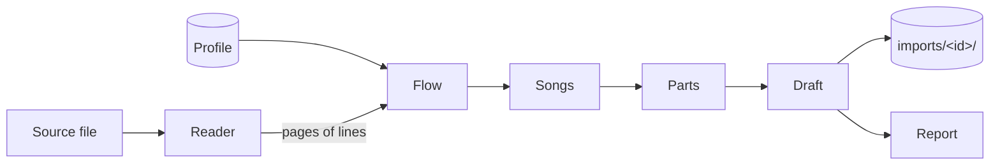

# SDD-0003 — Song import

- **Status:** Accepted; case by case, a profile per book
  ([ADR-0024](../decisions/0024-import-case-by-case.md))
- **Date:** 2026-09-27
- **Decision:**
  [ADR-0018](../decisions/0018-import-songs-through-a-layout-aware-pipeline.md)

Turns a source document into a draft hymnbook in the content format
([SDD-0002](0002-content-format.md)), plus a report of what the importer was
unsure of. Command line first; the browser later, on the same code.

## 1. Shape



| Stage  | Does                                                                     | Lives in            |
| ------ | ------------------------------------------------------------------------ | ------------------- |
| Reader | One per source format. Bytes → pages of positioned, styled lines         | `src/import/read/`  |
| Flow   | Lines → reading order: page, column, top to bottom; drops page furniture | `src/import/`       |
| Songs  | Starts a song at each title; a song runs on across columns and pages     | `src/import/`       |
| Parts  | Blocks → stanzas and choruses; printer's line wraps joined               | `src/import/`       |
| Draft  | Numbers, titles, sequence, `hymnbook.json`; checked by `validate.ts`     | `src/import/`       |
| CLI    | Arguments, file I/O, writing the draft and report                        | `scripts/import.ts` |

Everything in `src/import/` is pure TypeScript with no Node or DOM import, like
`src/domain/`, so the browser can run it unchanged. Readers may depend on a
library (pdf.js runs in both); only the CLI touches the file system.

## 2. The reader contract

```ts
interface SourceLine {
  text: string;
  /** Left edge and baseline, in points, origin top-left. */
  x: number;
  y: number;
  width: number;
  size: number;
  /** The line's dominant font, e.g. "TimesNewRomanPS-ItalicMT". */
  font: string;
}

interface SourcePage {
  number: number; // 1-based
  width: number;
  height: number;
  lines: SourceLine[]; // top to bottom, then left to right
}
```

**Lines from runs** (`src/import/source.ts`, shared by every reader that has
positions). Content-stream order is not trusted: runs on one baseline are one
line, with a space where the gap is wider than 0.15 em, unless a column gutter
falls between them. No gap width tells a gutter from a word space: justified
lines in _Hymns of Fellowship_ stretch a space to 1.6 em, and its narrowest
gutter is 1.5 em. A gutter is instead found per page as a vertical band no text
crosses, with text beside it on three or more baselines; one stray run across it
(a folio) is tolerated. Its right edge, where the next column starts, is where a
baseline splits. On that book's 98 song pages this merges no line across columns
and splits none within one.

**PDF** (pdf.js, `getTextContent`), passed pdf.js rather than importing it: Node
and Bun want its legacy build, a browser its default one. A PDF whose
permissions forbid copying text is refused, as is a password-protected one.
`font` is the PostScript name with the subset prefix stripped
(`OYCPPR+TimesNewRomanPS-ItalicMT` → `TimesNewRomanPS-ItalicMT`); one font often
appears under several subsets. pdf.js resolves names only after the page's
operator list is loaded.

**PowerPoint** (`src/import/read/pptx.ts`,
[fflate](https://github.com/101arrowz/fflate) to unzip and
[fast-xml-parser](https://github.com/NaturalIntelligence/fast-xml-parser) for
the XML, both MIT), added because _Songs of Zion_ is a deck
([ADR-0024](../decisions/0024-import-case-by-case.md): readers come when a real
book needs one). One page per slide, in the order `ppt/presentation.xml` lists
them through its rels, not by file name; the page is the slide size (`sldSz`,
EMU ÷ 12,700 = pt). A hidden slide (`show="0"`) has no page, and `--pages` and
the numbers of the others still count it, so a page number is always the slide's
place in the deck. A slide has shapes, not lines, so the reader makes the
positions. Each text shape gives runs, inside groups too (their transforms
applied, nested ones composed), as do a table's cells (each laid out as a small
box, in row order) and the `mc:Choice` of an `mc:AlternateContent`, else its
`mc:Fallback`. Slide number, date and footer placeholders are skipped: they are
furniture, not lyrics.

A paragraph, and each `a:br` in it, is one line, and a line is one run: its
texts joined, whitespace-only ones included, as they are the word spaces. Its
`x` is the shape's offset plus its inset and the paragraph's margin (and first-
line indent); its `width` is what is left of the shape's width from there, as a
line's true width is only known to the renderer. `y` is synthesised, a baseline
as a line's top plus 0.8 × its size: the box's top inset, plus the height of the
lines before it, a line being 1.2 × its size tall (or what `lnSpc` says; an
empty paragraph takes a line too). The block of lines sits at the top, middle or
bottom of the box as `anchor` says. This is enough because the flow stage needs
the order of lines and which ones sit side by side, not their true positions:
two shapes with the same top and different sizes land within the baseline
tolerance and so share a line, as in a PDF. Wrapping, rotation and space before
or after paragraphs are ignored.

`size` is the run's `sz`, else the first that says one of the shape's own
`lstStyle`, the layout's and the master's placeholder (matched by `idx`, then,
without one, by type), the master's `txStyles` (title, body or other) and the
presentation's default text style, else 18 pt, times `normAutofit`'s
`fontScale`. A line takes its size and font from its first run that has text.
`font` is resolved the same way from `a:latin`, with `+mj-lt` and `+mn-lt` read
from the theme, and named as a PDF names a styled face: `b="1"` and `i="1"` on
the run add `-Bold`, `-Italic` or `-BoldItalic` (`Calibri-Italic`), so one
profile reads either file; insets come from the shape, else its placeholders.
Field text is kept; XML entities, character references and Office's `_x000D_`
escapes are decoded. A file that is not a zip, one with an entry over 50 MB
unzipped, one without `ppt/presentation.xml`, a slide that is missing or whose
XML is not well-formed, are refused with the part named.

A document that yields no text (a scan), or text outside the profile's `script`,
is reported and not imported: it needs OCR, a later reader.

## 3. The profile

What differs between books is data, one JSON file per book in
`import-profiles/`, passed on the command line. It holds no lyrics, so it is
committed. Unknown fields fail, as in the format.

A profile is required, written from `bun run import`'s font table. A book that
needs more than a profile can say gets a script of its own beside the shared
stages (ADR-0024); nothing is inferred.

```json
{
  "hymnbook": { "id": "…", "title": "…", "language": "en", "script": "Latn" },
  "pages": { "from": 7, "to": 104 },
  "index": { "pages": { "from": 3, "to": 6 } },
  "furniture": { "pageNumber": true },
  "title": {
    "pattern": "^\\(?(?<number>\\d+)\\)\\s*(?<title>.+)$",
    "font": "TimesNewRomanPS-BoldMT"
  },
  "chorus": { "font": "TimesNewRomanPS-ItalicMT" },
  "labels": { "chorus": "chorus", "bridge": "bridge", "end": "outro" },
  "directions": ["ladies", "men", "women", "together", "echo"],
  "stanzaGap": 1.3
}
```

Four fields are for books that are not typeset pages, and may be left out:
`chorus` (a book that sets its choruses like its stanzas finds none by font),
`wraps: false` (the reader's lines are the author's own, so no line is joined to
the next), `pitch: "page"` (a gap is measured in the page's own tightest step,
not the book's commonest, for a deck whose slides shrink their type to fit; a
page with no measurable step, such as a single line, uses the book's pitch), and
`continues: true` (a heading that repeats the previous song's number on the very
next page continues that song, the page boundary a stanza break; any other
repeat is dropped and noted). A title pattern whose `(?<title>)` group is empty
marks a book that prints no titles (below).

The rules the stages apply with it:

- **Columns** are found per page by their gutters (§2); a page with fewer than
  most is split where most are. A line that is only a number is the folio, when
  `furniture.pageNumber` is set.
- **A song** starts at a line matching `title.pattern` in `title.font`, and runs
  on across columns and pages. A heading that wraps, in the same font, is
  joined.
- **Blocks** split where the gap exceeds `stanzaGap` × the book's line pitch. At
  the top of a column the gap can't be seen, so the halves are joined when a
  wrap runs across the break, or when together they are as long as the song's
  usual block (the commonest length among its other blocks) and neither alone
  is, or when the first half is shorter than the usual block and the second is
  as long: a stub at the foot of a column, or when both are chorus and the song
  has no other. A song with no other block joins.
- **Labels** in `labels`, however punctuated ("Chorus:", "(chorus)", "Chorus…"):
  heading lines, they give them their kind; alone or closing a block, they stand
  for that part sung again. Within a block, a chorus label heads what follows
  only if the profile has `chorus` and it is in that font; otherwise it closes
  the lines before it (no gap was printed after "Cho…"). Ending a line after an
  ellipsis or before one ("covered me…Cho….", "today. Ch…"), a label closes the
  block there.
- **Cues**: a block's last line that is the chorus's first line, in quotes or
  (only when the profile has `chorus`) in `chorus.font` ("Bind us together, Lord
  ...") stands for the chorus sung again. Trailing off alone doesn't make a cue:
  a stanza's own last line often leads into the chorus with its words. A
  chorus's first line printed as a block of its own and trailing off ("Jesus
  Messiah …..") is a cue too. A label or cue just before the chorus printed is
  that chorus.
- **Kind**, unlabelled: a block starting in `chorus.font` is a chorus, else a
  stanza (a chorus's italic can stop partway). A block printed again word for
  word is the same part.
- **Wraps** are joined where the next line's first word would not have fitted on
  this one, against the column's widest line. Before a lowercase word that is
  sure; before a capital, only a short remainder after unpunctuated text is
  joined, as a guess (two words or fewer; four for a line starting with "I" or
  "&").
- **Untitled songs**: where the heading carries no title, the song's first line
  stands for it, without the comma, semicolon or dash that ended it (SDD-0002:
  "the first line when none is printed"). Each is noted, with the title it got.
- **Sequence** is as printed when the page spells it out: a label, or choruses
  printed more than once. Otherwise
  [ADR-0009](../decisions/0009-migrate-the-corpus-by-rule.md)'s rule: the
  chorus, printed once (several blocks in a row count as one), is sung first if
  printed first, and after every stanza and bridge; an ending is sung where
  printed.
- **Title**: the index's, where it names the same song as the heading (indexes
  are set in the book's case, headings often in capitals; "O" and "Oh", and "&"
  and "and", count as the same word; so does a title cut short, if what is left
  is two words or more); else the heading, its capitalised words recased as the
  song's lines set them within a line (a line's first word, or one in capitals,
  only when there's nothing better); a bracketed subtitle starts with a capital.
  A heading that differs from the index only by a bracketed subtitle the index
  leaves out keeps it, and is not reported.
- Repeat marks ("(2)", "(repeat)", "x 2", "– 2" at a line's end) are taken out
  of the line, and a line left empty is dropped: the Output shows lyrics, and
  the operator repeats with Repeat. "(Repeat Chorus)" is a label standing for
  the chorus. So are directions: a bracket holding only `directions` words
  ("(ladies descant)", "(Men)", "(echo)", "[Together]"); echoed words in
  brackets are lyrics and stay. Format 1 has nowhere to keep them.

## 4. The report

Nothing uncertain is decided silently; each is written to `report.md` beside the
draft, by hymn:

- any `validate.ts` violation in the draft
- text before the first title, or a title with nothing under it
- a number missing, duplicated, or out of order
- the index disagreeing with the page: title, page number, or a song not found
- a song titled by its first line, as none is printed
- a block split by a column break, joined or kept apart, when not certain
- a stanza twice as long as the song's usual stanza (three lines or more): the
  book may have printed two with no gap, which layout can't split
- a block in mixed fonts, so neither clearly stanza nor chorus
- a cue read as the chorus
- a sequence taken from a rule beside a bridge or ending, or choruses that
  differ
- a line wrap joined as a guess (both halves quoted); sure joins are only
  counted
- a repeat mark or direction taken out, the line before and after

### 4.1 The judge: an optional second opinion

Most report items are small typed questions about a little evidence: "chorus or
stanza?", "does this line continue the one above?", "is this line a title?",
"does this column continue the song before it?". Decision models such as Laya
answer exactly that shape: a state plus typed questions in (`choice`, `score`,
`noul` for yes/no), calibrated probabilities out.

The stages ask a `Judge`, and the default judge is the profile's rules. A model
judge is consulted only for questions the rules marked uncertain, never for
every line. Its answer changes the draft only above a threshold, and every
answer is still written to the report with its probability: it informs the
review and never replaces it (arc42 §8.6).

```ts
type Question =
  | { kind: "choice"; ask: string; options: string[] }
  | { kind: "noul"; ask: string };

interface Judge {
  /** One batch per song; answers in question order, with probabilities. */
  decide(
    evidence: object,
    questions: Record<string, Question>,
  ): Promise<Answers>;
}
```

Laya, as surveyed on 2026-09-27:

| Build                         | Size (with 34 MB tokenizer) | Licence    |
| ----------------------------- | --------------------------- | ---------- |
| `laya-multilingual`, official | 644 MB safetensors          | Apache-2.0 |
| Community ONNX, fp16          | 681 MB                      | Apache-2.0 |
| Community ONNX, int8          | 366 MB                      | Apache-2.0 |
| Community ONNX, int4          | 221–240 MB                  | Apache-2.0 |

The multilingual checkpoint (mmBERT-base, 322M) is the first candidate: faster
than the English one and trained across 100+ languages. Runtime is ONNX Runtime
(MIT): `onnxruntime-node` for the CLI, `onnxruntime-web` (WASM or WebGPU) for
the browser. No official small, static or distilled build exists. The community
builds are days old and unvetted, so we quantise the official weights ourselves,
with a script, rather than depend on one.

**The model is swappable.** Nothing outside the judge names a model:

- **Stages know only `Judge`.** Questions are plain text and options, not one
  model's prompt format.
- **An adapter per model family** turns `evidence` and `questions` into that
  family's input and its output back into `Answers`. Laya is the first; a
  fine-tuned Laya or another local decision model would be another.
- **A manifest names the model**, never the code: adapter, weights path or URL,
  SHA-256, licence, and the languages it was checked on. The CLI takes
  `--judge <manifest.json>`; the browser downloads whatever the manifest names.
  Swapping models is swapping a manifest.
- **One evaluation set judges them all:** questions with known answers, drawn
  from our own fixtures and from reviewed drafts. A model is adopted when it
  beats the rules on it, and the score is recorded in the manifest.

**Not a bottleneck, by construction:**

- The rules run first and the judge sees only their uncertain cases, batched per
  song. At the published CPU figure (about 140 ms for three questions), a book
  with 1,000 open questions takes about a minute.
- The model is never a dependency of the build or the app. In the CLI it is a
  flag (`--judge <manifest>`) and an optional dependency. In the browser it is
  an opt-in download cached on the device, never precached with the app.
- Without it, the import works the same and the report just holds more open
  questions.

**Local, and never generative.** A judge runs on the machine doing the import
and only picks among typed options; it never writes or rewrites a lyric. No
hosted service and no LLM (Claude included) is part of the pipeline: lyrics must
not leave the device (ADR-0018). Jev, the hosted original, is excluded for that
reason. Claude may help build the pipeline, tune a local model such as Laya, and
review results during development; its output is never an import stage. A
distant-future exception would need its own ADR.

`OPEN:` whether the judge beats the rules on real books. The rules come first
(§3); the model is added only if the report from a real book shows questions the
rules cannot answer.

## 5. Output

`bun run import <file.pdf|file.pptx> [--pages 5-12]` (the reader follows the
extension; for a deck a slide is a page) prints each line with its position,
size and font, then every font with a sample: what a profile is written from.
With a profile, `bun run import <file> --profile <profile.json> [--out <dir>]`
writes `imports/<id>/`: `hymnbook.json`, the `NNNN.json` files and `report.md`,
replacing a previous draft's files there and nothing else: a `HAND-FIXES.md`
beside them, the fixes no rule makes, is kept. `imports/` is gitignored. A
reviewed draft is moved into `content/` by hand, and only once its rights allow
(arc42 R2). In practice that means public-domain books shipped as samples
([ADR-0020](../decisions/0020-present-songs-do-not-publish-them.md)).

A book in song text (the authoring kit,
[text format 1](../authoring/text-format.md), ADR-0029) comes in beside the
profile pipeline, not through it:

```sh
bun run text <file.txt> --id I --title T --language L --script S \
  [--source <src.txt>] [--out <dir>]
```

runs the deterministic parser (`src/import/songtext.ts`) and writes the same
`<out>/<id>/` directory of format 1 (nothing on an error, each listed with its
line number), which `bun run pack` packs. With `--source`, the source check
(`src/import/sourcecheck.ts`) lists result lines absent from the source and
source lines absent from the result, and exits 1 on any difference. No judge and
no model are involved.

The app (#28) never runs the import; it loads a format 1 file, a reviewed draft,
into the device's own store (ADR-0024), which assigns its key, records source
and song hashes, and handles a file or book it already holds
([ADR-0021](../decisions/0021-identify-books-by-the-store-that-holds-them.md)).

## 6. Testing

Fixtures are PDFs, and decks zipped from minimal XML, generated by the test
itself, never a real book's lyrics. Stages below the reader are tested on
`SourcePage` values directly.

## 7. The first book

_Hymns of Fellowship_ (Bethesda Assembly, Thane): English, 104 pages, InDesign,
two columns, text extractable. It is the target of #27 and would be the app's
second hymnbook. No Malayalam PDF is available, so Malayalam import is untested.

First draft (2026-09-27), in 4 s: 275 songs, numbered 1–275 without a gap, each
in the index on its page; 178 with a chorus, 26 with a bridge; valid content.
1,017 notes, 786 of them wraps: its columns are 157 pt wide. Two PDFs of it
exist; their drafts are identical, and the reports differ in one line, the older
index listing #165 on the wrong page.

_Songs of Zion_ (a deck by Vijay Lakka, published by GLS Publishing, Mumbai,
India): English, 422 slides of 960 × 540 pt, one song to a slide, headed by a
zero-padded number line (28 pt, centred) and untitled; Calibri, mostly 24 pt,
20–28 with the type shrunk on long songs.
`import-profiles/eng-gls-songs-of-zion.json`; the id is language, publisher,
title, as for any book. Numbered 1–420 without a gap. Two songs continue onto a
second slide, which repeats the number (slides 51–52 and 91–92: "051", "090");
`continues` joins each, the second slide a new stanza. Any other repeated number
would still be left out and noted, as a number is unique in a book.

The deck's paragraphs are the author's lines (PowerPoint wraps them only when it
draws): against the book's PDF, every slide's text is identical, and each deck
line is one PDF line or two (23 lines on 12 slides). They are not metrical
lines, though: a paragraph often holds two, rarely four, set one after the
other, so a stanza of four has two to four deck lines. They are kept as they
are. The italic lines are the choruses (140 songs), found by font, which the
reader gained here; the first book's rule for a stanza's sequence then applies.
First draft: 420 songs, 140 with a chorus, none with a bridge or an ending; 429
notes, 420 of them titles taken from the first line, 5 mixed fonts, 2
continuations, 1 cue, 1 sequence.

`OPEN:` Malayalam PDFs with legacy fonts; OCR; the other readers; splitting a
deck line that holds two verse lines.
