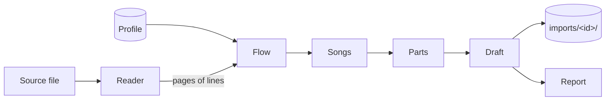

# SDD-0003 — Song import

- **Status:** Accepted; PDF reader first
- **Date:** 2026-09-27
- **Decision:** [ADR-0018](../decisions/0018-import-songs-through-a-layout-aware-pipeline.md)

Turns a source document into a draft hymnbook in the content format
([SDD-0002](0002-content-format.md)), plus a report of what the importer was
unsure of. Command line first; the browser later, on the same code.

## 1. Shape



| Stage  | Does                                                                     | Lives in            |
| ------ | ------------------------------------------------------------------------ | ------------------- |
| Reader | One per source format. Bytes → pages of positioned, styled lines         | `src/import/read/`  |
| Flow   | Lines → reading order: page, column, top to bottom; drops page furniture | `src/import/`       |
| Songs  | Starts a song at each title; a song runs on across columns and pages     | `src/import/`       |
| Parts  | Blocks → stanzas and refrains; printer's line wraps joined               | `src/import/`       |
| Draft  | Numbers, titles, sequence, `hymnbook.json`; checked by `validate.ts`     | `src/import/`       |
| CLI    | Arguments, file I/O, writing the draft and report                        | `scripts/import.ts` |

Everything in `src/import/` is pure TypeScript with no Node or DOM import,
like `src/domain/`, so the browser can run it unchanged. Readers may depend
on a library (pdf.js runs in both); only the CLI touches the file system.

## 2. The reader contract

```ts
interface SourceLine {
  text: string;
  /** Left edge and baseline, in points, origin top-left. */
  x: number;
  y: number;
  width: number;
  size: number;
  /** The line's dominant font, e.g. "TimesNewRomanPS-ItalicMT". */
  font: string;
}

interface SourcePage {
  number: number; // 1-based
  width: number;
  height: number;
  lines: SourceLine[]; // in the order the document gives them
}
```

**PDF** (pdf.js, `getTextContent`): text runs on one baseline are merged
into a line, with a space where the gap between them is wider than a
fraction of the font size. Run order within the content stream is not
trusted. `font` is the PostScript name with the subset prefix stripped
(`OYCPPR+TimesNewRomanPS-ItalicMT` → `TimesNewRomanPS-ItalicMT`); one font
often appears under several subsets. pdf.js resolves names only after the
page's operator list is loaded.

A document that yields no text (a scan), or text outside the profile's
`script`, is reported and not imported: it needs OCR, a later reader.

## 3. The profile

What differs between books is data, one JSON file per book, passed on the
command line. It holds no lyrics.

```jsonc
{
  "hymnbook": { "id": "…", "title": "…", "language": "en", "script": "Latn" },
  "pages": { "from": 5, "to": 104 }, // skip front matter and index
  "columns": 2,
  "furniture": { "pageNumber": true }, // drop the folio
  "title": {
    "pattern": "^\\((\\d+)\\)\\s+(.+)$", // group 1: number, group 2: title
    "font": "TimesNewRomanPS-BoldMT", // optional: must also match
  },
  "refrain": { "font": "TimesNewRomanPS-ItalicMT" },
  "stanzaGap": 1.5, // × line pitch
  "sequence": "refrain-after-each-stanza", // or "as-printed"
}
```

A title that wraps onto the next line, in the same font, is joined.
`sequence` follows [ADR-0009](../decisions/0009-migrate-the-corpus-by-rule.md):
with a refrain, it is sung first when printed first, and after every stanza.

## 4. The report

Nothing uncertain is decided silently; each is written to `report.md` beside
the draft, by hymn:

- a line wrap joined (both halves quoted)
- a block of mixed fonts, so neither clearly stanza nor refrain
- a number missing, duplicated, or out of order
- text before the first title, or a page the profile covered with no song
- any `validate.ts` violation in the draft

### 4.1 The judge: an optional second opinion

Most report items are small typed questions about a little evidence:
"refrain or stanza?", "does this line continue the one above?", "is this
line a title?", "does this column continue the song before it?". Decision
models such as Laya answer exactly that shape: a state plus typed questions
in (`choice`, `score`, `noul` for yes/no), calibrated probabilities out.

The stages ask a `Judge`, and the default judge is the profile's rules.
A model judge is consulted only for questions the rules marked uncertain,
never for every line. Its answer changes the draft only above a threshold,
and every answer is still written to the report with its probability: it
informs the review and never replaces it (arc42 §8.6).

```ts
type Question =
  | { kind: "choice"; ask: string; options: string[] }
  | { kind: "noul"; ask: string };

interface Judge {
  /** One batch per song; answers in question order, with probabilities. */
  decide(
    evidence: object,
    questions: Record<string, Question>,
  ): Promise<Answers>;
}
```

Laya, as surveyed on 2026-09-27:

| Build                         | Size (with 34 MB tokenizer) | Licence    |
| ----------------------------- | --------------------------- | ---------- |
| `laya-multilingual`, official | 644 MB safetensors          | Apache-2.0 |
| Community ONNX, fp16          | 681 MB                      | Apache-2.0 |
| Community ONNX, int8          | 366 MB                      | Apache-2.0 |
| Community ONNX, int4          | 221–240 MB                  | Apache-2.0 |

The multilingual checkpoint (mmBERT-base, 322M) is the first candidate:
faster than the English one and trained across 100+ languages. Runtime is
ONNX Runtime (MIT): `onnxruntime-node` for the CLI, `onnxruntime-web`
(WASM or WebGPU) for the browser. No official small, static or distilled
build exists. The community builds are days old and unvetted, so we
quantise the official weights ourselves, with a script, rather than depend
on one.

**The model is swappable.** Nothing outside the judge names a model:

- **Stages know only `Judge`.** Questions are plain text and options, not
  one model's prompt format.
- **An adapter per model family** turns `evidence` and `questions` into that
  family's input and its output back into `Answers`. Laya is the first; a
  fine-tuned Laya or another local decision model would be another.
- **A manifest names the model**, never the code: adapter, weights path or
  URL, SHA-256, licence, and the languages it was checked on. The CLI takes
  `--judge <manifest.json>`; the browser downloads whatever the manifest
  names. Swapping models is swapping a manifest.
- **One evaluation set judges them all:** questions with known answers,
  drawn from our own fixtures and from reviewed drafts. A model is adopted
  when it beats the rules on it, and the score is recorded in the manifest.

**Not a bottleneck, by construction:**

- The rules run first and the judge sees only their uncertain cases,
  batched per song. At the published CPU figure (about 140 ms for three
  questions), a book with 1,000 open questions takes about a minute.
- The model is never a dependency of the build or the app. In the CLI it
  is a flag (`--judge <manifest>`) and an optional dependency. In the browser it
  is an opt-in download cached on the device, never precached with the
  app.
- Without it, the import works the same and the report just holds more
  open questions.

**Local, and never generative.** A judge runs on the machine doing the
import and only picks among typed options; it never writes or rewrites a
lyric. No hosted service and no LLM (Claude included) is part of the
pipeline: lyrics must not leave the device (ADR-0018). Jev, the hosted
original, is excluded for that reason. Claude may help build the pipeline,
tune a local model such as Laya, and review results during development;
its output is never an import stage. A distant-future exception would need
its own ADR.

`OPEN:` whether the judge beats the rules on real books. The rules come
first (§3); the model is added only if the report from a real book shows
questions the rules cannot answer.

## 5. Output

`bun run import <file> --profile <profile.json> [--out <dir>]` writes
`imports/<id>/`: `hymnbook.json`, the `NNNN.json` files and `report.md`.
`imports/` is gitignored. A reviewed draft is moved into `content/` by hand,
and only once its rights allow (arc42 R2).

## 6. Testing

Fixtures are PDFs generated by the test itself, never a real book's lyrics.
Stages below the reader are tested on `SourcePage` values directly. A real
book is used only by hand, locally.

## 7. The first book

_Hymns of Fellowship_ (Bethesda Assembly, Thane): English, 104 pages,
InDesign, two columns, text extractable. It is the target of #27 and would
be the app's second hymnbook. No Malayalam PDF is available, so Malayalam
import is untested.

`OPEN:` Malayalam PDFs with legacy fonts; OCR; the other readers.
