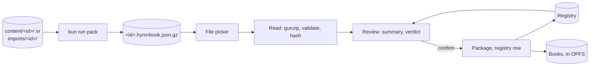

# SDD-0004 — Loading books

- **Status:** Proposed; its decisions are accepted (ADR-0026, ADR-0027)
- **Date:** 2026-10-02
- **Decisions:** [ADR-0026](../decisions/0026-songs-leave-the-repository.md)
  (songs leave the repository),
  [ADR-0027](../decisions/0027-review-a-book-without-editing-it.md) (review
  without edit),
  [ADR-0021](../decisions/0021-identify-books-by-the-store-that-holds-them.md)
  (keys, duplicates),
  [ADR-0019](../decisions/0019-version-the-content-format.md) (the container),
  [ADR-0024](../decisions/0024-import-case-by-case.md) (the app loads format 1),
  [ADR-0020](../decisions/0020-present-songs-do-not-publish-them.md) (stays on
  the device)

How a book gets onto a device and how the app knows what it holds: a container
file is picked, read, checked, shown, and stored, with a key, in the content
store. The app never runs an import (ADR-0024) and never uploads a byte.

## 1. Shape



| Stage    | Does                                                       | Lives in                   |
| -------- | ---------------------------------------------------------- | -------------------------- |
| Pack     | A directory → a container, validated first                 | `scripts/pack.ts`          |
| Read     | Bytes → the file's hash, a validated book, a hash per song | `src/domain/container.ts`  |
| Hashes   | The file's, and each song's, canonical form                | `src/domain/hash.ts`       |
| Key      | A UUIDv7                                                   | `src/domain/key.ts`        |
| Verdict  | What loading this would do, against what is held           | `src/domain/duplicates.ts` |
| Registry | The books held, their sources and song hashes              | content-store worker, OPFS |
| Package  | A SQLite package per book, schema version 3                | content-store worker, OPFS |
| Library  | List, load, summary, prompt, remove, choose                | `src/library/`             |

Everything in `src/domain/` stays pure, with no framework and no DOM, like the
rest of it. Reading and hashing use `DecompressionStream` and `crypto.subtle`,
which Bun, workers and browsers all have, and the worker does the reading, so a
large book never holds up a frame.

## 2. The container writer

`bun run pack <dir> [--out <dir>]` writes `<id>.hymnbook.json.gz`
([SDD-0002 §1](0002-content-format.md#1-two-forms)) from `content/<id>/` or
`imports/<id>/`. It is a CLI step beside `import`, not part of it.

1. Load the directory with `loadContent`, as `build:content` does, and run
   `validateCorpus`. Any violation is listed and nothing is written; the exit
   code is non-zero.
2. Write `{ "hymnbook": …, "hymns": […] }`: the parsed files verbatim (including
   `$schema`), hymns in number order, compact JSON.
3. Gzip at level 9 with fflate's `gzipSync` (pure JS, its version pinned by
   `bun.lock`), not `node:zlib`, whose deflate differs between Bun and Node. The
   header carries no timestamp and no file name, and its OS byte is set to 255
   (unknown), so the same book packs to the same bytes on any machine and
   runtime, and so to the same source hash. A test packs twice and compares, a
   golden test pins one book's sha256, and a test compares the CLI under Bun
   with the function under Node; an fflate upgrade that changed its output would
   fail the golden test.

The default output is `imports/` (ignored), relative to the working directory,
as `import`'s is, and made if missing; `--out` overrides it. It prints
`packed <file>: N songs, <size>, sha256 <hex>`. The directory's `id` must match
its name, as the build requires today; a container carries no such rule, since a
device keys the book itself (§5).

## 3. Reading a container

One file picker, `accept=".gz"`. The worker is handed the `File`.

1. **Bytes.** `file.arrayBuffer()`. The source hash is the SHA-256 of these
   bytes (§4), taken before anything else.
2. **Gunzip.** `DecompressionStream("gzip")`, to text. A stream that fails to
   decompress, or inflates past a ceiling of 64 MB (about fifteen times the
   Malayalam book's 4.15 MB of source), is rejected as "not a hymnbook
   container". The ceiling is a guard against a file built to exhaust memory,
   not a limit on books.
3. **Parse.** One JSON document; anything else is rejected.
4. **Shape.** An object with `hymnbook` and `hymns` (an array) and no other key.
5. **Validate.** `validateCorpus(hymnbook, hymns)` needs file names, which a
   container does not have, so they are synthesised: `hymnFileName(number)` for
   a hymn with an integer number, `hymns[i]` otherwise. Its rules then hold as
   they do for a directory: I1–I7, no unknown field, `hymnCount`, the format. A
   newer format is refused, naming both versions ("this book needs a newer app",
   ADR-0019). The directory-name rule (`id` equals the directory) does not
   apply.
6. **Hash the songs** (§4), only if valid.

A rejected book is rejected whole, every violation kept, nothing repaired
(ADR-0027). The worker keeps the parsed book under a token until the user
confirms or cancels; one review is pending at a time, and a second pick replaces
it.

```ts
interface LoadReview {
  token: string;
  title: string;
  language: string;
  script: string;
  sourceHash: string; // the file's hash (§4)
  origin: string; // the file's `id`
  songCount: number;
  violations: Violation[]; // non-empty: rejected, no verdict, no token
  verdict?: Verdict; // §8
  /** Songs of this file already held in another book. */
  held: {
    count: number;
    books: { key: string; title: string; count: number }[];
  };
}
```

## 4. Hashes

**The source hash** is the SHA-256 of the container file's bytes, hex. Two files
that differ in a byte differ here, whatever their songs; a repacked book is "the
same songs" (§8), not "the same file".

**The song hash** is the SHA-256, hex, of one song's canonical form: the JSON
text of this array,

```text
[title, parts.map(p => [p.kind, p.label ?? "", p.lines]),
 sequence.map(e => index of its part in parts), [author, tune, meter]]
```

with every string put in **NFC** and its **whitespace collapsed** (runs to one
space, ends trimmed), line by line. Absent `author`, `tune` and `meter` read as
empty strings, and an unset label as `""`, so a missing field and an empty one
hash alike. The parts are in printed order, as the file has them; the sequence
names parts by position, not by id, so a book that renamed `s1` to `1` is the
same book. The song's number and `$schema` are not in it.

A song hash spots exact matches only. A near match (the same song typed
differently) is a suggestion for a person, as ADR-0021 says.

**Same songs** means both books hold the same numbers and the hashes at every
one are equal. It is an equality of the whole, so a book with a song more or
less is not "the same songs".

Tests: hex of known SHA-256 vectors; NFC and spaced forms hash alike; a changed
word, label, kind, sequence or meta value does not; a renamed part id does.

## 5. Key and origin

A book on a device has a **key**, an opaque string
([ADR-0021](../decisions/0021-identify-books-by-the-store-that-holds-them.md)),
and an **origin**, the `id` its file declared.

The key is a **UUIDv7**, written by hand, with no dependency
(`src/domain/key.ts`): 48 bits of milliseconds since the epoch, version 7, the
variant bits, and 74 random bits from `crypto.getRandomValues`, as lowercase
hyphenated hex. The clock and the random source are parameters, so a test is
deterministic. A key is never parsed. A shipped book's key is its slug, and its
origin the same.

## 6. The registry

The registry lists the books held, so the Library and the duplicate check need
not open each one. It sits in the content store, in OPFS, beside the books: a
SQLite file in the same pool (`/registry.sqlite3`), written only by the worker.
It is not in `idb`: user state is small and irreplaceable, and the registry is
neither, and it must go or stay with the books it describes.

```sql
CREATE TABLE book (
  key       TEXT PRIMARY KEY,
  origin    TEXT NOT NULL,
  kind      TEXT NOT NULL CHECK (kind IN ('shipped','loaded')),
  file      TEXT NOT NULL,     -- the package's name in the pool
  title     TEXT NOT NULL,
  language  TEXT NOT NULL,
  script    TEXT NOT NULL,
  songs     INTEGER NOT NULL,
  added_at  INTEGER NOT NULL
) STRICT;

CREATE TABLE source (
  hash      TEXT PRIMARY KEY,  -- SHA-256 of a container file's bytes
  book_key  TEXT NOT NULL REFERENCES book(key) ON DELETE CASCADE,
  added_at  INTEGER NOT NULL
) STRICT;

CREATE TABLE song (
  book_key  TEXT NOT NULL REFERENCES book(key) ON DELETE CASCADE,
  number    INTEGER NOT NULL,
  hash      TEXT NOT NULL,
  PRIMARY KEY (book_key, number)
) STRICT;
CREATE INDEX song_hash ON song (hash);
```

The registry has its own version, in `PRAGMA user_version`, migrated by the same
rules as a package (§7).

**Clarified, decided in part 3: an unreadable package is a row with a state.**
`book` has one more column, `state TEXT NOT NULL DEFAULT 'ok'` with
`CHECK (state IN ('ok','needs-reloading','needs-newer-app','unreadable'))`; the
registry's `user_version` is 1. A package that is kept but cannot be opened (a
newer version, no migration step, a failed migration, a damaged file that has a
row) is a `loaded` row whose key is read from the file name (`<key>.<n>.sqlite3`
or `<slug>.sqlite3`) and whose `origin` is that key. Its `title` is read from
the package's `hymnbook` table if that still answers, else it is the key;
`language` and `script` are `''`, `songs` is 0, and it has no `song` or `source`
rows. Reconcile recomputes `state` at every start, so a package that becomes
readable (the app gains a migration step) is indexed afresh. A registry whose
version is not the app's is dropped and rebuilt from the packages, since it is
an index.

**It can be rebuilt from the books.** Each package records its key, origin and
source hashes (§7), and a song's hash is computed from its lines. So the
registry is an index, not the only copy, and the worker reconciles the two when
it starts:

- A registry row whose file is gone is dropped (the book was evicted or
  removed).
- A package file with no registry row is **adopted** if it is a package this app
  can read or migrate and its key is not already held: its row, sources and song
  hashes are rebuilt from it. This is how a crash between writing a book and
  registering it heals, and how a book from before the registry is taken in
  (ADR-0026). Its kind is `shipped` if the app bundles that id, else `loaded`
  with the slug as key: the one exception to a UUIDv7 key, which stays opaque
  ([ADR-0021](../decisions/0021-identify-books-by-the-store-that-holds-them.md)
  revised). A file that can't be read (a newer version, a failed migration) is
  **kept**, as a row listed unreadable (§7), never deleted. **Clarified, decided
  in part 3: reconcile never deletes a file that is or may be a book.** It
  deletes only a provably empty leftover with no row: a zero-byte file, or a
  database with no tables at all (an aborted first write). Everything else
  without a row is kept and listed: a database SQLite calls not a database or
  malformed, or one with other tables but no `hymnbook`, is listed unreadable; a
  readable package whose key another row holds (a stale copy, say) is listed
  unreadable under its file name (`k.2`), never overwriting the held row, unless
  it is a Replace that finished writing, or an older copy that is provably
  superseded by the row's file, which is deleted (**clarified, decided in part
  4**, §8: the one exception to "never deletes"). A transient error (busy, I/O)
  keeps the file and skips it until the next start. Of two files with one key,
  the higher `<n>` takes the key. The registry file itself is discarded and
  rebuilt only when SQLite calls it not a database or malformed; on any other
  error the app runs without a registry that session.
- A `shipped` book the app no longer bundles becomes `loaded`, key unchanged.
  When the songs leave (§13, part 6), this keeps the Malayalam book on every
  device that has it.
- A book's `sources` in the package and its `source` rows in the registry are
  merged: the union is kept in both, so a crash between the two writes (§8)
  heals.

**Decided: a package is installed whole, and an aborted first write is healed
only on proof.** A package written in place under its final name was torn when
the page reloaded mid-write: the pool takes a file's name at its first
statement, and SQLite spills the pages of a new file past a journal it has not
synced, so the next start found a malformed file and its journal, which no
reader rolls back. It was listed unreadable for good (reproduced by ending the
page 3.3 to 4.5 s into a 1,631-song load). So `PackageFiles.write(file, fn)`
builds the package in a scratch in-memory database, serializes it, and installs
it with the pool's `importDb`, which writes into a spare slot and takes the name
last (header, then flush): a kill leaves nothing under the name, and
`writeNewPackage` never opens a new package's file. Limits: if `importDb` throws
(storage quota) the write fails cleanly and says so, but the spare slot may hold
the partial bytes, unassociated, until it is reused or the next start truncates
it; and on an operating-system crash (not a worker kill) the order in which the
data and the header reach the disk is the platform's, so "whole" is the pool's
best effort, not a guarantee.

For files torn before this, reconcile removes a file with no row that SQLite
calls malformed or not a database **only when its `-journal` proves a first
write**: it reads the rollback journal's header (the magic `d9d505f920a163d7`,
then the record count, a nonce, and at offset 16 the database's size in pages
when the transaction began, big-endian: file format §4) and requires that size
to be 0, which only a file's first write has. Both files go, as the empty
leftover does. A journal with a size above zero (a crashed UPDATE or migration
of a book that exists), a short or unreadable journal, a garbage one, or none,
leaves the file kept and listed unreadable: it may be a book. A journal with no
file beside it is removed; there is nothing to roll back.

The pool's capacity is raised as books are added
(`SAHPoolUtil.reserveMinimumCapacity`), since each package, the registry, and
any journal take a file slot, and the default is small. The worker keeps the
registry and the current book open and opens another only to query it.

## 7. The package, schema version 3

`schema_version` goes to 3 ([ADR-0025](../decisions/0025-call-it-the-chorus.md)
took it to 2). The `hymnbook` row of
[SDD-0001 §6](0001-domain-model.md#6-storage-schema) changes:

| Column    | Was             | Now                                                            |
| --------- | --------------- | -------------------------------------------------------------- |
| `id`      | the book's slug | **the key**: a slug (shipped) or a UUIDv7 (loaded)             |
| `origin`  | none            | the `id` the file declared; for a shipped book, the slug       |
| `sources` | none            | JSON array of the container files' hashes the book has matched |

`part` gains **`position INTEGER NOT NULL`**, with
`UNIQUE (hymn_number, position)`: the part's place in the printed order, as the
file has it (0, 1, ...). **Clarified, decided in part 3:** a song hash (§4)
needs the file's part order, which a package must keep without relying on
`rowid` (SQLite may change the rowids of such a table on `VACUUM`). In the
Malayalam book 270 of 1,631 songs list their parts in an order other than first
appearance in the sequence, which is how the Operator reads them, so `getHymn`
keeps its own order and the hashing reader orders by `position`. `content_hash`
stays as it is: a hash of the source files, not of a container (§4), so it is
never put in `sources`. For a loaded book it is the first container's file hash.
The other tables are unchanged. Search, `hymn_fts` and every query are as
before.

**One builder.** The rows a package holds are produced by one pure function,
`packageRows(book, hymns)`, which `build:content` (`node:sqlite`) and the worker
(OO1) each insert, so the two cannot disagree. A test builds one book and
compares the rows each would insert. The worker writes a package to a file named
`<key>.<n>.sqlite3` (`n` counts up with each Replace), then the registry row, in
that order; the registry transaction is the commit.

**Migrate on open.** The worker reads `schema_version` when it opens a book:

| Found                 | What happens                                                             |
| --------------------- | ------------------------------------------------------------------------ |
| The app's version     | Open                                                                     |
| Older, a shipped book | Replaced from the bundle, once (ADR-0025)                                |
| Older, a loaded book  | **Migrated in place**, step by step, from the version it has to this one |
| Older, no step known  | Kept, listed as "needs reloading", openable never, removable always      |
| Newer than the app    | Kept, listed as "needs a newer app", removable                           |

Only a shipped book is ever replaced from the bundle: a loaded book has none to
be replaced from. **A version bump never deletes a loaded book.** A migration
that fails leaves the file as it was and the book listed as unreadable. The
steps go from version 2: 2 → 3 adds `origin` (filled from `id`) and `sources`
(left empty: no container has been loaded, so the first container of that book
is "the same songs" by its song hashes, and records its hash then), and
`position`, filled once from `rowid` order, the best a version 2 file has (the
app has never vacuumed one), all in one transaction. A migrated package gets a
unique index in place of the table constraint, which `ALTER` cannot add. A
version 1 package (with `refrain`, which `CHECK` cannot be altered to allow) has
no step and is the "no step known" row.

## 8. Duplicates

Checked when a file is read, in this order, against the registry's `source`,
`song` and `book` tables. The first row that holds wins.

| #   | Verdict                | Holds when                                                | Offered                              | Written                                                                   |
| --- | ---------------------- | --------------------------------------------------------- | ------------------------------------ | ------------------------------------------------------------------------- |
| 1   | Same file              | the file's hash is in some book's `source`                | Open that book                       | nothing                                                                   |
| 2   | Same songs             | a held book has the same numbers, each with an equal hash | Open that book                       | the file's hash, in the package's `sources`, then the registry's `source` |
| 3   | Same origin, different | a held book has this origin, and the songs differ         | **Keep both** (default), **Replace** | see below                                                                 |
| 4   | New                    | none of the above                                         | Load                                 | a new book, key and registry rows                                         |

**Keep both** loads a new book beside the other, with its own new key and the
same origin; the next load of that origin finds two held books, and Replace is
offered for each. **Replace** keeps the book's **key**, so recents and positions
still point at it: the new package is written under the same key, the registry
row, `song` rows and `source` rows are swapped in one transaction, then the old
file is removed. Its sources become the new file's hash alone, so the old file,
loaded again, is a row-3 case, not row 1. **Replace is not offered for a shipped
book**, which the bundle would overwrite; Keep both is.

**Clarified, decided in part 4: Replace's write order, and what a crash
leaves.** Replace is three steps, in this order:

1. the new package is written as `<key>.<n+1>.sqlite3`, where `n+1` is past
   every `<n>` of that key in the pool (a kept leftover is never opened over);
2. **one registry transaction swaps the row, its `song` rows and its `source`
   rows: this is the commit.** The row keeps its key and its `added_at`;
3. the old file is removed.

A crash before step 2 leaves the old row and a higher `<n>` copy with no row; a
crash after it leaves the new row and a lower, superseded copy with no row. At
start, reconcile treats a no-row, readable package whose key a row holds as a
**finished Replace** when the held book is `loaded` and readable, its file is a
lower `<n>` that still exists, and both packages read as the same origin: the
higher copy takes the row (its sources are its own, as after a Replace; the
registry's old ones go with the old rows), `added_at` kept. The lower file is
then provably superseded and **is deleted**: that is the one amendment to part
3's rule that reconcile never deletes a file that is or may be a book, and
nothing else is loosened. A file with no row is deleted only when all of these
hold: it is a readable package (SQLite says so); the row's file is a readable
package of the same key and the same origin; and the row's file has a strictly
higher `<n>` and holds the row (after the finished-Replace rule above, the
higher copy does). Anything short of that (a different origin, an unreadable
file on either side, the lower file holding the row, an equal `<n>`) is a stray:
kept, listed under its file name, never preferred. A crash before step 2
therefore completes the Replace the user chose, and one after it leaves the
Replace done, with no leftover either way.

**Recording a hash (row 2)** is two writes in this order: the package's
`sources` (one small transaction in the book's own file), then the registry's
`source` row. A crash between them leaves the package ahead, and the start-up
reconcile (§6) copies the hash to the registry.

**A song already held** is never a verdict. The summary counts the file's songs
whose hash is in `song` under another book, by book, and flags them; the load
proceeds (ADR-0021). A "same songs" book is all songs held by definition, and
says so only as row 2.

The verdict is a pure function of the file's hash, its origin, its song hashes
and the registry's rows; it lives in `src/domain/duplicates.ts` and is tested
without a store. Per-song reconcile, picking among the added, removed and
changed songs of two editions (ADR-0021), is a later part (§13, part 7); until
then, row 3 is Replace or Keep both.

## 9. The Library

Board #28 turns the Library from a provisioning gate
([SDD-0001 §12](0001-domain-model.md#12-library)) into the list of books held.
How it is drawn is [`visual/DESIGN.md`](../visual/DESIGN.md#structure)'s, § The
Library; this says what it shows and does.

- **The list**: every book held, shipped and loaded, each with its title,
  language, song count (written `1,631`), and what it is (shipped or loaded).
  The current book is marked. Order is the registry's (added), never changed by
  choosing. A book that is missing, unreadable or needs a newer app says so, in
  the list, and can be removed; **Load Again** is offered where a file can fix
  it (below).
- **Choose**: choosing a book makes it the current book, and a tap on its row
  goes on to the Finder, aimed at that book and focused, so the next thing typed
  is a search in it (over the song on screen, if one is up). The current book is
  the Finder's **scope**; it is never the song's book (§10). There is no new
  stored field: the app's current book starts as the book of the newest recent
  (`RecentEntry.hymnbookId`, SDD-0001 §11) that is still held, else the first
  held book, is chosen again the same way when it stops being held (a removal),
  and a chosen book is remembered once a hymn from it is opened, which adds a
  recent. Choosing first asks the worker to `openBook` it; a file that has gone
  (evicted) turns the row into **File missing**, with Load Again, and the book
  is not chosen.
- **Load Books**: the file picker. While it reads, the row is a progress line;
  then the **summary** (ADR-0027): title, language and script, song count, the
  violations if any (all of them, by song and rule; none repaired), the verdict
  and its choices (§8), and how many songs are held elsewhere, by book. Nothing
  is written until a button is pressed. Cancel throws the parsed book away.
- **Remove**: chosen, by the maintainer: a loaded book only, after a
  confirmation that names it. It removes the package file and the registry rows
  and drops its recents; if it was the current book, the next held book becomes
  current, or none.
- **Nothing held** is the first run (ADR-0026), chosen by the maintainer: the
  Library says, in a line, that a songbook file is loaded or typed in and stays
  on this device ("Bring your first songbook"), and offers **Load Books** (the
  filled button) and **From Text**. No demo book, no download. The Finder and
  the Operator say "no book yet" and link to it.

Chosen, by the maintainer: the first load asks for persistent storage
(`navigator.storage.persist()`), since a loaded book has no host to come back
from (arc42 R4). If it is refused, a one-time note says to keep the file; the
book loads as before.

This unblocks Board #19, the picker's hymnbook scope.

**Decided in part 5, by the maintainer, after the mockup (and pinned in
review):**

1. **Load Again aims the review at the book.** A row that cannot be opened
   (`needs-reloading`, `unreadable`, or a file found missing) offers Load Again;
   the picked file is reviewed with that book's key as its **target**
   (`LoadSession.review(bytes, target)`, `LoadReview.restore`). Committing
   replaces the book **under its key**, so its recents and positions come back,
   whatever origin the file declares: the duplicate verdict is not asked, since
   the book it would match cannot be read. The review says it "brings a book
   back", and a file whose title differs from the book's (when the book still
   has one) adds a warning naming both titles. The write is Replace's (§8) with
   one difference: `replaceBook` is given `restore: true` and accepts a book
   whose state is not `ok`; the damaged file is then removed like the old file
   of any Replace. The review pins the book as it was (key, file, state): the
   commit is refused as stale unless the row still names that file and the book
   still cannot be read (or its file is gone), so a file never goes over a book
   that has become good or been replaced meanwhile. A shipped book, a book that
   needs a newer app (a file does not fix that), or a key not held, is refused,
   at the review and at the commit. Nothing else is loosened: a crash between
   the steps leaves the damaged row and a higher-`<n>` stray, listed, never
   preferred (§6).
2. **A same-songs file is recorded on Open Book**, not when it is read. The
   review of a same-songs file writes nothing (ADR-0027); **Open Book** commits
   (`recorded`) and chooses the book; Cancel writes nothing. Same file's Open
   Book writes nothing and chooses the book.
3. **Error colours**: MD3's baseline error roles join the tokens, in every theme
   block, distinct from On Air's (`visual/DESIGN.md` § Colors).
4. **A load becomes current only when none is.** The first load makes its book
   current (the Operator has nothing else to show); any later load leaves the
   current book as it is, so a load can never change the book under a service,
   and the new row is scrolled into view, tagged **Added** for a few seconds.
   Open Book and Restore Book on a book that is not current do not choose it
   either; Open Book does, being the user's choice of that book.

Part 5 also decided, by the mockup: the choice for a same-origin file is
**radios** (Keep both, then Replace for each loaded held book, a shipped one
shown and disabled), with one confirm button whose label follows; Replace's text
says what it keeps (the key, so recents and position; the added date) and drops
(the old songs; the old file's record). The review sheet is taller than other
sheets. A long title is clamped to two lines in the list and shown whole in the
review. The hymnbook picker lists the readable books (its **Manage Books** row
was dropped later: the Library is in the navigation).

**A book from text (Board #34, ADR-0029).** Beside Load Books, **From Text**
opens a sheet with the book's own fields (title, language and script, all
required and never guessed; the id, made from the title as a slug and editable;
an optional song number for one song whose first line has none), an area for the
song text (pasted, or opened from a `.txt`), and an optional area for the source
text. **Review the Book** runs `parseSongText` and nothing else: its errors are
listed with their line numbers, or the fields that are missing, and nothing is
written. When there are none, `textBook` builds the book and `containerBytes`
(`src/import/container.ts`, the writer `bun run pack` uses, so the same text is
the same bytes) gzips it in memory; the bytes go to `review` as a file named
`<id>.hymnbook.json.gz`, exactly as a picked container would, so the validator,
the hashes and the verdict (§8) are the one code path. The review shows a
**Source check** row: "Not checked against a source" when no source text was
given (ADR-0029, open point 3), "Checked against a source: no differences", or
"Checked: N to look at" with the lines the book added or altered and the source
lines it dropped, listed for a person to judge (`sourceCheck`; nothing is
decided). The buttons are the same: Load Book, Keep Both, Replace, Open Book.
Nothing is written before one is pressed, there is no network, and the text
never leaves the page. Cancel in that review, or Edit the Text after a refusal,
returns to the sheet with everything typed kept; a successful load clears it.

**Decided after the first look (Board #34 and #28, by the maintainer):**

1. **The language is picked by name.** Codes are too technical. The language is
   a searchable list of languages by name, each in its own name and English
   ("മലയാളം — Malayalam", from `Intl.DisplayNames` over a fixed list:
   `en ml ta hi te kn bn mr gu pa or ur ne si` and others), with **Other…** to
   type a code. The script is derived
   (`new Intl.Locale(code).maximize().script`) and shown as a quiet line,
   "Script: Malayalam (Mlym) · Change", editable only on Change; choosing
   another language derives it again. The id (still from the title) and the song
   number move under **Advanced**.
2. **Errors are field errors.** Each is under its field, in the field-error
   style (outline and helper text in `error`). "There is no song text." is the
   Song text field's; the parser's errors are listed under it as "Line 12:
   message". No callout, no table.
3. **Sheets pin their header.** In the shared Sheet, the title and Close are a
   fixed row and only the content scrolls; the card ends after the last control.
4. **Choosing a book goes to Present.** A tap on a row makes the book current
   and shows the Operator; ⋯ stays.
5. **Several at once.** Load Books takes several files; **Open .txt files**
   joins several text files into one song text with `---` between (the format
   allows it). The review of several is a queue (below). Load Again takes one
   file.

**The queue (decided after the first look, by the maintainer).** The books can
be looked at in any order before any is decided: the sheet's header says "Book 2
of 5" with **Back** and **Next** (the arrow keys too) on either side, so the
whole set can be read first. Each book's decision is kept: open (not decided) or
loaded; a loaded book shows "Loaded" in place of its button, and any book still
open can be loaded from wherever the operator is. Loading one brings the next
open book into view, and the sheet closes when none is left. Closing the sheet
leaves the open books unloaded and says so in a snackbar ("2 books not loaded";
nothing is said for one book, or when all were decided). A file that cannot be
read is said and passed over, in either direction.

The session keeps **one** pending review (§3, §8), so the queue does not hold
tokens: a book brought into view is **read again**, and the new review replaces
the one pending, so the commit always uses the token of the review in view, and
the verdict is the one for the books held then (an earlier decision may have
made it a second edition of a held book). A book returned to shows its last
review at once, with its button disabled until the fresh review lands; one read
for the first time in the open sheet shows a progress line. A read overtaken by
moving on is thrown away when it lands (its token cancelled). Commits stay
serialized in the session (`#tail`) and a late-finishing commit never restores a
review begun while it wrote (`#generation`); `scripts/load.test.ts` pins both
for reviews taken out of order.

## 10. Several books

Nothing may assume one book. `BUNDLED_HYMNBOOK_ID` and its `?book=` development
hook go, along with the defaults that read it (`Library`, `Finder`, `Presenter`,
`App`):

- The content store's methods already take a `HymnbookId`; it becomes the key.
  `openBook(key)` (part 5) answers whether the book held under a key can be read
  (`ready`, or `missing-asset`, or `unreadable` with the registry's reason), and
  the store's queries find the book's file from the registry's **current row**
  for the key, not from its name, so a Replace (a new file under the same key)
  needs nothing invalidated. `ensureInstalled(id)` stays for the shipped book
  until part 6; the Library uses it only for a shipped book not yet held. The
  worker adds `listBooks`, `review(file, target?)`, `commit(token, choice)`,
  `cancel(token)` and `removeBook(key)`.
- The app's current book (`App.tsx`) starts as §9 says, not from
  `BUNDLED_HYMNBOOK_ID`; the book the hymn on screen is from is kept apart, so
  choosing another book does not blank the Output (SDD-0001 §16.4). **Decided
  after the first look, by the maintainer: two meanings, kept apart.** The
  current book is the Finder's **scope** (what a search looks in; the Finder
  says which book, under its field; Recents in the Finder are that book's; a
  first load adopts its book as the scope when there is none). The **song's
  book** (the presented book, from the hymn itself) is what the header's crumb,
  This Song, the Operator's Recents and the removal check name. The crumb is
  never a book paired with a song that is not in it. Choosing a book (the
  header's Hymnbooks picker or the Library) sets the scope and opens the Finder;
  the song on screen and the Output stay until a song is picked. A Finder closed
  without a pick puts the scope back on the song's book. A recents entry that
  names a key no longer held is skipped. `lastPosition` is unwired today
  (SDD-0001 §11) and is not used for this.
- **Decided in part 5, by the orchestrator: the book on the Output cannot be
  removed while the Output is live.** If the book being removed is the one the
  hymn on screen is from (the presented book) and the Output is live (On Air or
  Blanked, or not yet known to be closed), the Remove sheet says "This book is
  on the Output now. End Live first, then remove it", with an End Live button
  beside it (SDD-0001 §16.4), and Remove Book is disabled; the confirm is
  refused as well, whatever the button says. When the Output is not live,
  removing the presented book clears the presented state (hymn, number and
  presented key) at once, whether or not it was the current book, and the sheet
  says the song on screen goes with the book. Choosing another book still leaves
  the hymn on screen alone (SDD-0001 §16.4).
- Opening a book that is held but whose file is missing (evicted) is an error
  state with Load again, not a crash (arc42 §8.6).
- The development hook gives way to loading the file: a draft in `imports/` is
  packed (§2) and picked, as anyone's would be.

## 11. Privacy

A book never leaves the device (ADR-0020). The picker's `File` is read in the
worker, hashed there and written to OPFS; no step makes a request. The container
is never fetched, so the service worker never sees it, and nothing is cached
beyond OPFS. A test asserts it: it stubs `fetch`, `XMLHttpRequest`,
`navigator.sendBeacon` and `WebSocket`, runs a full read, review and commit, and
fails on any call. The registry holds titles and hashes and no lyrics, though
the packages it names do.

## 12. Testing

Unit, in vitest, with no browser: the writer (§2), the reader and every refusal
(§3), the hashes and the key (§4, §5), `packageRows` and the registry's SQL (run
on `node:sqlite`, which `build-content.test.ts` already uses), the migration
steps on a package built by `build:content`, and the verdict (§8) as a table of
every row and its order. The fixtures are books the tests generate, never a real
book's lyrics ([SDD-0003 §6](0003-song-import.md#6-testing)). `Library` is
tested with a fake store, as it is now.

OPFS, Workers and Wasm remain browser-only
([SDD-0001 §10.5](0001-domain-model.md#105-testing)): the worker's file and
registry code is checked by hand in a real browser, with the run-app skill, each
time it changes, and the check is written down in the part.

**A harness before the UI.** Parts 3 and 4 come before the Library's screen, so
they are driven from the browser's console: a development-only hook,
`window.hymnalDev` (`load(file)`, `list()`, `remove(key)`, and the review and
commit calls of §10), installed only under `import.meta.env.DEV`, so a
production build strips it. Part 5 replaces its loading calls with the screen
and deletes them. What stays, dev-only, is the inspector for the cases only OPFS
can show: `list`, `files`, `sql`, `put`, `copy`, `del`, `reconcile`, `recents`
and `addRecent`, which build a damaged package, a missing file or a recents
entry to look at in the Library. Everything pure in the worker's logic, the
registry's SQL, the migration steps and the verdict, is also tested in vitest on
`node:sqlite`, with no OPFS stand-in: what only OPFS can show is shown through
the hook.

**The app keeps working between parts.** Until part 6 the bundled book still
ships. Part 3 adds the registry and the new path beside `ensureInstalled` and
the bundle fetch, which keep working unchanged; the bundled book registers as
`shipped`. Schema 3 covers the bundled package: `build:content` writes it
through `packageRows` (§7) with `origin` equal to the slug and no `sources`, and
an installed copy at version 2 is replaced from the bundle, once, as ADR-0025
says. `Library`, `Finder` and `Presenter` keep their defaults until part 5.

## 13. Parts

Each part is built and reviewed on its own, in order. Each ends with
`bun run check` and what is named here.

1. **The container writer.** `bun run pack`, with its tests (§2). Verify: the
   test packs a fixture, validates the file against `container.schema.json` with
   ajv, reads it back to the source's content, and packs twice to the same hash;
   a book with a violation writes nothing and exits 1. By hand, on the Malayalam
   book and on _Hymns of Fellowship_: the sizes (ADR-0019 measured the first at
   508 KB) and the printed hash.
2. **Reader and hashes**, pure domain (§3–§5). Verify: every refusal in §3 has a
   test (not gzip, not JSON, wrong shape, an unknown key, a newer format, over
   the ceiling, a violation); the synthesised names pass what a directory passes
   and fail what it fails; the hash and key tests of §4 and §5, including a
   known-answer vector; the Malayalam container reads to the same violations
   `build:content` finds, none.
3. **The worker's package builder, registry and schema 3** (§6, §7), beside
   `ensureInstalled`, which still works (§12). Verify: unit tests as in §12; in
   a browser through `window.hymnalDev`, loading a container writes a package
   and a registry row, a reload keeps them, the bundled book registers as
   shipped, an existing copy with no row is adopted, a file with no row is
   adopted, a row with no file is dropped, an unreadable package is kept and
   listed, and a version 2 package migrates with its songs intact. Written down
   as steps in this part's commit.
4. **Duplicate check and write paths** (§8, §11). Review, commit, cancel,
   remove, persistent storage, through the same hook. Verify: the verdict
   table's tests; in a browser, each row with real files: the same file twice;
   the same songs repacked with a different gzip level (the hash lands in both
   places); a changed song (Keep both, then Replace, with the key and its
   recents unchanged); a new origin; a file with a violation, which writes
   nothing; a killed write, healed at the next start. The no-network test (§11).
   Remove leaves no file and no row.
5. **The Library** (§9, §10). The mockup first, at 390x844 and wide, light and
   dark. The hook goes. Verify: component tests for each state of §9;
   screenshots at 390x844 and in the dark theme, with the worst cases: a title
   that just fits, a Malayalam title with glyph overhang, wide song counts, a
   long list. The empty first run is looked at.
6. **The songs leave** (ADR-0026) — **done, pending the user** (prepared on the
   branch `board-songsleave`; it lands once the maintainer has loaded the
   container on their device and says go). Last, once the maintainer has loaded
   the Malayalam container through the Library. What depends on `content/`
   today, from a search of the tree, and what happens to each:

   | Depends                                   | On                                                       | Then                                                                                    |
   | ----------------------------------------- | -------------------------------------------------------- | --------------------------------------------------------------------------------------- |
   | `.github/workflows/deploy.yml`            | runs `bun run build:content`                             | the step goes                                                                           |
   | `package.json` `build:content`            | the script                                               | stays until a sample is decided (ADR-0026)                                              |
   | `scripts/build-content.ts`                | reads `content/`, merges `content-local/`                | kept; the overlay and the `content/` loop are dropped                                   |
   | `scripts/build-content.test.ts`           | temporary directories only                               | unchanged apart from the overlay tests                                                  |
   | `scripts/corpus-schema.test.ts`           | reads the real `content/`, which CI won't have           | changed to skip when absent, or removed: the container test of part 1 covers the schema |
   | `scripts/migrate-legacy.ts` and test      | writes `content/`; reads legacy source from a git commit | removed with ADR-0009 (the commit may go in the history rewrite)                        |
   | `src/config.ts`                           | `BUNDLED_HYMNBOOK_ID`, the `?book=` hook                 | removed with the defaults that read it (§10)                                            |
   | `src/persistence/content-store.worker.ts` | fetches `content/<id>.sqlite`                            | no bundled path while nothing ships                                                     |
   | `vite.config.ts`                          | `globIgnores: ["content/**"]` and comments               | comments updated; the glob is harmless                                                  |
   | `biome.json`, `.gitignore`                | `!content` ignore; `content/` committed                  | `content/` added to `.gitignore`; biome's entry stays                                   |
   | `public/content/`                         | the built packages                                       | no longer produced; already ignored                                                     |
   | `src/domain/types.ts`, tests              | a comment, and a fixture id                              | comment reworded                                                                        |

   Then: `git rm -r content/`, the ignore, the `deploy.yml` step, the removed
   defaults. Verify: `bun run check` with no `content/` on disk (a clean
   checkout), and `bun run build`; a device that holds the old copy still has
   its book, adopted as `loaded` (§6), recents intact.

7. **Reconcile**, later: two editions compared song by song (added, removed,
   changed) and picked per song (ADR-0021). Not designed here; its screen is
   drawn when this part is picked up.

`OPEN:` loose songs, which belong to no book, are a later Board item (ADR-0021).
The registry's `kind` would gain a third value for them.
