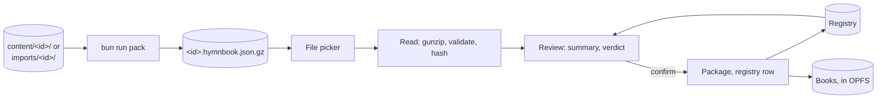

# SDD-0004 — Loading books

- **Status:** Proposed; its decisions are accepted (ADR-0026, ADR-0027)
- **Date:** 2026-10-02
- **Decisions:** [ADR-0026](../decisions/0026-songs-leave-the-repository.md)
  (songs leave the repository),
  [ADR-0027](../decisions/0027-review-a-book-without-editing-it.md) (review
  without edit),
  [ADR-0021](../decisions/0021-identify-books-by-the-store-that-holds-them.md)
  (keys, duplicates),
  [ADR-0019](../decisions/0019-version-the-content-format.md) (the container),
  [ADR-0024](../decisions/0024-import-case-by-case.md) (the app loads format 1),
  [ADR-0020](../decisions/0020-present-songs-do-not-publish-them.md) (stays on
  the device)

How a book gets onto a device and how the app knows what it holds: a container
file is picked, read, checked, shown, and stored, with a key, in the content
store. The app never runs an import (ADR-0024) and never uploads a byte.

## 1. Shape



| Stage    | Does                                                       | Lives in                   |
| -------- | ---------------------------------------------------------- | -------------------------- |
| Pack     | A directory → a container, validated first                 | `scripts/pack.ts`          |
| Read     | Bytes → the file's hash, a validated book, a hash per song | `src/domain/container.ts`  |
| Hashes   | The file's, and each song's, canonical form                | `src/domain/hash.ts`       |
| Key      | A UUIDv7                                                   | `src/domain/key.ts`        |
| Verdict  | What loading this would do, against what is held           | `src/domain/duplicates.ts` |
| Registry | The books held, their sources and song hashes              | content-store worker, OPFS |
| Package  | A SQLite package per book, schema version 3                | content-store worker, OPFS |
| Library  | List, load, summary, prompt, remove, choose                | `src/library/`             |

Everything in `src/domain/` stays pure, with no framework and no DOM, like the
rest of it. Reading and hashing use `DecompressionStream` and `crypto.subtle`,
which Bun, workers and browsers all have, and the worker does the reading, so a
large book never holds up a frame.

## 2. The container writer

`bun run pack <dir> [--out <dir>]` writes `<id>.hymnbook.json.gz`
([SDD-0002 §1](0002-content-format.md#1-two-forms)) from `content/<id>/` or
`imports/<id>/`. It is a CLI step beside `import`, not part of it.

1. Load the directory with `loadContent`, as `build:content` does, and run
   `validateCorpus`. Any violation is listed and nothing is written; the exit
   code is non-zero.
2. Write `{ "hymnbook": …, "hymns": […] }`: the parsed files verbatim (including
   `$schema`), hymns in number order, compact JSON.
3. Gzip at level 9 with fflate's `gzipSync` (pure JS, its version pinned by
   `bun.lock`), not `node:zlib`, whose deflate differs between Bun and Node. The
   header carries no timestamp and no file name, and its OS byte is set to 255
   (unknown), so the same book packs to the same bytes on any machine and
   runtime, and so to the same source hash. A test packs twice and compares, a
   golden test pins one book's sha256, and a test compares the CLI under Bun
   with the function under Node; an fflate upgrade that changed its output would
   fail the golden test.

The default output is `imports/` (ignored), relative to the working directory,
as `import`'s is, and made if missing; `--out` overrides it. It prints
`packed <file>: N songs, <size>, sha256 <hex>`. The directory's `id` must match
its name, as the build requires today; a container carries no such rule, since a
device keys the book itself (§5).

## 3. Reading a container

One file picker, `accept=".gz"`. The worker is handed the `File`.

1. **Bytes.** `file.arrayBuffer()`. The source hash is the SHA-256 of these
   bytes (§4), taken before anything else.
2. **Gunzip.** `DecompressionStream("gzip")`, to text. A stream that fails to
   decompress, or inflates past a ceiling of 64 MB (about fifteen times the
   Malayalam book's 4.15 MB of source), is rejected as "not a hymnbook
   container". The ceiling is a guard against a file built to exhaust memory,
   not a limit on books.
3. **Parse.** One JSON document; anything else is rejected.
4. **Shape.** An object with `hymnbook` and `hymns` (an array) and no other key.
5. **Validate.** `validateCorpus(hymnbook, hymns)` needs file names, which a
   container does not have, so they are synthesised: `hymnFileName(number)` for
   a hymn with an integer number, `hymns[i]` otherwise. Its rules then hold as
   they do for a directory: I1–I7, no unknown field, `hymnCount`, the format. A
   newer format is refused, naming both versions ("this book needs a newer app",
   ADR-0019). The directory-name rule (`id` equals the directory) does not
   apply.
6. **Hash the songs** (§4), only if valid.

A rejected book is rejected whole, every violation kept, nothing repaired
(ADR-0027). The worker keeps the parsed book under a token until the user
confirms or cancels; one review is pending at a time, and a second pick replaces
it.

```ts
interface LoadReview {
  token: string;
  title: string;
  language: string;
  script: string;
  origin: string; // the file's `id`
  songCount: number;
  violations: Violation[]; // non-empty: rejected, and no verdict
  verdict?: Verdict; // §8
  /** Songs of this file already held in another book. */
  held: {
    count: number;
    books: { key: string; title: string; count: number }[];
  };
}
```

## 4. Hashes

**The source hash** is the SHA-256 of the container file's bytes, hex. Two files
that differ in a byte differ here, whatever their songs; a repacked book is "the
same songs" (§8), not "the same file".

**The song hash** is the SHA-256, hex, of one song's canonical form: the JSON
text of this array,

```text
[title, parts.map(p => [p.kind, p.label ?? "", p.lines]),
 sequence.map(e => index of its part in parts), [author, tune, meter]]
```

with every string put in **NFC** and its **whitespace collapsed** (runs to one
space, ends trimmed), line by line. Absent `author`, `tune` and `meter` read as
empty strings, and an unset label as `""`, so a missing field and an empty one
hash alike. The parts are in printed order, as the file has them; the sequence
names parts by position, not by id, so a book that renamed `s1` to `1` is the
same book. The song's number and `$schema` are not in it.

A song hash spots exact matches only. A near match (the same song typed
differently) is a suggestion for a person, as ADR-0021 says.

**Same songs** means both books hold the same numbers and the hashes at every
one are equal. It is an equality of the whole, so a book with a song more or
less is not "the same songs".

Tests: hex of known SHA-256 vectors; NFC and spaced forms hash alike; a changed
word, label, kind, sequence or meta value does not; a renamed part id does.

## 5. Key and origin

A book on a device has a **key**, an opaque string
([ADR-0021](../decisions/0021-identify-books-by-the-store-that-holds-them.md)),
and an **origin**, the `id` its file declared.

The key is a **UUIDv7**, written by hand, with no dependency
(`src/domain/key.ts`): 48 bits of milliseconds since the epoch, version 7, the
variant bits, and 74 random bits from `crypto.getRandomValues`, as lowercase
hyphenated hex. The clock and the random source are parameters, so a test is
deterministic. A key is never parsed. A shipped book's key is its slug, and its
origin the same.

## 6. The registry

The registry lists the books held, so the Library and the duplicate check need
not open each one. It sits in the content store, in OPFS, beside the books: a
SQLite file in the same pool (`/registry.sqlite3`), written only by the worker.
It is not in `idb`: user state is small and irreplaceable, and the registry is
neither, and it must go or stay with the books it describes.

```sql
CREATE TABLE book (
  key       TEXT PRIMARY KEY,
  origin    TEXT NOT NULL,
  kind      TEXT NOT NULL CHECK (kind IN ('shipped','loaded')),
  file      TEXT NOT NULL,     -- the package's name in the pool
  title     TEXT NOT NULL,
  language  TEXT NOT NULL,
  script    TEXT NOT NULL,
  songs     INTEGER NOT NULL,
  added_at  INTEGER NOT NULL
) STRICT;

CREATE TABLE source (
  hash      TEXT PRIMARY KEY,  -- SHA-256 of a container file's bytes
  book_key  TEXT NOT NULL REFERENCES book(key) ON DELETE CASCADE,
  added_at  INTEGER NOT NULL
) STRICT;

CREATE TABLE song (
  book_key  TEXT NOT NULL REFERENCES book(key) ON DELETE CASCADE,
  number    INTEGER NOT NULL,
  hash      TEXT NOT NULL,
  PRIMARY KEY (book_key, number)
) STRICT;
CREATE INDEX song_hash ON song (hash);
```

The registry has its own version, in `PRAGMA user_version`, migrated by the same
rules as a package (§7).

**It can be rebuilt from the books.** Each package records its key, origin and
source hashes (§7), and a song's hash is computed from its lines. So the
registry is an index, not the only copy, and the worker reconciles the two when
it starts:

- A registry row whose file is gone is dropped (the book was evicted or
  removed).
- A package file with no registry row is **adopted** if it is a package this app
  can read or migrate and its key is not already held: its row, sources and song
  hashes are rebuilt from it. This is how a crash between writing a book and
  registering it heals, and how a book from before the registry is taken in
  (ADR-0026). Its kind is `shipped` if the app bundles that id, else `loaded`
  with the slug as key: the one exception to a UUIDv7 key, which stays opaque
  ([ADR-0021](../decisions/0021-identify-books-by-the-store-that-holds-them.md)
  revised). A file that can't be read (a newer version, a failed migration) is
  **kept**, as a row listed unreadable (§7), never deleted. Only a file that is
  not a package at all, or whose key is held already (a stale copy left by a
  crashed Replace), is removed.
- A `shipped` book the app no longer bundles becomes `loaded`, key unchanged.
  When the songs leave (§13, part 6), this keeps the Malayalam book on every
  device that has it.
- A book's `sources` in the package and its `source` rows in the registry are
  merged: the union is kept in both, so a crash between the two writes (§8)
  heals.

The pool's capacity is raised as books are added
(`SAHPoolUtil.reserveMinimumCapacity`), since each package, the registry, and
any journal take a file slot, and the default is small. The worker keeps the
registry and the current book open and opens another only to query it.

## 7. The package, schema version 3

`schema_version` goes to 3 ([ADR-0025](../decisions/0025-call-it-the-chorus.md)
took it to 2). The `hymnbook` row of
[SDD-0001 §6](0001-domain-model.md#6-storage-schema) changes:

| Column    | Was             | Now                                                            |
| --------- | --------------- | -------------------------------------------------------------- |
| `id`      | the book's slug | **the key**: a slug (shipped) or a UUIDv7 (loaded)             |
| `origin`  | none            | the `id` the file declared; for a shipped book, the slug       |
| `sources` | none            | JSON array of the container files' hashes the book has matched |

`content_hash` stays as it is: a hash of the source files, not of a container
(§4), so it is never put in `sources`. For a loaded book it is the first
container's file hash. The other tables are unchanged. Search, `hymn_fts` and
every query are as before.

**One builder.** The rows a package holds are produced by one pure function,
`packageRows(book, hymns)`, which `build:content` (`node:sqlite`) and the worker
(OO1) each insert, so the two cannot disagree. A test builds one book and
compares the rows each would insert. The worker writes a package to a file named
`<key>.<n>.sqlite3` (`n` counts up with each Replace), then the registry row, in
that order; the registry transaction is the commit.

**Migrate on open.** The worker reads `schema_version` when it opens a book:

| Found                 | What happens                                                             |
| --------------------- | ------------------------------------------------------------------------ |
| The app's version     | Open                                                                     |
| Older, a shipped book | Replaced from the bundle, once (ADR-0025)                                |
| Older, a loaded book  | **Migrated in place**, step by step, from the version it has to this one |
| Older, no step known  | Kept, listed as "needs reloading", openable never, removable always      |
| Newer than the app    | Kept, listed as "needs a newer app", removable                           |

Only a shipped book is ever replaced from the bundle: a loaded book has none to
be replaced from. **A version bump never deletes a loaded book.** A migration
that fails leaves the file as it was and the book listed as unreadable. The
steps go from version 2: 2 → 3 adds `origin` (filled from `id`) and `sources`
(left empty: no container has been loaded, so the first container of that book
is "the same songs" by its song hashes, and records its hash then). A version 1
package (with `refrain`, which `CHECK` cannot be altered to allow) has no step
and is the "no step known" row.

## 8. Duplicates

Checked when a file is read, in this order, against the registry's `source`,
`song` and `book` tables. The first row that holds wins.

| #   | Verdict                | Holds when                                                | Offered                              | Written                                                                   |
| --- | ---------------------- | --------------------------------------------------------- | ------------------------------------ | ------------------------------------------------------------------------- |
| 1   | Same file              | the file's hash is in some book's `source`                | Open that book                       | nothing                                                                   |
| 2   | Same songs             | a held book has the same numbers, each with an equal hash | Open that book                       | the file's hash, in the package's `sources`, then the registry's `source` |
| 3   | Same origin, different | a held book has this origin, and the songs differ         | **Keep both** (default), **Replace** | see below                                                                 |
| 4   | New                    | none of the above                                         | Load                                 | a new book, key and registry rows                                         |

**Keep both** loads a new book beside the other, with its own new key and the
same origin; the next load of that origin finds two held books, and Replace is
offered for each. **Replace** keeps the book's **key**, so recents and positions
still point at it: the new package is written under the same key, the registry
row, `song` rows and `source` rows are swapped in one transaction, then the old
file is removed. Its sources become the new file's hash alone, so the old file,
loaded again, is a row-3 case, not row 1. **Replace is not offered for a shipped
book**, which the bundle would overwrite; Keep both is.

**Recording a hash (row 2)** is two writes in this order: the package's
`sources` (one small transaction in the book's own file), then the registry's
`source` row. A crash between them leaves the package ahead, and the start-up
reconcile (§6) copies the hash to the registry.

**A song already held** is never a verdict. The summary counts the file's songs
whose hash is in `song` under another book, by book, and flags them; the load
proceeds (ADR-0021). A "same songs" book is all songs held by definition, and
says so only as row 2.

The verdict is a pure function of the file's hash, its origin, its song hashes
and the registry's rows; it lives in `src/domain/duplicates.ts` and is tested
without a store. Per-song reconcile, picking among the added, removed and
changed songs of two editions (ADR-0021), is a later part (§13, part 7); until
then, row 3 is Replace or Keep both.

## 9. The Library

Board #28 turns the Library from a provisioning gate
([SDD-0001 §12](0001-domain-model.md#12-library)) into the list of books held.
How it is drawn is `visual/DESIGN.md`'s and a mockup's; this says what it shows.

- **The list**: every book held, shipped and loaded, each with its title,
  language and script, song count, and what it is (shipped or loaded). The
  current book is marked. A book that is missing, unreadable or needs a newer
  app says so, in the list, and can be removed.
- **Choose**: choosing a book makes it the current book. The Finder and the
  Operator follow it. There is no new stored field: the app's `hymnbookId`
  signal starts as the book of the newest recent (`RecentEntry.hymnbookId`,
  SDD-0001 §11) that is still held, else the first held book, and a chosen book
  is remembered once a hymn from it is opened, which adds a recent.
- **Load a book**: the file picker. While it reads, the row is a progress line;
  then the **summary** (ADR-0027): title, language and script, song count, the
  violations if any (all of them, by song and rule; none repaired), the verdict
  and its choices (§8), and how many songs are held elsewhere, by book. Nothing
  is written until a button is pressed. Cancel throws the parsed book away.
- **Remove**: chosen, by the maintainer: a loaded book only, after a
  confirmation that names it. It removes the package file and the registry rows
  and drops its recents; if it was the current book, the next held book becomes
  current, or none.
- **Nothing held** is the first run (ADR-0026), chosen by the maintainer: the
  Library explains that books load from a file, and offers the picker. No demo
  book, no download. The Finder and the Operator say "no book yet" and link to
  it.

Chosen, by the maintainer: the first load asks for persistent storage
(`navigator.storage.persist()`), since a loaded book has no host to come back
from (arc42 R4). If it is refused, a one-time note says to keep the file; the
book loads as before.

This unblocks Board #19, the picker's hymnbook scope.

## 10. Several books

Nothing may assume one book. `BUNDLED_HYMNBOOK_ID` and its `?book=` development
hook go, along with the defaults that read it (`Library`, `Finder`, `Presenter`,
`App`):

- The content store's methods already take a `HymnbookId`; it becomes the key.
  `ensureInstalled(id)` becomes `openBook(key)` at part 5 (until then it stays,
  §13); the worker adds `listBooks`, `review(file)`, `commit(token, choice)`,
  `cancel(token)` and `removeBook(key)`.
- The app's existing `hymnbookId` signal (`App.tsx`) stays the current book; its
  starting value is chosen as in §9, not from `BUNDLED_HYMNBOOK_ID`. A recents
  entry that names a key no longer held is skipped. `lastPosition` is unwired
  today (SDD-0001 §11) and is not used for this.
- Opening a book that is held but whose file is missing (evicted) is an error
  state with Load again, not a crash (arc42 §8.6).
- The development hook gives way to loading the file: a draft in `imports/` is
  packed (§2) and picked, as anyone's would be.

## 11. Privacy

A book never leaves the device (ADR-0020). The picker's `File` is read in the
worker, hashed there and written to OPFS; no step makes a request. The container
is never fetched, so the service worker never sees it, and nothing is cached
beyond OPFS. A test asserts it: it stubs `fetch`, `XMLHttpRequest`,
`navigator.sendBeacon` and `WebSocket`, runs a full read, review and commit, and
fails on any call. The registry holds titles and hashes and no lyrics, though
the packages it names do.

## 12. Testing

Unit, in vitest, with no browser: the writer (§2), the reader and every refusal
(§3), the hashes and the key (§4, §5), `packageRows` and the registry's SQL (run
on `node:sqlite`, which `build-content.test.ts` already uses), the migration
steps on a package built by `build:content`, and the verdict (§8) as a table of
every row and its order. The fixtures are books the tests generate, never a real
book's lyrics ([SDD-0003 §6](0003-song-import.md#6-testing)). `Library` is
tested with a fake store, as it is now.

OPFS, Workers and Wasm remain browser-only
([SDD-0001 §10.5](0001-domain-model.md#105-testing)): the worker's file and
registry code is checked by hand in a real browser, with the run-app skill, each
time it changes, and the check is written down in the part.

**A harness before the UI.** Parts 3 and 4 come before the Library's screen, so
they are driven from the browser's console: a development-only hook,
`window.hymnalDev` (`load(file)`, `list()`, `remove(key)`, and the review and
commit calls of §10), installed only under `import.meta.env.DEV`, so a
production build strips it. Part 5 replaces it with the screen and deletes it.
Everything pure in the worker's logic, the registry's SQL, the migration steps
and the verdict, is also tested in vitest on `node:sqlite`, with no OPFS
stand-in: what only OPFS can show is shown through the hook.

**The app keeps working between parts.** Until part 6 the bundled book still
ships. Part 3 adds the registry and the new path beside `ensureInstalled` and
the bundle fetch, which keep working unchanged; the bundled book registers as
`shipped`. Schema 3 covers the bundled package: `build:content` writes it
through `packageRows` (§7) with `origin` equal to the slug and no `sources`, and
an installed copy at version 2 is replaced from the bundle, once, as ADR-0025
says. `Library`, `Finder` and `Presenter` keep their defaults until part 5.

## 13. Parts

Each part is built and reviewed on its own, in order. Each ends with
`bun run check` and what is named here.

1. **The container writer.** `bun run pack`, with its tests (§2). Verify: the
   test packs a fixture, validates the file against `container.schema.json` with
   ajv, reads it back to the source's content, and packs twice to the same hash;
   a book with a violation writes nothing and exits 1. By hand, on the Malayalam
   book and on _Hymns of Fellowship_: the sizes (ADR-0019 measured the first at
   508 KB) and the printed hash.
2. **Reader and hashes**, pure domain (§3–§5). Verify: every refusal in §3 has a
   test (not gzip, not JSON, wrong shape, an unknown key, a newer format, over
   the ceiling, a violation); the synthesised names pass what a directory passes
   and fail what it fails; the hash and key tests of §4 and §5, including a
   known-answer vector; the Malayalam container reads to the same violations
   `build:content` finds, none.
3. **The worker's package builder, registry and schema 3** (§6, §7), beside
   `ensureInstalled`, which still works (§12). Verify: unit tests as in §12; in
   a browser through `window.hymnalDev`, loading a container writes a package
   and a registry row, a reload keeps them, the bundled book registers as
   shipped, an existing copy with no row is adopted, a file with no row is
   adopted, a row with no file is dropped, an unreadable package is kept and
   listed, and a version 2 package migrates with its songs intact. Written down
   as steps in this part's commit.
4. **Duplicate check and write paths** (§8, §11). Review, commit, cancel,
   remove, persistent storage, through the same hook. Verify: the verdict
   table's tests; in a browser, each row with real files: the same file twice;
   the same songs repacked with a different gzip level (the hash lands in both
   places); a changed song (Keep both, then Replace, with the key and its
   recents unchanged); a new origin; a file with a violation, which writes
   nothing; a killed write, healed at the next start. The no-network test (§11).
   Remove leaves no file and no row.
5. **The Library** (§9, §10). The mockup first, at 390x844 and wide, light and
   dark. The hook goes. Verify: component tests for each state of §9;
   screenshots at 390x844 and in the dark theme, with the worst cases: a title
   that just fits, a Malayalam title with glyph overhang, wide song counts, a
   long list. The empty first run is looked at.
6. **The songs leave** (ADR-0026), last, once the maintainer has loaded the
   Malayalam container through the Library. What depends on `content/` today,
   from a search of the tree, and what happens to each:

   | Depends                                   | On                                                       | Then                                                                                    |
   | ----------------------------------------- | -------------------------------------------------------- | --------------------------------------------------------------------------------------- |
   | `.github/workflows/deploy.yml`            | runs `bun run build:content`                             | the step goes                                                                           |
   | `package.json` `build:content`            | the script                                               | stays until a sample is decided (ADR-0026)                                              |
   | `scripts/build-content.ts`                | reads `content/`, merges `content-local/`                | kept; the overlay and the `content/` loop are dropped                                   |
   | `scripts/build-content.test.ts`           | temporary directories only                               | unchanged apart from the overlay tests                                                  |
   | `scripts/corpus-schema.test.ts`           | reads the real `content/`, which CI won't have           | changed to skip when absent, or removed: the container test of part 1 covers the schema |
   | `scripts/migrate-legacy.ts` and test      | writes `content/`; reads legacy source from a git commit | removed with ADR-0009 (the commit may go in the history rewrite)                        |
   | `src/config.ts`                           | `BUNDLED_HYMNBOOK_ID`, the `?book=` hook                 | removed with the defaults that read it (§10)                                            |
   | `src/persistence/content-store.worker.ts` | fetches `content/<id>.sqlite`                            | no bundled path while nothing ships                                                     |
   | `vite.config.ts`                          | `globIgnores: ["content/**"]` and comments               | comments updated; the glob is harmless                                                  |
   | `biome.json`, `.gitignore`                | `!content` ignore; `content/` committed                  | `content/` added to `.gitignore`; biome's entry stays                                   |
   | `public/content/`                         | the built packages                                       | no longer produced; already ignored                                                     |
   | `src/domain/types.ts`, tests              | a comment, and a fixture id                              | comment reworded                                                                        |

   Then: `git rm -r content/`, the ignore, the `deploy.yml` step, the removed
   defaults. Verify: `bun run check` with no `content/` on disk (a clean
   checkout), and `bun run build`; a device that holds the old copy still has
   its book, adopted as `loaded` (§6), recents intact.

7. **Reconcile**, later: two editions compared song by song (added, removed,
   changed) and picked per song (ADR-0021). Not designed here; its screen is
   drawn when this part is picked up.

`OPEN:` loose songs, which belong to no book, are a later Board item (ADR-0021).
The registry's `kind` would gain a third value for them.
